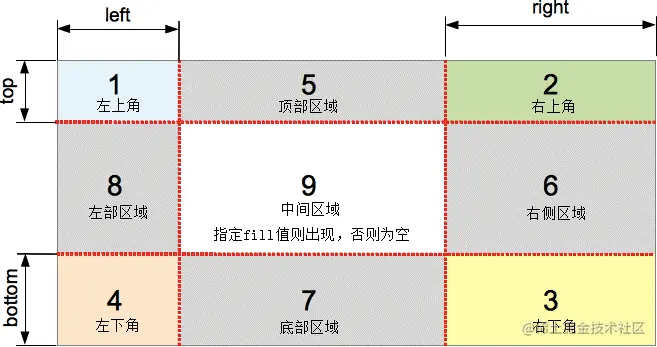
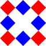
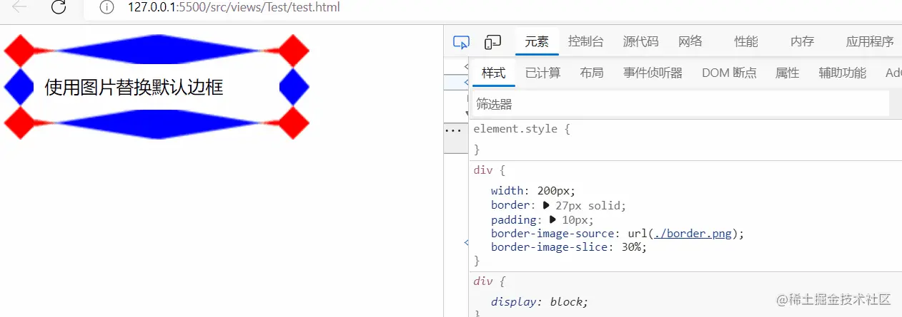
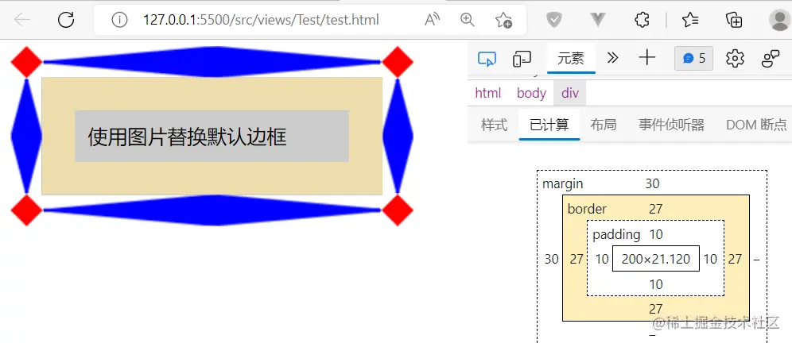

## [CSS 边框样式](#)
> **介绍** : 边框样式、圆角边框、边框阴影、边框图像。


### [1. 属性大纲](#)
关于边框的css属性。

| 属性                         |CSS Version 版本|继承性|简介|
|:---------------------------|:---|:---|:---|
| border                     |CSS1|无|复合属性。设置对象边框的特性|
| border-width               |CSS1|无|设置或检索对象边框宽度|
| border-style               |CSS1|无|设置或检索对象边框样式|
| border-color               |CSS1|无|设置或检索对象边框颜色|
| border-top                 |CSS1|无|复合属性。设置对象顶边的特性|
| border-top-width           |CSS1|无|设置或检索对象顶边宽度|
| border-top-style           |CSS1|无|设置或检索对象顶边样式|
| border-top-color           |CSS1|无|设置或检索对象顶边颜色|
| border-right               |CSS1|无|复合属性。设置对象右边的特性|
| border-right-width         |CSS1|无|设置或检索对象右边宽度|
| border-right-style         |CSS1|无|设置或检索对象右边样式|
| border-right-color         |CSS1|无|设置或检索对象右边颜色|
| border-bottom              |CSS1|无|复合属性。设置对象底边的特性|
| border-bottom-width        |CSS1|无|设置或检索对象底边宽度|
| border-bottom-style        |CSS1|无|设置或检索对象底边样式|
| border-bottom-color        |CSS1|无|设置或检索对象底边颜色|
| border-left                |CSS1|无|复合属性。置对象左边的特性|
| border-left-width          |CSS1|无|设置或检索对象左边宽度|
| border-left-style          |CSS1|无|设置或检索对象左边样式|
| border-left-color          |CSS1|无|设置或检索对象左边颜色|
| **border-radius**            |CSS3|无|设置或检索对象使用圆角边框|
| border-top-left-radius     |CSS3|无|设置或检索对象左上角圆角边框|
| border-top-right-radius    |CSS3|无|设置或检索对象右上角圆角边框|
| border-bottom-right-radius |CSS3|无|设置或检索对象右下角圆角边框|
| border-bottom-left-radius  |CSS3|无|设置或检索对象左下角圆角边框|
| **box-shadow**                 |CSS3|无|设置或检索对象阴影|
| **border-image**               |CSS3|无|设置或检索对象的边框样式使用图像来填充|
| border-image-source        |CSS3|无|设置或检索对象的边框是否用图像定义样式或图像来源路径|
| border-image-slice         |CSS3|无|设置或检索对象的边框背景图的分割方式|
| border-image-width         |CSS3|无|设置或检索对象的边框厚度|
| border-image-outset        |CSS3|无|设置或检索对象的边框背景图的扩展|
| border-image-repeat        |CSS3|无|设置或检索对象的边框图像的平铺方式|

### [2 border](#)
CSS 的 border 属性是一个用于设置各种单独的边界属性的简写属性。border 可以用于设置一个或多个以下属性的值：**border-width**、**border-style**、**border-color**。

**语法**：
```css
.example{
    border：[ border-width ] || [ border-style ] || [ border-color ]
}

.exp{
    /* width | style | color */
    border: 1px dashed green;
}
```

#### [2.1 border-width](#)
`border-width` 用于设置元素边框的宽度。

* 值 `<line-width>` 定义边框的宽度，可以是明确的非负数 <length> 或关键字。如果是关键字，则必须是以下值之一：
  * thin
  * medium
  * thick

**border-width** 属性可以通过一个、两个、三个或四个值来指定。
* 当指定一个值时，该宽度将应用于四条边。
* 当指定两个值时，第一个宽度应用于顶部和底部，第二个宽度应用于左侧和右侧。
* 当指定三个值时，第一个宽度应用于顶部, 第二个宽度应用于左侧和右侧, 第三个宽度应用于底部.
* 当指定四个值时，这些宽度按照顶部、右侧、底部和左侧的顺序（顺时针）进行应用。

```css
/* 关键字值 */
border-width: thin;
border-width: medium;
border-width: thick;

/* <length> 值 */
border-width: 4px;
border-width: 1.2rem;

/* 顶部和底部 | 左侧和右侧 */
border-width: 2px 1.5em;

/* 顶部 | 左侧和右侧 | 底部 */
border-width: 1px 2em 1.5cm;

/* 顶部 | 右侧 | 底部 | 左侧 */
border-width: 1px 2em 0 4rem;
```

#### [2.2 border-style](#)
border-style 用来设定元素所有边框的样式。

> border-style 默认值是 none，这意味着如果你只修改 border-width 和 border-color 是不会出现边框的。

```css
/* Apply to all four sides */
border-style: dashed;

/* horizontal | vertical */
border-style: dotted solid;

/* top | horizontal | bottom */
border-style: hidden double dashed;

/* top | right | bottom | left */
border-style: none solid dotted dashed;

/* Global values */
border-style: inherit;
border-style: initial;
border-style: unset;
```
**取值**
* **none** ：和关键字 hidden 类似，不显示边框。在这种情况下，如果没有设定背景图片，border-width 计算后的值将是 0，即使先前已经指定过它的值。在单元格边框重叠情况下，none 值优先级最低，意味着如果存在其他的重叠边框，则会显示为那个边框。
* **hidden** ：和关键字 none 类似，不显示边框。在这种情况下，如果没有设定背景图片，border-width 计算后的值将是 0，即使先前已经指定过它的值。在单元格边框重叠情况下，hidden 值优先级最高，意味着如果存在其他的重叠边框，边框不会显示。
* **dotted** ：显示为一系列圆点。标准中没有定义两点之间的间隔大小，视不同实现而定。圆点半径是 border-width 计算值的一半。
* **dashed** ：显示为一系列短的方形虚线。标准中没有定义线段的长度和大小，视不同实现而定。
* **solid** ：显示为一条实线。
* **double** ：显示为一条双实线，宽度是 border-width 。
* **groove** ：显示为有雕刻效果的边框，样式与 ridge 相反。
* **ridge** ：显示为有浮雕效果的边框，样式与 groove 相反。
* **inset** ：显示为有陷入效果的边框，样式与 outset 相反。当它指定到 border-collapse 为 collapsed 的单元格时，会显示为 groove 的样式。
* **outset** ：显示为有突出效果的边框，样式与 inset 相反。当它指定到 border-collapse 为 collapsed 的单元格时，会显示为 ridge 的样式。


#### [2.3 border-color](#)
可以确定 border 的颜色。如果这个值没有设置，它的默认值是元素的 color 属性值（是文字颜色而非背景色）。


```css
/* border-color: color; 单值语法 */
border-color: red;

/* border-color: vertical horizontal; 双值语法*/
border-color: red #f015ca;

/* border-color: top horizontal bottom; 三值语法 */
border-color: red yellow green;

/* border-color: top right bottom left; 四值语法 */
border-color: red yellow green blue;

border-color: inherit;
```


### [3. border-radius](#)
允许你设置元素的外边框圆角。当使用一个半径时确定一个圆形，当使用两个半径时确定一个椭圆。这个（椭）圆与边框的交集形成圆角效果。


```css
border-radius: 30px;
border-radius: 25% 10%;
border-radius: 10% 30% 50% 70%;
border-radius: 10% / 50%;  /* 两个半径椭圆 */
border-radius: 10px 100px / 120px;
border-radius: 50% 20% / 10% 40%;
```
该属性是一个 简写属性，是为了将这四个属性 border-top-left-radius、border-top-right-radius、border-bottom-right-radius，和 border-bottom-left-radius 简写为一个属性。

**值**:
* 可以是 `<length>` 或者 `<percentage>`，表示边框四角的圆角半径。
* `<length>` / `<length>` or  `<percentage>` / `<percentage>` 。 定义一个椭圆。

### [4. box-shadow](#)
属性用于在元素的框架上添加阴影效果。你可以在同一个元素上设置多个阴影效果，并用逗号将他们分隔开。该属性可设置的值包括阴影的 X 轴偏移量、Y 轴偏移量、模糊半径、扩散半径和颜色。

**取值**
* inset  如果没有指定inset，默认阴影在边框外，即阴影向外扩散。 使用 inset 关键字会使得阴影落在盒子内部，这样看起来就像是内容被压低了。此时阴影会在边框之内 (即使是透明边框）、背景之上、内容之下。
* `<offset-x>` `<offset-y>` 这是头两个 `<length>` 值，用来设置阴影偏移量。x,y 是按照数学二维坐标系来计算的，
只不过 y 垂直方向向下。 <offset-x> 设置水平偏移量，正值阴影则位于元素右边，负值阴影则位于元素左边。 `<offset-y>` 
设置垂直偏移量，正值阴影则位于元素下方，负值阴影则位于元素上方。可用单位请查看 `<length>` 。 如果两者都是 0，那么阴
影位于元素后面。这时如果设置了`<blur-radius>` 或`<spread-radius>` 则有模糊效果。需要考虑 inset
* `<blur-radius>` 这是第三个 `<length>` 值。值越大，模糊面积越大，阴影就越大越淡。不能为负值。默认为 0，此时阴影边缘锐利。本规范不包括如何计算模糊半径的精确算法，但是，它详细说明如下：
对于长而直的阴影边缘，它会创建一个过渡颜色用于模糊 以阴影边缘为中心、模糊半径为半径的局域，过渡颜色的范围在完整的阴影颜色到它最外面的终点的透明之间。 （译者注：对此有兴趣的可以了解下数字图像处理的模糊算法。）
* `<spread-radius>` 这是第四个 `<length>` 值。取正值时，阴影扩大；取负值时，阴影收缩。默认为 0，此时阴影与元素同样大。需要考虑 inset
* `<color>` : 相关事项查看 `<color>` 。如果没有指定，则由浏览器决定——通常是color的值，不过目前 Safari 取透明。

```css
/* x 偏移量 | y 偏移量 | 阴影颜色 */
box-shadow: 60px -16px teal;

/* x 偏移量 | y 偏移量 | 阴影模糊半径 | 阴影颜色 */
box-shadow: 10px 5px 5px black;

/* x 偏移量 | y 偏移量 | 阴影模糊半径 | 阴影扩散半径 | 阴影颜色 */
box-shadow: 2px 2px 2px 1px rgba(0, 0, 0, 0.2);

/* 插页 (阴影向内) | x 偏移量 | y 偏移量 | 阴影颜色 */
box-shadow: inset 5em 1em gold;

/* 任意数量的阴影，以逗号分隔 */
box-shadow:
  3px 3px red,
  -1em 0 0.4em olive;

/* 全局关键字 */
box-shadow: inherit;
box-shadow: initial;
box-shadow: unset;
```

向元素添加单个 box-shadow 效果时使用以下规则：
* 当给出两个、三个或四个 `<length>` 值时。
  * 如果只给出两个值，那么这两个值将会被当作 `<offset-x><offset-y>` 来解释。
  * 如果给出了第三个值，那么第三个值将会被当作 `<blur-radius>` 解释。
  * 如果给出了第四个值，那么第四个值将会被当作 `<spread-radius>` 来解释。
  * 可选，inset关键字。
  * 可选，<color>值。

若要对同一个元素添加多个阴影效果，请使用逗号将每个阴影规则分隔开。

```css
blockquote {
  padding: 20px;
  box-shadow:
    inset 0 -3em 3em rgba(0, 0, 0, 0.1),
    0 0 0 2px rgb(255, 255, 255),
    0.3em 0.3em 1em rgba(0, 0, 0, 0.3);
}
```

### [5. border-image](#)
在给定元素的周围绘制图像，取代元素的常规边框，[视频教学](https://www.bilibili.com/video/BV1xM4y1y73W/?spm_id_from=333.337.search-card.all.click&vd_source=a03ca1a86c1e90990c4facd27ae17815)。

此属性为以下 CSS 属性的简写：

```css
border-image：border-image-source 
|| border-image-slice [ / border-image-width |
/ border-image-width ? / border-image-outset ]? || border-image-repeat
```

* **border-image-slice** 用于将源图像分割为多个区域。最多可以指定四个值。
* **border-image-source** 用以创建元素边框图像的源图像。
* **border-image-width** 边框图像的宽度。最多可以指定四个值。
* **border-image-repeat** 定义源图像边缘区域适配边框图像尺寸的方式。最多可以指定两个值。
* border-image-outset 边框图像到元素外部边缘的距离,最多可以指定四个值。

```css
.example{
  /* source | slice */
  border-image: linear-gradient(red, blue) 27;

  /* source | slice | repeat */
  border-image: url("/images/border.png") 27 space;

  /* source | slice | width */
  border-image: linear-gradient(red, blue) 27 / 35px;

  /* source | slice | width | outset | repeat */
  border-image: url("/images/border.png") 27 23 / 50px 30px / 1rem round space;
}
```

**参考**
- [掘金 CSS border-image（边框图片）](https://juejin.cn/post/7136833061320146974)
- [CSS3 border-image 彻底明白](https://segmentfault.com/a/1190000010969367)

#### [5.1 border-image-source](#)
指定一个图像来替换边框的默认样式。

**值**
* none 不使用边框图像，而由 border-style 定义所展现的外观。
* `<image>` 用作边框的图片引用。

```css
.exp{
  border-image-source: url("/umix/kicker.png");
}

div {
  width: 200px;
  border: 27px solid;
  padding: 10px;
  border-image-source: url(./border.png);
}
```

#### [5.2 border-image-slice](#)
定义边框图像从什么位置开始分割。

```
border-image-slice：[ <number> | <percentage> ]{1,4} && fill?
```

**值**：
* `<number>`：数值，用具体数值指定图像分割的位置，数值代表图像的像素位置或向量坐标，不允许负值；
* `<percentage>`：百分比，相对于图像尺寸的百分比，图像的宽度影响水平方向，高度影响垂直方向；
* `fill`：保留边框图像的中间部分。

border-image-slice 属性可以指定上、下、左、右四个方位来分割图像，并将图像分成 4 个角、4条边和中间区域等 9 个部份，中间区域始终是透明的（即没图像填充），除非加上关键字 fill
**其中，左上角、右上角、左下角、右下角不会发生拉伸和变形** ，5、6、7、8 区域因为高度宽度重复方式等会发生变化。



除 fill 关键字外，border-image-slice 属性可以接受 1~4 个参数值：
* 如果提供全部四个参数值，那么将按上、右、下、左的顺序对图像进行分割；
* 如果提供三个参数，那么第一个参数用于上方，第二个参数用于左、右两侧，第三个参数用于下方；
* 如果提供两个参数，那么第一个参数用于上方和下方，第二个参数用于左、右两个；
* 如果只提供一个参数，那么上、右、下、左都将使用该值进行分割，**就是指定上图四条红线的位置**。



**例子:** 


#### [5.3 border-image-outset](#)
属性定义边框图像可超出边框盒的大小。

```css
.same{
  /* border-image-outset: sides */
  border-image-outset: 30%;
  /* border-image-outset:垂直,水平 */
  border-image-outset: 10% 30%;
  /* border-image-outset: 顶 水平 底 */
  border-image-outset: 30px 30% 45px;
  /* border-image-outset:顶 右 底 左  */
  border-image-outset: 7px 12px 14px 5px;
  /*  */
  border-image-repeat: inherit;
}
```

* **sides** 边框图像在四个方向超出边框盒的 `<length>` 或 `<number>` 数量。
* **horizontal** 边框图像在水平方向（左和右）超出边框盒的 `<length>` 或 `<number>` 数量。
* **vertical** 边框图像在垂直方向（上和下）超出边框盒的 `<length>` 或 `<number>` 数量。
* **top** 边框图像在上方超出边框盒的 `<length>` 或 `<number>` 数量。
* **bottom** 边框图像在下方超出边框盒的 `<length>` 或 `<number>` 数量。
* **right** 边框图像在右方超出边框盒的 `<length>` 或 `<number>` 数量。
* **left** 边框图像在左方超出边框盒的 `<length>` 或 `<number>` 数量。
* **inherit** 四个方向的值都继承于父元素的该属性计算后值。


#### [5.4 border-image-width](#)
border-image-width 属性用来设置通过 border-image-source 属性加载的图像厚度（宽度），属性的语法格式如下：

```
border-image-width：[ <length> | <percentage> | <number> | auto ]{1,4}
```

语法说明如下：
* `<length>`：使用数值加单位的形式指定图像边框的宽度，不允许为负值；
* `<percentage>`：用百分比的形式指定图像边框的宽度，参照图像边框区域的宽和高进行换算，不允许负值；
* `<number>`：使用浮点数指定图像边框的宽度，该值对应 border-width 的倍数，例如值为 2，则参数的实际值为 2 * border-width，不允许负值；
* **auto**：由浏览器自动设定，当 border-image-width 设置为 auto 时，它的实际值与 border-image-slice 相同的值。

**border-image-width** 属性同样可以接受 1~4 个参数值：
* 如果提供全部四个参数值，那么将按照上、右、下、左的顺序设置图像边框四个方向上的宽度；
* 如果提供三个参数，那么第一个参数用于上边框，第二个参数用于左、右两个边框，第三个参数用于下边框；
* 如果提供两个参数，那么第一个参数用于上、下两个边框，第二个参数用于左、右两个边框；
* 如果只提供一个参数，那么上、右、下、左都将使用该值设置图像边框的宽度。

```css
div {
    width: 200px;
    border: 27px solid;
    padding: 10px;
    border-image-source: url(./border.png);
    border-image-slice: 27;
    border-image-width: 10px 1 0.5 15px;
}
```
#### [5.5 border-image-outset](#)
border-image-outset 属性用来定义图像边框相对于边框边界向外偏移的距离（使图像边框延伸到盒子模型以外），该属性的语法格式如下：

```
border-image-outset：[ <length> | <number> ]{1,4};
```
语法说明如下：
* `<length>`：用具体的数值加单位的形式指定图像边框向外偏移的距离，不允许为负值；
* `<number>`：用浮点数指定图像边框向外偏移的距离，该值表示 border-width 的倍数，例如值为 2，则表示偏移量为 2 * border-width，不允许为负值。

**border-image-outset** 属性同样可以接受 1~4 个参数值：
* 如果提供全部四个参数值，那么将按上、右、下、左的顺序作用于四边；
* 如果提供三个参数值，那么第一个参数将用于上边框，第二个参数将用于左、右两个边框，第三个参数将用于下边框；
* 如果提供两个参数，那么第一个参数将用于上、下两个边框，第二个参数将用于左、右两个边框；
* 如果只提供一个参数，那么该参数将同时作用于四边。

```css
div {
  width: 200px;
  border: 27px solid;
  padding: 10px;
  margin: 30px 0px 0px 30px;
  border-image-source: url(./border.png);
  border-image-slice: 27;
  border-image-outset: 25px;
  background-color: #ccc;
}
```



#### [5.6 border-image-repeat](#)
填充使用 border-image-slice 属性分割的图像边框。

border-image-repeat 属性用来设置如何填充使用 border-image-slice 属性分割的图像边框，例如平铺、拉伸等等，该属性的语法格式如下：

```
border-image-repeat：[ stretch | repeat | round | space ]{1,2}
```
**如果给两个值 就是先指定水平方向，再指定垂直方向**
* **stretch**：将被分割的图像使用拉伸的方式来填充满边框区域；
* **repeat**：将被分割的图像使用重复平铺的方式来填充满边框区域，当图像碰到边界时，超出的部分会被截断；
* **round**：与 repeat 关键字类似，不同之处在于，当背景图像不能以整数次平铺时，会根据情况缩放图像，**推荐使用**；
* **space**：与 repeat 关键字类似，不同之处在于，当背景图像不能以整数次平铺时，会用空白间隙填充在图像周围，**推荐使用**。

**介绍**:
