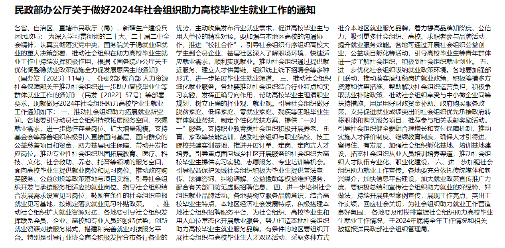
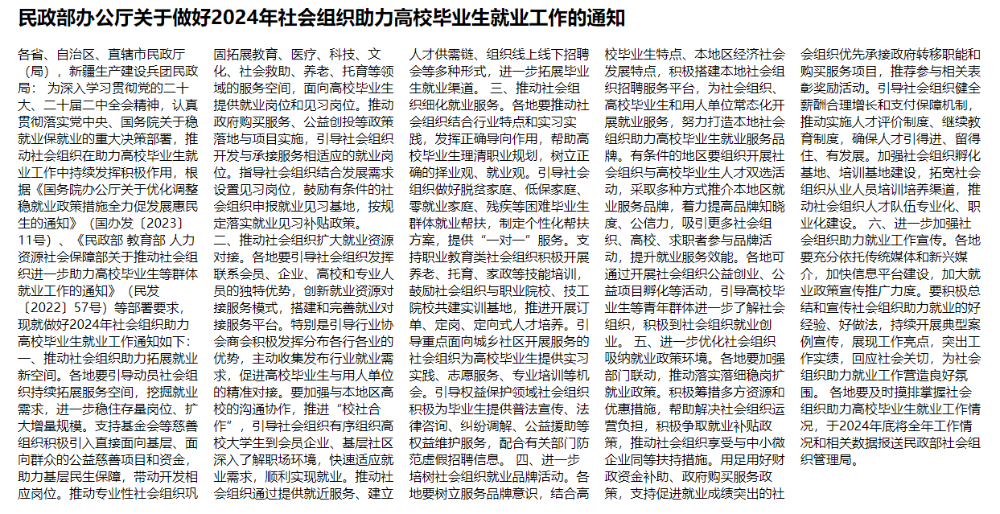
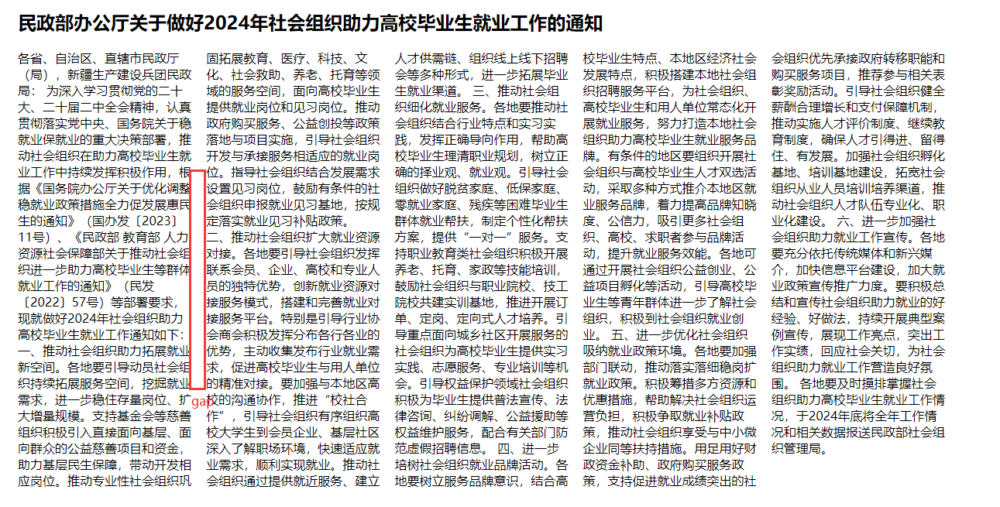
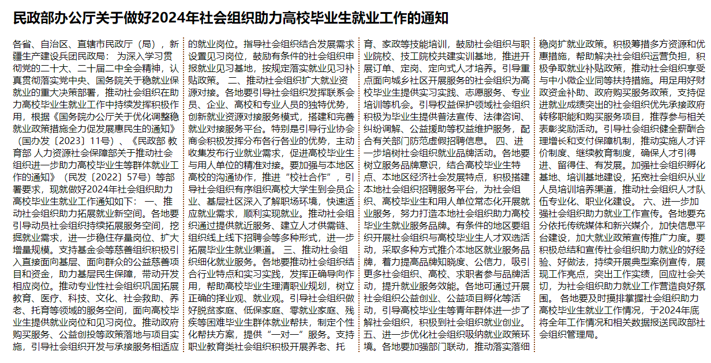
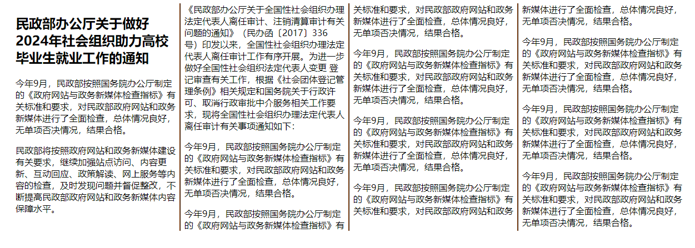
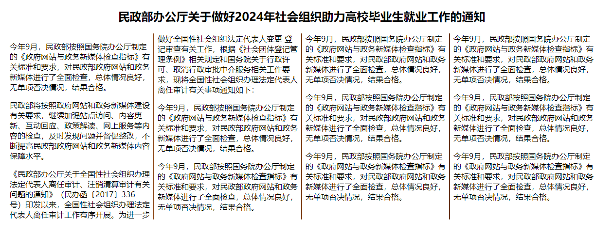

## [多列 Column](#)
> **介绍**：CSS 多列属性。

-----

### [1. 多列](#)
| 属性                       | CSS Version/ 值 | 继承性	 | 简介                     |
|:-------------------------|:---------------|:-----|:-----------------------|
| [columns](https://developer.mozilla.org/zh-CN/docs/Web/CSS/columns)	|CSS3	|无| 	设置或检索对象的列数和每列的宽度。复合属性 |
| [column-count](https://developer.mozilla.org/zh-CN/docs/Web/CSS/column-count) |CSS3	|无| 	设置或检索对象的列数            |
| [column-width](https://developer.mozilla.org/en-US/docs/Web/CSS/column-width) |CSS3	|无| 	设置或检索对象每列的宽度          |
| [column-gap](https://developer.mozilla.org/zh-CN/docs/Web/CSS/column-gap)|CSS3	|无	| 设置或检索对象的列与列之间的间隙       |
| [column-rule](https://developer.mozilla.org/zh-CN/docs/Web/CSS/column-rule) |CSS3	|无| 	设置或检索对象的列与列之间的边框。复合属性 |
| [column-rule-width](https://developer.mozilla.org/zh-CN/docs/Web/CSS/column-rule-width)   |	CSS3	|无| 	设置或检索对象的列与列之间的边框厚度。   |
| [column-rule-style](https://developer.mozilla.org/zh-CN/docs/Web/CSS/column-rule-style) |	CSS3	|无| 	设置或检索对象的列与列之间的边框样式。   |
| [column-rule-color](https://developer.mozilla.org/zh-CN/docs/Web/CSS/column-rule-color) |	CSS3	|无| 	设置或检索对象的列与列之间的边框颜色。   |
| [column-span](https://developer.mozilla.org/zh-CN/docs/Web/CSS/column-span) |CSS3	|无	| 设置或检索对象元素是否横跨所有列。      |
| [column-fill](https://developer.mozilla.org/zh-CN/docs/Web/CSS/column-fill)	            |CSS3	|无	| 设置或检索对象所有列的高度是否统一。     |
| column-break-before     |	CSS3|	无| 	设置或检索对象之前是否断行，暂未支持。   |
| column-break-after	     |CSS3	|无	| 设置或检索对象之前是否断行，暂未支持。     |
| column-break-inside	 |CSS3|	无	| 设置或检索对象内部是否断行，暂未支持。    |

columns 它是一个简写属性，可在单个方便的声明中设置 column-width 和 column-count 属性。与所有简写属性一样，任何省略的子值都将设置为其初始值。

```
columns =
<'column-width'>  ||
<'column-count'>
```

* `<'column-width'>` 理想的列宽，定义为 `<length>` 或 auto 关键字。实际宽度可以更宽或更窄以适合可用空间。See column-width。
* `<'column-count'>` 元素内容应分成的理想列数，定义为 `<integer>` 或 auto 关键字。如果此值和列的宽度都不是 auto ，则它仅指示允许的最大列数。请参阅 column-count 。

```css

/* Column width */
. wdex{ columns: 18em;}
/* Column count */
. coex{
    columns: auto;
    columns: 2;
}

.content-box {
  columns: 3 auto;
}

/* Both column width and count */
.col-ex{
    columns: 2 auto;
    columns: auto 12em;
    columns: auto auto;
}
```

#### [1.1 column-count](#)
属性将一个元素的内容分成指定数量的列。

**column-count 的值**：
* auto 用来表示列的数量由其他 CSS 属性指定，例如 column-width。
* `<integer>` 是个严格的正整型 <integer>，用来描述元素内容被划分的理想列数。假如 column-width 也被设置为非零值，此参数仅表示所允许的最大列数。

> 如果同时指定 column-count 和column-width 结果谁的列数少，谁的优先级较高。

```css
main{
    width: 1200px;
    margin: 0 auto;
}
main:hover > div{
    column-count: 3;
}
```
html:
```html
    <main>
        <h2>
            民政部办公厅关于做好2024年社会组织助力高校毕业生就业工作的通知
        </h2>
        <div>
            各省、自治区、直辖市民政厅（局），新疆生产建设兵团民政局： 为深入学习贯彻党的二十大、
            二十届二中全会精神，认真贯彻落实党中央、国务院关于稳就业保就业的重大决策部署，推动
            社会组织在助力高校毕业生就业工作中持续发挥积极作用，根据《国务院办公厅关于优化调整
            稳就业政策措施全力促发展惠民生的通知》...
        </div>
    </main>
```



#### [1.2 column-width](#)
设置或检索对象每列的宽度。

* auto	浏览器将决定列的宽度
* length	指定列宽的长度
```css
div
{
    column-width:100px;
    -moz-column-width:100px; /* Firefox */
    -webkit-column-width:100px; /* Safari and Chrome */
}
```
**例子**：
```css
main{
    width: 1200px;
    margin: 0 auto;
}
main:hover > div{
    column-width: 200px;
}
```



#### [1.3 column-gap](#)
属性用来设置元素列之间的间隔（gutter）大小。



**取值:**
* normal 表示列之间的间隔宽度。在 多列布局 时默认间隔为 1em，其他类型布局默认间隔为 0。
* `<length>` 用 `<length>` 来定义列之间的间隔大小。而且 `<length>` 值必须是非负数的。
* `percentage>` 用 `<percentage>`（百分比）来定义列之间的间隔大小。

```css
main{
    width: 1200px;
    margin: 0 auto;
}
main:hover > div{
    column-count: 4;
    column-gap: 3em;
}
```

> 如果值为0，结果间距不会是0，还是有一定的间距。

#### [1.4 column-rule](#)
指定列之间的规则：宽度，样式和颜色：
```
column-rule: column-rule-width column-rule-style column-rule-color;
```
规则和 border 一样。
```css
main:hover > div{
    column-count: 4;
    column-rule: 2px ridge saddlebrown;
}
```



**column-rule-style**的取值：
* none	定义没有规则。
* hidden	定义隐藏规则。
* dotted	定义点状规则。
* dashed	定义虚线规则。
* solid	定义实线规则。
* double	定义双线规则。
* groove	定义 3D grooved 规则。该效果取决于宽度和颜色值。
* ridge	定义 3D ridged 规则。该效果取决于宽度和颜色值。
* inset	定义 3D inset 规则。该效果取决于宽度和颜色值。
* outset	定义 3D outset 规则。该效果取决于宽度和颜色值。

#### [1.5 column-span](#)
column-span 的值被设置为 all 时，可以让一个元素跨越所有的列。

```css
main{
    width: 1200px;
    margin: 0 auto;
}
main:hover{
    column-count: 4;
    column-rule: 2px ridge saddlebrown;
}
```
```html
<main>
    <h2>
        民政部办公厅关于做好2024年社会组织助力高校毕业生就业工作的通知
    </h2>
    <p>今年9月，民政部按照国务院办公厅制定的《政府网站与政务新媒体检查指标》有关标
        准和要求，对民政部政府网站和政务新媒体进行了全面检查，总体情况良好，无
        单项否决情况，结果合格。</p>
    <p>...</p>
    <p>...</p>
    <p>...</p>
    <p>...</p>
    <p>...</p>
    <p>...</p>
</main>
```



**让h2能够跨行**
```css
main:hover > h2{
    text-align: center;
    column-span: all;
}
```


#### [1.6 column-fill](#)
column-fill CSS 属性可控制元素内容分成列时的平衡方式。

* **auto** 按顺序填充列。内容只占用其所需的空间，可能导致某些列保持空白。
* **balance** 内容平均分配到各列。在片段式上下文中，如 CSS 分页媒体，只有最后一个片段是平衡的。因此，在分页媒体中，只有最后一页是平衡的。

### [1.7 多列图片](#)
利用多列实现一个炫酷的效果。
```css
.outer{
    column-count: 5;
}
.outer img{
    width: 100%;
}
```

```html
<div class="outer">
    
    
    
    
    
    
    
    ...
</div>
```

