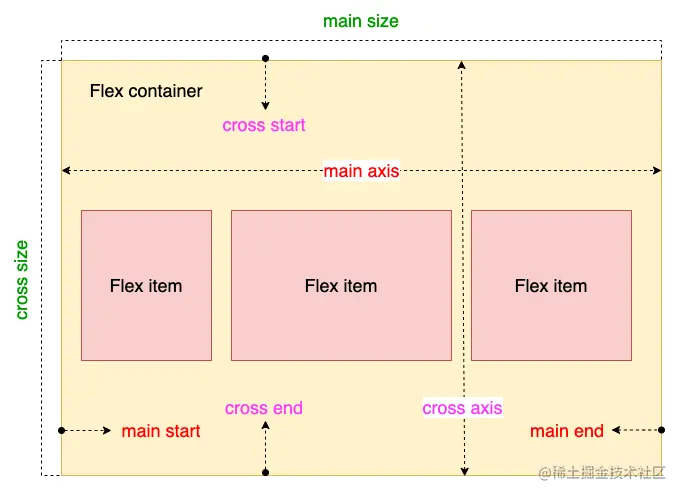

## [弹性布局 flex](#)
> **介绍**：必须掌握的布局技巧,Flexbox 布局也叫 Flex 布局，弹性盒子布局。。

-----

### [1. 伸缩盒 Flexible Box Layout](#)
它决定了元素如何在页面上排列，使它们能在不同的屏幕尺寸和设备下可预测地展现出来，更简便、完整、响应式地实现各种页面布局。


| 属性                                                                                   | CSS Version/ 值 | 继承性	 | 简介                       |
|:-------------------------------------------------------------------------------------|:---------------|:-----|:-------------------------|
| flex                                                                                 |	CSS3|	无|	复合属性。设置或检索伸缩盒对象的子元素如何分配空间。|
| [flex-flow](https://developer.mozilla.org/zh-CN/docs/Web/CSS/flex-flow)	             |CSS3|	无|	复合属性。设置或检索伸缩盒对象的子元素排列方式。|
| [flex-direction](https://developer.mozilla.org/zh-CN/docs/Web/CSS/flex-direction)	   |CSS3	|无|	设置或检索伸缩盒对象的子元素在父容器中的位置。
| [flex-wrap](https://developer.mozilla.org/zh-CN/docs/Web/CSS/flex-wrap)	             |CSS3	|无|	设置或检索伸缩盒对象的子元素超出父容器时是否换行。|
| [justify-content](https://developer.mozilla.org/zh-CN/docs/Web/CSS/justify-content)	 |CSS3|	无|	设置或检索弹性盒子元素在主轴（横轴）方向上的对齐方式。|
| [align-content](https://developer.mozilla.org/zh-CN/docs/Web/CSS/align-content)	     |CSS3	|无|	设置或检索弹性盒堆叠伸缩行的对齐方式。|
| [align-items](https://developer.mozilla.org/zh-CN/docs/Web/CSS/align-items)	         |CSS3	|无|	设置或检索弹性盒子元素在侧轴（纵轴）方向上的对齐方式。|
| flex-grow	                                                                           |CSS3|	无|	设置或检索弹性盒的扩展比率。|
| flex-shrink                                                                          |	CSS3|	无|	设置或检索弹性盒的收缩比率|
| flex-basis	                                                                          |CSS3|	无|	设置或检索弹性盒伸缩基准值。|
| [align-self](https://developer.mozilla.org/zh-CN/docs/Web/CSS/align-self)	                                                                      |CSS3	|无	|设置或检索弹性盒子元素自身在侧轴（纵轴）方向上的对齐方式。|
| order	                                                                               |CSS3|	无|	设置或检索伸缩盒对象的子元素出現的順序。|

> **注意**，设为 Flex 布局以后，子元素的float、clear和vertical-align属性将失效。当布局涉及到不定宽度，分布对⻬的场景时，我们可以优先考虑弹性盒布局。

- [稀土掘金 - 带你了解flex弹性布局](https://juejin.cn/post/7363932520953380864?searchId=202409132200371323CB7D93BB1FC47C02)
- [稀土掘金 - 一文吃透 CSS Flex 布局](https://juejin.cn/post/7245898637779157052?searchId=202409132200371323CB7D93BB1FC47C02)



#### 1.1 主轴与交叉轴

**主轴（Main Axis）**：

主轴是 Flex 容器的主要方向，决定 Flex 项目的排列方式。
默认情况下，主轴是水平方向（row，x轴），但可以通过设置 flex-direction 属性来改变。
Flex 项目沿着主轴排列，其大小和位置受到主轴方向的影响。

**交叉轴（Cross Axis）**：

交叉轴是与主轴垂直的方向，用于控制 Flex 项目在垂直方向上的布局。
默认情况下，交叉轴是垂直方向（column，y轴），但同样可以通过设置 flex-direction 属性进行更改。
交叉轴上的对齐方式由 align-items 和 align-self 属性控制。

在 flex 布局中，是分为主轴和交叉轴两个方向，同样的叫法有 ： 行和列、x 轴和y 轴，主轴和侧轴
主轴和交叉是会变化的，就看 `flex-direction` 设置谁为主轴，剩下的就是交叉轴。而我们的子元素是跟着主轴来排列的

#### [2. 容器属性](#)
以下6个属性设置在容器上。
* [flex-direction](https://developer.mozilla.org/zh-CN/docs/Web/CSS/flex-direction) 属性指定了内部元素是如何在弹性容器中布局的，定义了主轴的方向（正方向或反方向）。
* [flex-wrap](https://developer.mozilla.org/zh-CN/docs/Web/CSS/flex-wrap) 指定 flex 元素单行显示还是多行显示。
* [flex-flow](https://developer.mozilla.org/zh-CN/docs/Web/CSS/flex-flow) 是 flex-direction 和 flex-wrap 的简写。
* [justify-content](https://developer.mozilla.org/zh-CN/docs/Web/CSS/justify-content) justify-content 属性定义浏览器如何沿着弹性容器的主轴和网格容器的行向轴分配内容元素之间和周围的空间。
* [align-items](https://developer.mozilla.org/zh-CN/docs/Web/CSS/align-items) 设置了所有直接子元素的 align-self 值作为一个组。
* [align-content](https://developer.mozilla.org/zh-CN/docs/Web/CSS/align-content) 交叉轴上多行子元素的对齐方式。

#### [2.1 flex-direction](#)
flex-direction 属性指定了内部元素是如何在弹性容器中布局的，定义了主轴的方向（正方向或反方向）。

| 属性值          |含义|
|:-------------|:---|
|row          |默认值，主轴为水平方向（水平布局），起点在左端，从左向右排列|
|row-reverse  |主轴为水平方向（水平布局），起点在右端，从右向左排列|
|column       | 主轴为垂直方向（垂直布局），起点在上沿，从上往下排列|
|column-reverse | 主轴为垂直方向（垂直布局），起点在下沿，从下往上排列|

#### [2.2 flex-wrap](#)
flex-wrap 属性指定 flex 元素单行显示还是多行显示。如果允许换行，这个属性允许你控制行的堆叠方向。

|属性值|	含义|
|:-------------|:---|
|nowrap	|flex 的元素被摆放到到一行，这可能导致 flex 容器溢出。cross-start 会根据 flex-direction 的值等价于 start 或 before。为该属性的默认值。|
|wrap	|flex 元素 被打断到多个行中。cross-start 会根据 flex-direction 的值等价于 start 或before。cross-end 为确定的 cross-start 的另一端。|
|wrap-reverse|	和 wrap 的行为一样，但是 cross-start 和 cross-end 互换。|

#### [2.3 flex-flow](#)
CSS flex-flow 属性是 flex-direction 和 flex-wrap 的简写。

初始值	该简写所对应的每个属性：
* flex-direction: row
* flex-wrap: nowrap

```
/* flex-flow：<'flex-direction'> 和 <'flex-wrap'> */
flex-flow: row nowrap;
flex-flow: column wrap;
flex-flow: column-reverse wrap-reverse;
```

#### [2.4 justify-content](#)
控制 Flex 项目在主轴上的对齐方式。

|属性值| 	含义                                                                                     |
|:-------------|:----------------------------------------------------------------------------------------|
|start| 从行首开始排列。每行第一个元素与行首对齐，同时所有后续的元素与前一个对齐。                                                   |
|end | 从行尾开始排列。每行最后一个元素与行尾对齐，同时所有前面的元素与后一个对齐。                                                  |
|flex-start	| 默认值，左对齐                                                                                 |
|flex-end	| 右对齐                                                                                     |
|center	| 居中                                                                                      |
|space-between| 	两端对齐，项目之间的间隔都相等                                                                        |
|space-around| 	每个项目两侧的间隔相等。所以，项目之间的间隔比项目与边框的间隔大一倍                                                     |
|space-evenly| 	`每项都沿着主轴均匀分布在指定的对齐容器中。相邻 flex 项之间的间距，主轴起始位置到第一个 flex 项的间距，主轴结束位置到最后一个 flex 项的间距，都完全一样。` |
|stretch| 多行子元素会被拉伸以填充 父 容器的整个交叉轴。                                                                |
|safe|如果元素溢出对齐容器，则元素将按照对齐模式为 start 进行对齐。所期望的对齐将不会被实现。|
|unsafe|即使元素溢出对齐容器，也会实现所需的对齐方式。与 safe 不同，safe 会忽略所要求的对齐方式以防止溢出。|


```
/* Positional alignment */
justify-content: center; /* 居中排列 */
justify-content: start; /* Pack items from the start */
justify-content: end; /* Pack items from the end */
justify-content: flex-start; /* 从行首起始位置开始排列 */
justify-content: flex-end; /* 从行尾位置开始排列 */
justify-content: left; /* Pack items from the left */
justify-content: right; /* Pack items from the right */

/* Baseline alignment */
justify-content: baseline;
justify-content: first baseline;
justify-content: last baseline;

/* Distributed alignment */
justify-content: space-between; /* 均匀排列每个元素
                                   首个元素放置于起点，末尾元素放置于终点 */
justify-content: space-around; /* 均匀排列每个元素
                                   每个元素周围分配相同的空间 */
justify-content: space-evenly; /* 均匀排列每个元素
                                   每个元素之间的间隔相等 */
justify-content: stretch; /* 均匀排列每个元素
                                   'auto'-sized 的元素会被拉伸以适应容器的大小 */

/* Overflow alignment */
justify-content: safe center;
justify-content: unsafe center;

/* Global values */
justify-content: inherit;
justify-content: initial;
justify-content: unset;
```

#### [2.5 align-items](#)
align-items 属性设置了所有直接子元素的 align-self 值作为一个 **组** 。在 Flexbox 中，它控制子元素在交叉轴上的对齐。

默认值：**normal**
这个关键字的效果取决于我们处在什么布局模式中：
* 在绝对定位的布局中，对于被替代的绝对定位盒子，行为与 start 类似；对于其他所有绝对定位的盒子，行为与 stretch 类似。
* 在绝对定位布局的静态位置上，行为与 stretch 类似。
* 对于那些 flex 元素而言，行为与 stretch 类似。
* 对于那些 grid 元素而言，行为与 stretch 类似，但对于具有长宽比或固有尺寸的盒子，其行为与 start 类似。
* 这个属性不适用于块级盒子和表格。

| 属性值          |含义|
|:-------------|:---|
|flex-start|	交叉轴的起点对齐|
|flex-end|	交叉轴的终点对齐|
|center	|交叉轴的中点对齐|
|baseline|	项目的第一行文字的基线对齐|
|start|将元素与容器的主轴起点或交叉轴起点对齐。|
|end|将元素与容器的主轴末端或交叉轴末端对齐。|
|stretch|	（默认值） 如果项目未设置高度或设为auto，将占满整个容器的高度|

#### [2.6 align-content](#)
控制多行 Flex 项目在交叉轴上的对齐方式。 

> **说明** 该属性对单行弹性盒子模型无效。（即：带有 flex-wrap: nowrap）。

* **start** 所有行从容器的起始边缘开始填充。
* **end** 所有行从容器的结束边缘开始填充。
* **flex-start** 所有行从垂直轴起点开始填充。第一行的垂直轴起点边和容器的垂直轴起点边对齐。接下来的每一行紧跟前一行。
* **flex-end** 所有行从垂直轴末尾开始填充。最后一行的垂直轴终点和容器的垂直轴终点对齐。同时所有后续行与前一个对齐。
* **center** 所有行朝向容器的中心填充。每行互相紧挨，相对于容器居中对齐。容器的垂直轴起点边和第一行的距离相等于容器的垂直轴终点边和最后一行的距离。
* **normal** 这些项按默认位置填充，就像没有设置对齐内容值一样。
* **space-between** 所有行在容器中平均分布。相邻两行间距相等。容器的垂直轴起点边和终点边分别与第一行和最后一行的边对齐。
* **space-around** 所有行在容器中平均分布，相邻两行间距相等。容器的垂直轴起点边和终点边分别与第一行和最后一行的距离是相邻两行间距的一半。
* **space-evenly** 所有行沿垂直轴均匀分布在对齐容器内。每对相邻的项之间的间距，主开始边和第一项，以及主结束边和最后一项，都是完全相同的。
* **stretch** 拉伸所有行来填满剩余空间。剩余空间平均地分配给每一行。
* **safe** 与对齐关键字一起使用。如果所选的关键字意味着项溢出对齐容器（data loss），则将采用备用策略对项进行对齐，就像启动了 start 对齐模式一样。
* **unsafe** 与对齐关键字一起使用。无论元素和对齐容器的相对大小如何、是否会导致一些元素溢出可见范围（data loss），都使用给定的对齐值。

### [3. 子项目属性](#)
以下6个属性设置在项目上。

* **order** order属性用来定义项目的排列顺序。数值越小，排列越靠前，默认为 0 。使用形式如下:
* flex-grow flex-grow属性定义项目的放大比例，默认为 0 ，即如果存在剩余空间，也不放大。
* flex-shrink flex-shrink属性定义了项目的缩小比例，默认为 1 ，即如果空间不足，该项目将缩小。
* flex-basis flex-basis属性定义了在分配多余空间之前，项目占据的主轴空间（main size）。
* align-self align-self属性允许单个项目有与其他项目不一样的对齐方式，可覆盖align-items属性。
