## [网格布局 grid](#)
> **介绍**：CSS 网格布局(Grid Layout) 是 CSS 中最强大的布局系统。 这是一个`二维系统`，这意味着它可以同时处理列和行。

-----

### [1. 属性大纲](#)
|属性| 描述|
|:---|:-----------|
|[grid](https://developer.mozilla.org/zh-CN/docs/Web/CSS/Reference/Properties/grid)	| `grid-template-rows`, `grid-template-columns`, `grid-auto-flow`等属性的简写属性。 |
|`grid-template-columns`| 	指定列的大小，以及网格布局中设置列的数量|
|`grid-template-rows`	| 指定网格布局中行的大小                                     |
|grid-row	| grid-row-start 和 grid-row-end 的简写属性|
|`grid-row-end`	| 指定网格元素行的结束位置                                    |
|`grid-row-start`	| 指定网格元素行的开始位置                                    |
|grid-column	| grid-column-start 和 grid-column-end 的简写属性       |
|`grid-column-end`|指定网格元素列的结束位置|
|`grid-column-start`|指定网格元素列的开始位置|
|grid-area| 指定网格元素的名称，或者也可以是 grid-row-start, grid-column-start, grid-row-end等的简写属性|
|grid-auto-columns|指的默认的列尺寸|
|grid-auto-flow	| 指定自动布局算法怎样运作，精确指定在网格中被自动布局的元素怎样排列。|
|grid-auto-rows	| 指的默认的行尺寸|
|grid-template| grid-template-rows, grid-template-columns 和 grid-areas 的简写属性|
|grid-template-areas|指定如何显示行和列，使用命名的网格元素|
|gap|row-gap 和 column-gap 的简写属性|
|`column-gap`|指定列之间的间隙|
|`row-gap`| 指定两个行之间的间距|
|grid-gap| grid-row-gap 和 grid-column-gap 的简写属性|
|`grid-row-gap`|指定网格元素的行间距|
|`grid-column-gap`|指定网格元素的间距大小|
```css
.container{
    display: grid;/* inline-grid; */
}
```

- [grid网格布局真香，比flex方便太多了](https://www.bilibili.com/video/BV1gw41167gh/?spm_id_from=333.337.search-card.all.click&vd_source=a03ca1a86c1e90990c4facd27ae17815)
- [重学CSS】图文并茂！一次性搞懂 Grid 布局，实现“布局自由”~](https://juejin.cn/post/7208484366955085883?searchId=202409151158418507F6FDC167488C3DD2)
- [CSS3最强布局-Grid布局: grid的布局的使用](https://juejin.cn/post/7409110408991522827?searchId=20260606181207BBD474563E70D6402436)

Flexbox的强项
- **一维布局**: 沿单轴排列元素
- **空间分配**:灵活的对齐和空间控制
- **响应式友好**:自动折行和伸缩
遇到的挑战
- 二维矩阵布局:仪表盘、图库
- 精确定位需求:圣杯布局、复杂表格
- 行列同时控制:需要更精细的控制

### [2. Gird 网格布局模型](#)
CSS 网格布局（又称 "网格 "或 "CSS网格"），是一种基于 `二维网格` 的布局系统，与过去的任何网页布局系统相比，它完全改变了我们设计用户界面的方式。它将网页划分成一个个网格，可以任意组合不同的网格，做出各种各样复杂的布局。

- 同时定义行和列
- 精确的网格单元格
- 元素可以跨越多个格子
```css
.container{
    display: grid;
    grid-template-columns: 33.33% 33.33% 33.33%;  /* 三列 */
    grid-template-rows: 50% 50%;  /* 两行 */
}
```
使用 repeat 统一设置值，第一个参数为重复数量，第二个参数是重复值

```css
.box {
    margin: 50px auto;
    display: grid;
    grid-template-rows: repeat(2, 50%);
    grid-template-columns: repeat(2, 50%);
    width: 300px;
    height: 200px;
    border: 5px solid #3333;
}
```

要使用 CSS Grid，你必须用 display: grid 定义一个容器元素为网格，用 `grid-template-columns` 和 `grid-template-rows` 设置列和行的大小，然后用 `grid-column` 和 `grid-row` 将其子元素放入网格。

#### [2.1 容器（Grid Container）](#)
Grid 容器 指的是应用 display: grid 的元素。它是所有网格项目的直接父元素。

- grid：生成一个块状的网格
- inline-grid：生成一个 inline-level 的网格

```css
.container{
    border: 1px solid gainsboro;
    display: grid;
}
```

下面这个例子中，container 是网格的容器：
```html
<div class="container"> 
    <div class="item item-1"></div> 
    <div class="item item-2"></div> 
    <div class="item item-3"></div>
</div>
```

#### [2.2 项目（Grid Items）](#)
Grid 项目 指的是网格容器的直接后代元素。

下面这个例子中的 item 元素是网格项目，但 sub-item 不是：
```html
<div class="container">
  <div class="item"> </div>
  <div class="item">
    <p class="sub-item"> </p>
  </div>
  <div class="item"> </div>
</div>
```

#### [2.3 网格线（Grid Lines）](#)
网格线（Grid Lines） 指的是构成网格结构的分界线。它们可以是垂直的（“列网格线”）或水平的（“行网格线”），并且位于行或列的任一侧。请看下图：

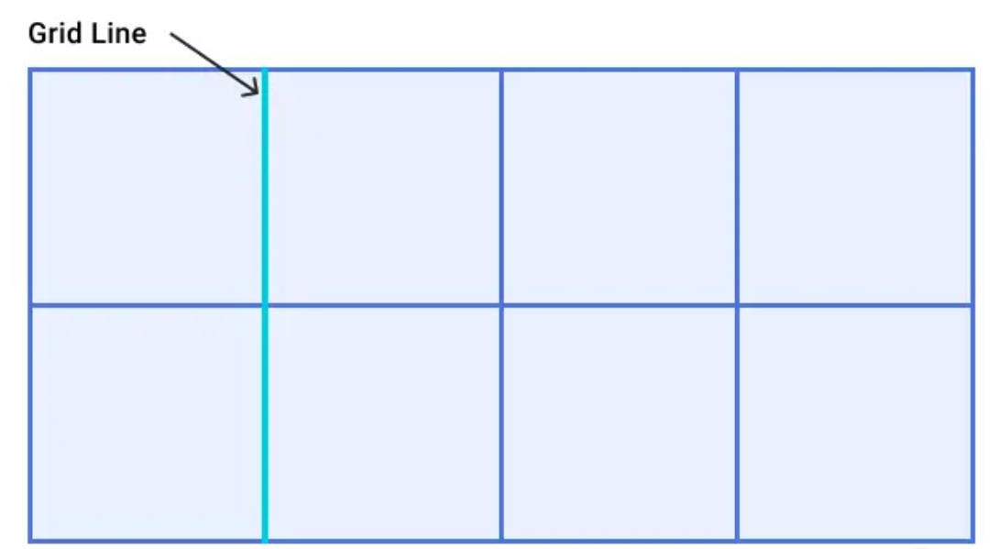

分割轨道的坐标系
- n列网格=n+1条垂直线
- m行网格=m+1条水平线

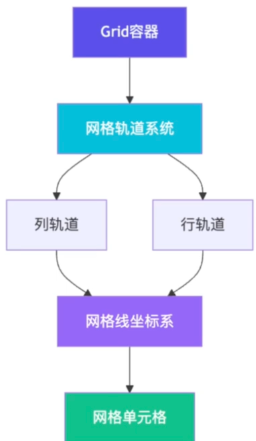


#### [2.4 单元格（Grid Cell）](#)
单元格（Grid Cell） 指的是相邻两行和相邻两列网格线之间的空间。它是网格的一个 "单元"。

下面是行网格线1和2，列网格线2和3之间的网格单元：

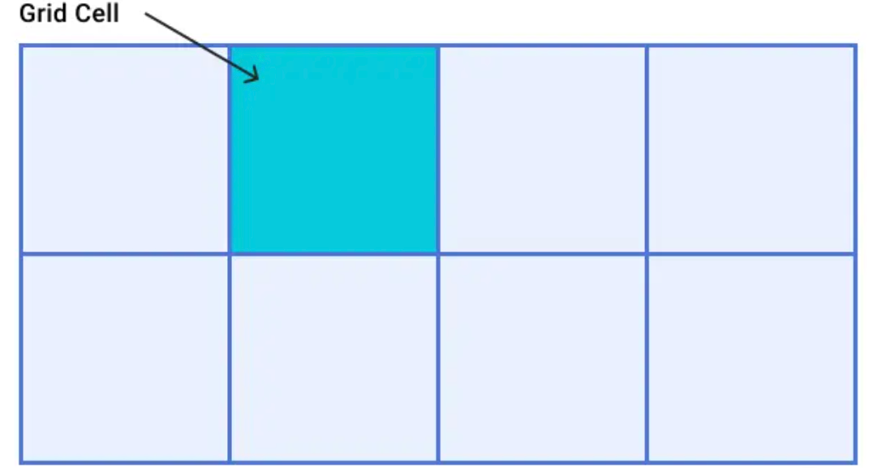

#### [2.5 网格轨道（Grid Tracks）](#)
网格轨道（Grid Track） 指的是两条相邻网格线之间的空间。你可以把它们看成是网格的列或行。

下面是第1行和第2行网格线之间的网格轨道：
- 行轨道:水平方向的"走廊"
- 列轨道:垂直方向的"走廊"
- 内容就在这些轨道里排列

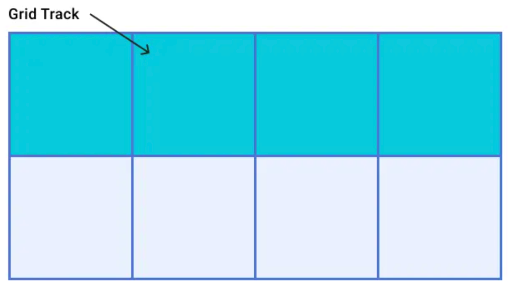

#### [2.6 网格区域（Grid Area）](#)
网格区域（Grid Area） 指的是由四条网格线包围的总空间。一个网格区域可以由任何数量的网格单元组成。

下面是行网格线1和3，列网格线2和4之间的网格区域：

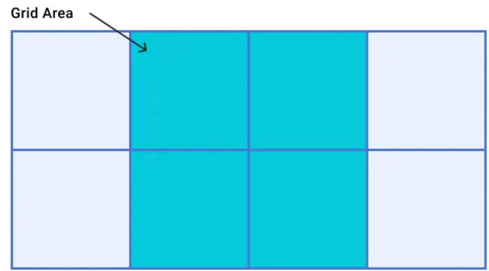


#### [2.7 网格间距（Gaps）](#)
网格间距（Gaps） 指的是轨道之间的间隙。为了确定尺寸，这些东西就像普通的轨道一样。你不能在缝隙中放置内容，但你可以将网格项目跨越它。

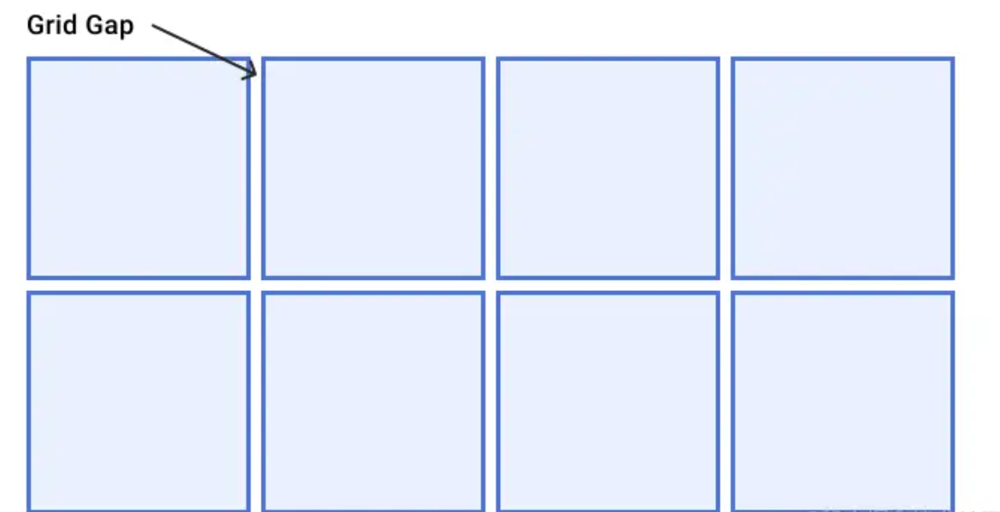

### [3. 创建网格](#)
[grid-template-columns](https://developer.mozilla.org/zh-CN/docs/Web/CSS/Reference/Properties/grid-template-columns) 该属性是基于网格列的维度，去定义网格线的名称和网格轨道的尺寸大小。

[grid-template-rows](https://developer.mozilla.org/zh-CN/docs/Web/CSS/Reference/Properties/grid-template-rows) 该属性是基于 网格行 的维度，去定义网格线的名称和网格轨道的尺寸大小。

可选的值：
- `<track-size>`：可以是一个`长度(px em rem vh wh)`、`一个百分比`，或者使用 `fr` 单位表示网格中自由空间的一部分
    - `repeat( [ <positive-integer> | auto-fill | auto-fit ] ,<track-list> )` 表示网格轨道的重复部分，以一种更简洁的方式去表示大量而且重复列的表达式。
- `<line-name>`：一个你选择的任意的名字
- `auto` 由内容决定轨道宽度，如果该网格轨道为最大时，该属性等同于 `<max-content>`，为最小时，则等同于 `<min-content>`。
    - `备注`：网格轨道大小为 auto（且只有为 auto）时，才可以被属性 `align-content` 和 `justify-content` 拉伸。
```css
.container{
    display: grid;
    /* 定义三列:第一列200px，第二列占1份剩余空间，第三列100px */
    grid-template-columns:200px 1fr 100px;
}
```
**自动填充**: 自动填充是根据容器尺寸，自动设置元素尺寸。

```css
.box {
    margin: 50px auto;
    display: grid;
    grid-template-columns: repeat(auto-fit, 100px);
    grid-template-rows: repeat(auto-fit, 100px);

    width: 300px;
    height: 200px;
    border: 5px solid #3333;
}
.box div {
    padding: 20px;
    background-clip: content-box;
    background-color: blueviolet;
    border: 1px solid #d2d0d0;
}
```

使用 minmax 方法可以设置取值范围，下列在行高在 最小50px ~ 最大1fr 间取值。
```html
<style>
    .box {
    margin: 50px auto;
    min-width: 150px;
    height: 200px;
    display: grid;
    grid-template-columns: repeat(3, minmax(50px, 1fr));
    grid-template-rows: repeat(2, minmax(100px, 1fr));
    border: 5px solid #d0d0d0;
    }
    .box div {
    background-clip: content-box;
    background-color: blueviolet;
    color: #fff;
    font-size: 20px;
    border: 1px solid #d0d0d0;
    }
</style>

<body>
    <div class="box">
        <div>1</div>
        <div>2</div>
        <div>3</div>
        <div>4</div>
    </div>
</body>
```


#### [3.1 fr的优势](#)
[fr](https://developer.mozilla.org/zh-CN/docs/Web/CSS/Reference/Values/flex_value) 表示了网格（grid）容器中的一段可变长度。于 grid-template-columns、grid-template-rows 及相关属性中使用。
- 自动计算:浏览器处理所有计算
- 间距友好:自动扣除gap空间
- 比例清晰:直观表达空间分配意图

```css
.container{
    display: grid;
    /* 定义3行4列:*/
    grid-template-columns:1fr 1fr 1fr 1fr;
    grid-template-rows:1fr 1fr 1fr;
    gap:5px 5px;

    border: 1px solid gainsboro;
    margin-top: 15px;
    margin-left: 15px;
    background-color: #1062ec;
    padding: 5px;
    width: 800px;
    height: 200px;
    --box-size: 40px;
    & > div{
        background-color: #042326;
        color:white;
        text-align: center;
        line-height: var(--box-size);
    }
}
```

```html
<div class="container">
    <div class="item">1</div>
    <div class="item">2</div>
    <div class="item">3</div>
    <div class="item">4</div>
    <div class="item">5</div>
    <div class="item">6</div>
    <div class="item">7</div>
    <div class="item">8</div>
    <div class="item">9</div>
    <div class="item">10</div>
    <div class="item">11</div>
    <div class="item">12</div>
</div>
```

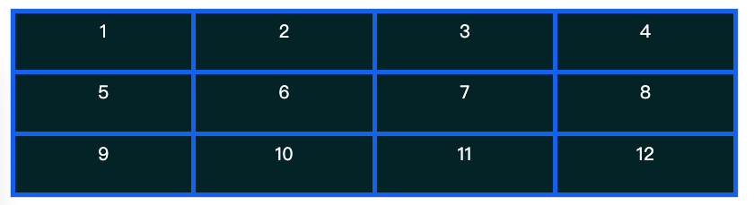

### [4. 基于网格线的精确定位布局](#)
以下属性主要作用在网格项目 Grid Items。

|属性| 描述|
|:---|:-----------|
|`grid-row`	| grid-row-start 和 grid-row-end 的简写属性|
|grid-row-end	| 指定网格元素行的结束位置                                    |
|grid-row-start	| 指定网格元素行的开始位置                                    |
|`grid-column`	| grid-column-start 和 grid-column-end 的简写属性       |
|grid-column-end| 	指定网格元素列的结束位置|
|grid-column-start| 	指定网格元素列的开始位置|


```html
<style>
.container{
    display: grid;
    /* 定义 3行4列（五根列网格线  4根行网格线） */
    grid-template-columns:1fr 1fr 1fr 1fr;
    grid-template-rows:1fr 1fr 1fr;

    border: 1px solid gainsboro;
    background-color: #1062ec;
    width: 500px;
    height: 200px;

    .item-c-r{
        /* 列定位 从第二根列网格线开始 ，到第五根网格线结束 */
        grid-column-start: 2;
        grid-column-end: 5;

        grid-row-start: 2;
        grid-row-end: 4;
        background-color: #042326;
    }
}
</style>

<div class="container">
    <div class="item-c-r"></div>
</div>
```

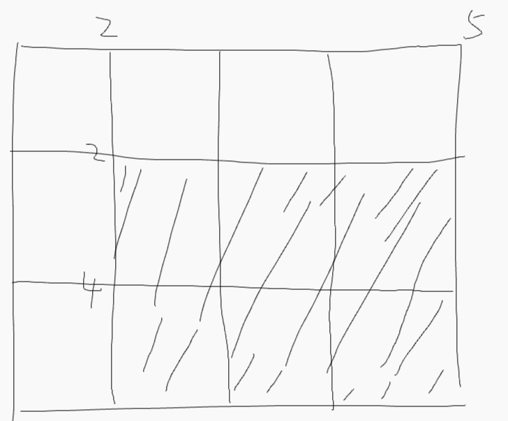

#### [4.1 grid-row](#)
[grid-row](https://developer.mozilla.org/zh-CN/docs/Web/CSS/Reference/Properties/grid-row) 它定义了网格单元与网格行（row）相关的尺寸和位置，可以通过在网格布局中的基线（line）、跨度（span），或者什么也不做（自动），从而指定网格区域的行起始与行结束。

```css
grid-row: 1 / 3;  /*从第一行开始，到第三行结束 占据前两行高度*/
grid-row: 1 / span 2;  /*从第一行开始，到第三行结束 占据前两行高度*/

.item-a {
/* 从第2列开始，向后跨越2个轨道*/
grid-column: 2 / span 2;
}
.item-b {
/* 自动放置，但占据3列的宽度*/
grid-column: span 3;
```

#### [4.2 span 关键字](#)
利用span关键字 创建一个灵活的卡片布局系统

```html
<style>
    .card-container{
        display: grid;
        /* 定义 2行5列（五根列网格线  4根行网格线） */
        grid-template-columns:1fr 1fr 1fr 1fr 1fr;
        grid-template-rows:1fr  1fr;
        border: 1px solid gainsboro;
        background-color: white;
        width: 500px;
        height: 500px;
        grid-gap: 5px 5px;
        .card-small {
            /* 小卡片：跨越1列1行 */
            grid-column: span 1;
            grid-row: span 1;
            background: #ffeaa7;
        }

        .card-medium {
            /* 中等卡片：跨越2列1行 */
            grid-column: span 2;
            grid-row: span 1;
            background: #fab1a0;
        }

        .card-large {
            /* 大卡片：跨越2列2行 */
            grid-column: span 2;
            grid-row: span 2;
            background: #fd79a8;
        }

        .card-wide {
            /* 宽卡片：跨越3列1行 */
            grid-column: span 3;
            grid-row: span 1;
            background: #a29bfe;
        }
    }
</style>
<div class="card-container">
    <div class="card-small"></div>
    <div class="card-medium"></div>
    <div class="card-large"></div>
    <div class="card-wide"></div>
</div>
```

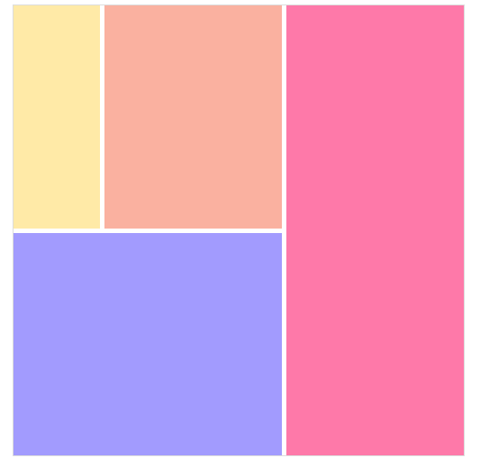

#### [4.3 grid-area](#)
grid-area更加简洁是同时对 grid-row 与 grid-column 属性的组合声明。

```css
grid-area: grid-row-start/grid-column-start/grid-row-end/grid-column-end。
/* grid-area:2/2/3/3 */
```

### [5. 命名网格区域在响应式设计中的优势](#)
grid-template-areas 通过引用 grid-area 属性指定的网格区域的名称，定义一个网格模板。重复一个网格区域的名称会使内容跨越这些单元格。一个句号表示一个空单元。语法本身提供了一个可视化的网格结构。

```css
.container {
  grid-template-areas: 
    "<grid-area-name> | . | none | ..."
    "...";
}
```

```css
.item-a {
  grid-area: header;
}
.item-b {
  grid-area: main;
}
.item-c {
  grid-area: sidebar;
}
.item-d {
  grid-area: footer;
}

.container {
  display: grid;
  grid-template-columns: 50px 50px 50px 50px;
  grid-template-rows: auto;
  grid-template-areas: 
    "header header header header"
    "main main . sidebar"
    "footer footer footer footer";
}
```
这将创建一个四列宽、三行高的网格。整个顶行将由页眉区域组成。中间一行将由两个主要区域、一个空单元和一个侧边栏区域组成。最后一行是所有的页脚。

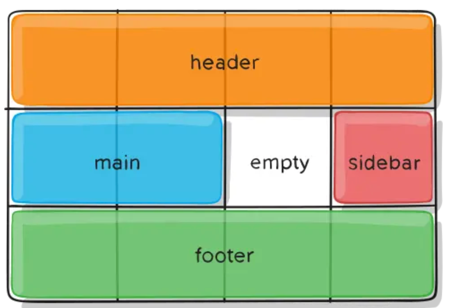


#### [5.1 grid-template-areas](#)
```html
<style>
    .grid-container {
        display: grid;
        grid-template-areas: 
            "header header1 header2"
            "main1 main2 sidebar"
            "footer footer1 footer2";
        grid-template-columns: 2fr 1fr 1fr;
        grid-template-rows: 100px auto 100px;
        gap: 10px;
    }

    .header     { grid-area: header; background: #d0e; }
    .header1    { grid-area: header1; background: #cce; }
    .header2    { grid-area: header2; background: #ace; }
    .main1      { grid-area: main1; background: #eda; }
    .main2      { grid-area: main2; background: #ebf; }
    .sidebar    { grid-area: sidebar; background: #bee; }
    .footer     { grid-area: footer; background: #ffc; }
    .footer1    { grid-area: footer1; background: #ffa; }
    .footer2    { grid-area: footer2; background: #eef; }
</style>

<div class="grid-container">
  <div class="header">Header</div>
  <div class="header1">Header1</div>
  <div class="header2">Header2</div>
  <div class="main1">Main1</div>
  <div class="main2">Main2</div>
  <div class="sidebar">Sidebar</div>
  <div class="footer">Footer</div>
  <div class="footer1">Footer1</div>
  <div class="footer2">Footer2</div>
</div>
```

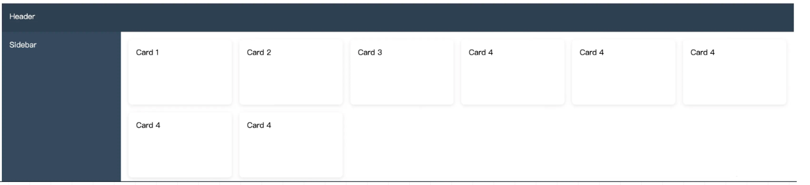

```html
<div class="dashboard-grid">
  <header class="header">Header</header>
  <aside class="sidebar">Sidebar</aside>
  <main class="main">
    <div class="card">Card 1</div>
    <div class="card">Card 2</div>
    <div class="card">Card 3</div>
    <div class="card">Card 4</div>
  </main>
</div>
```

```css
.dashboard-grid {
  display: grid;
  grid-template-areas:
    "header header"
    "sidebar main";
  grid-template-columns: 250px 1fr;
  grid-template-rows: 60px 1fr;
  height: 100vh;
}

.header {
  grid-area: header;
  background: #2d3e50;
  color: white;
  padding: 1rem;
}

.sidebar {
  grid-area: sidebar;
  background: #34495e;
  color: white;
  padding: 1rem;
}

.main {
  grid-area: main;
  padding: 1rem;
  display: grid;
  grid-template-columns: repeat(auto-fill, minmax(200px, 1fr));
  gap: 16px;
}

.card {
  background: white;
  padding: 1rem;
  border-radius: 8px;
  box-shadow: 0 2px 8px rgba(0, 0, 0, 0.1);
}
```
