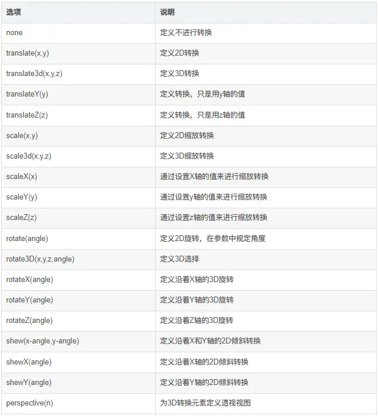
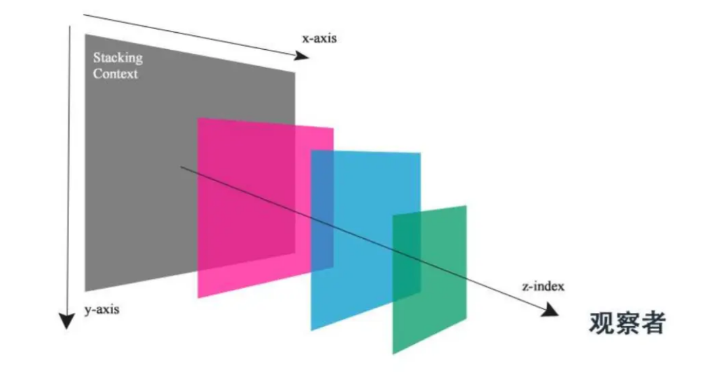
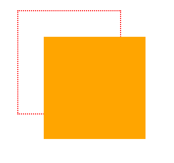
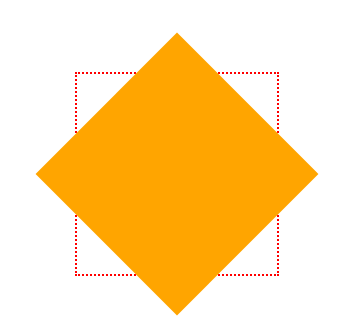
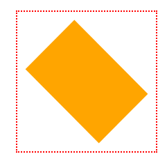

## [Transform 变换](#)
> **介绍**：CSS transform 属性允许你旋转、缩放、倾斜或平移给定元素。这是通过修改 CSS 视觉格式化模型的坐标空间实现的。

-----

### [1. 属性大纲](#)

| 属性                                                                                    | CSS  | 继承性	 | 简介                        |
|:--------------------------------------------------------------------------------------|:-----|:-----|:--------------------------|
| [transform](https://developer.mozilla.org/zh-CN/docs/Web/CSS/transform) | CSS3 | 无继承  | 使用各种子函数实现2D/3D位移、旋转、放缩、变形 |
| [transform-box](https://developer.mozilla.org/zh-CN/docs/Web/CSS/transform-box)       |      CSS3 | 无继承      | 定义了与 transform、transform-origin 这两个属性有关联的布局框。  |
| [transform-origin](https://developer.mozilla.org/zh-CN/docs/Web/CSS/transform-origin) |      CSS3 | 无继承    |CSS 属性让你更改一个元素变形的原点。|
| [transform-style](https://developer.mozilla.org/zh-CN/docs/Web/CSS/transform-style)   |     CSS3 | 无继承      |  设置元素的子元素是位于 3D 空间中还是平面中。   |

使用 transform 来控制元素变形操作，包括控制移动、旋转、倾斜、3D转换等。


#### 1.1 教学例子
- [CSS3-2D变换与3D变换、过渡与动画一文全搞定](https://juejin.cn/post/6918049507884138510?searchId=20241004112725C11F1E18BB412BC932C0)

#### 1.2 坐标系统




* X轴代表水平轴
* Y轴代表垂直轴
* Z轴代表纵深轴
  * Z轴数值越大，说明观测距离越远。
  * Z轴的数值可以无限大，所以设置的时候一定要小心。


### [2. 2D变换](#)

**变换的原点** 原点就是元素的中心，可以通过transform-origin属性改变原点位置
* 默认值为transform-origin: center center;
* 除了位移(因为位移元素直接移跑了)，别的变换(旋转、缩放、变形）都是围绕原点变换的
* 原点关键字：top bottom center left right
* 只设置一个的话，另一个为默认值center
* 也可以使用px、em、百分比值(一般用不到)
* 设置的偏移值都是从元素左上角开始的

**变换的特点**
* 变换之后的元素不会脱离文档流
* 可以移出屏幕边缘或遮挡住旁边其他元素
* 行内元素需要改变元素的display为block或inline-block，或者改变其父元素的display为flex或grid后，才能使用变换
* 可以使用多重变换，用空格隔开，变换的每个值从右向左依次执行，通常将平移放到首位，最后执行。

#### [2.1 位移：translate translateX translateY](#)
translate()函数可以将元素向指定的方向移动，类似于position中的relative。或以简单的理解为，使用translate()函数，可以把元素从原来的位置移动，而不影响在X、Y轴上的任何Web组件。

* 一个参数：translate(x)，代表沿x轴位移x像素，y轴默认为0
* 两个参数：translate(x, y)，代表沿x轴和y轴位移的距离
  * x、y单位为px
  * x值：为正则沿着x轴向右位移，为负则沿着x轴向左位移
  * y值：为正则沿着y轴向下位移，为负则沿着y轴向上位移
  * 如果是通过active进行位移，执行完毕后会还原
  * 单独写法：translateX(x) translateY(y)
  * 位移的参考原点为元素左上角

```css
.wrapper {
  width: 200px;
  height: 200px;
  border: 2px dotted red;
  margin: 100px auto;

}
.wrapper div{
  transition: all 2s;
  transition-timing-function: linear;
  background: white;
  width: 100px;
  height: 100px;
}
.wrapper:hover div {
  width: 200px;
  height: 200px;
  line-height: 200px;
  text-align: center;
  background: orange;
  color: #fff;
  transform: translate(50px,50px);
}
```

```html
<main class="wrapper">
    <div></div>
</main>
```



#### [2.2 rotate](#)
旋转rotate()函数通过指定的角度参数使元素相对原点进行旋转。旋转不仅可以是固定的度数，还可以是动态变化的，创造出无限的可能性。

* rotate(angle)：参数只有一个
* 参数为旋转的角度，单位为deg
* **2d空间只能围绕元素中心的z轴旋转**
* 参数为正值则顺时针旋转，为负值则逆时针旋转
* 默认为围绕元素中心为原点进行旋转

```css
.wrapper:hover div {
  width: 200px;
  height: 200px;
  line-height: 200px;
  text-align: center;
  background: orange;
  color: #fff;
  transform: translate(50px,50px) rotate(45deg);
}
```



#### [2.3 skew skewX skewY](#)
扭曲skew()函数能够让元素倾斜显示。这种效果常常用于模拟速度感或者倾斜的视觉效果。

它可以将一个对象以其中心位置围绕着X轴和Y轴按照一定的角度倾斜。这与rotate()函数的旋转不同，rotate()函数只是旋转，而不会改变元素的形状。
* 一个参数：skew(x)，代表沿x轴变形x角度，y轴默认为0
* 两个参数：skew(x, y)，代表沿x轴变形x的角度，沿y轴变形y的角度
* 参数为变形的角度，单位为deg
* x值：为正则向左变形，为负则向右变形
* y值：为正则向上变形，为负则向下变形
* 单独写法：skewX(x)  skewY(y)
* 默认为围绕元素中心为原点进行变形

#### [2.4 scale](#)
缩放 scale()函数 让元素根据中心原点对对象进行缩放。这不仅可以用来模拟放大镜效果，还可以创造出元素的进入和退出动画，比如一个图片慢慢缩小直至消失。

* 一个参数：scale(num)，代表同时在x轴和y轴两个方向缩放相同的倍数
* 两个参数：scale(x, y) ，分别代表x和y轴方向缩放相应的倍数
* 参数为数字，无单位
* 默认值为1倍，就是不缩放
* 默认为围绕元素中心为原点进行缩放
* scaleX(x)元素仅水平方向缩放（X轴缩放）
* scaleY(y)元素仅垂直方向缩放（Y轴缩放）

```css
.wrapper:hover>div {
    text-align: center;
    background: orange;
    color: #fff;
    transform: translate(50px,50px) rotate(45deg) scale(1.5,1);
}
```

