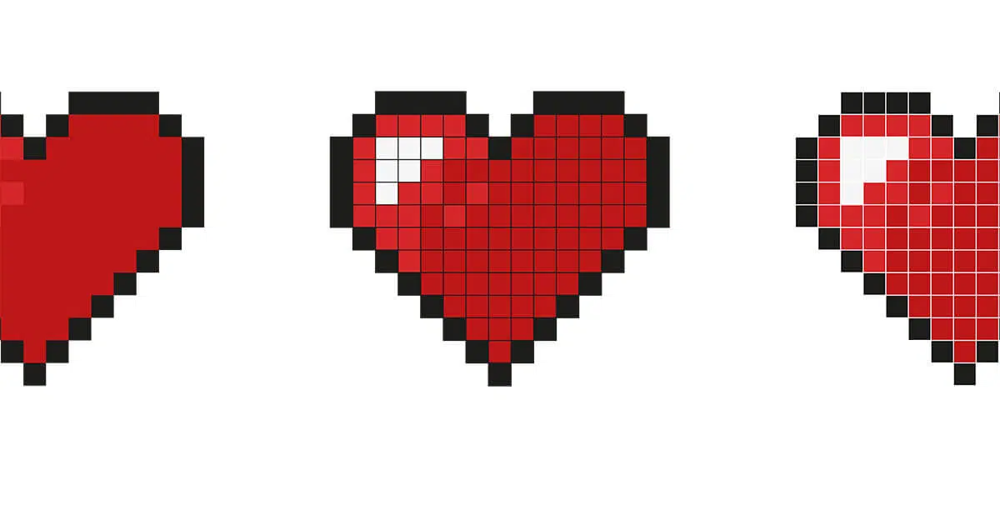

## [WEB 像素、分辨率、DPI](#)
> **介绍**：PPI 和 DPI 是两个经常被混用，但实际上完全不同的概念。它们分别属于`屏幕领域`和`打印领域`。

-----

- [1. 理解像素和分辨率的概念](#1-理解像素和分辨率的概念)
- [2. 分辨率](#2-分辨率)
- [3. PPI](#3-ppi)
- [4. DPI](#4-dpi)

------

### 1. 理解像素和分辨率的概念
屏幕设备是由成千上万个小灯泡（发光单元）组成，图像是由成千上万个点阵格子组成，而每个点阵格子就可以是由一个或多个小灯泡形成像素单元，设备控制所有像素单元的颜色形成我们看见的图像。

#### [1.1 像素](#)
“Pixel”一词来源于 “Picture Element”，意思是“图像元素”。像素是指由图像的小方格组成的，这些小方块都有一个明确的位置和被分配的色彩数值，小方格颜色和位置就决定该图像所呈现出来的样子。

可以将像素视为整个图像中不可分割的单位或者是元素。不可分割的意思是它不能够再切割成更小单位抑或是元素，它是以一个单一颜色的小格存在。

像素（Pixel）:数字图像中最小的可显示或可编辑的图像单元。
- **值**：每个像素记录了一个颜色信息（如 RGB 三色值），就像一块小小的彩色方格,使用三个字节(255,255,255)，允许它们显示最多 16777216种不同的颜色.
- **发光单元**:在显示器或手机屏幕上，每个像素都是一个发光单元。

像素不仅在数字显示器中很重要，它们在现实世界中也发挥着至关重要的作用 打印 和 数字艺术。在印刷图像中，密度的测量单位是 DPI （每英寸点数）。为了获得高质量的图像 专业的，一般采用300 DPI的分辨率，而在显示器上显示，72 DPI对于人眼来说已经足够了。

而分辨率通常用 水平像素数x垂直像素数 来表示

一张 1920×1080 的图片，表示它有 1920 像素宽 × 1080 像素高，总像素数量是：1920 × 1080 ≈ 207 万像素（约 2MP）

#### [1.2 分辨率](#)
“分辨率”这个词有多种常见含义

- 图像分辨率（像素尺寸）：指图片的像素宽度和高度，比如 1920×1080。也就是我们平时经常问别人的：“这张图片的分辨率是多少？”其实我们问的是像素尺寸。
- 打印分辨率（DPI ） DPI (Dots Per Inch)：每英寸打印多少点，用于打印机。
- 屏幕分辨率（PPI） PPI (Pixels Per Inch)：每英寸显示多少像素，用于屏幕。（每英寸说的不是面积。可以理解为宽度是1像素长度是1英寸的一条线。）

### [2. 分辨率](#)
分辨率越高，画面就越清晰，细节就越丰富。

有些4K显示器能做到3840x2160的分辨率，8K显示器甚至还能做到7680x4320，同样是1080P的画面，4K显示器能够开启200%缩放效果，使用4个像素点去渲染1个像素点，8K甚至可以开启400%缩放效果，用16个像素点去渲染1个像素点，这在处理一些斜线的绘制时，细腻效果尤为突出，像素点越少，锯齿感越明显，所以很多游戏都会有抗锯齿选项来通过一些算法来弥补像素点不足导致的锯齿感。

#### 2.1 “P”的含义
**垂直分辨率** 咱们先来说说“P”，像720P、1080P这样的标识，“P”代表的是“逐行扫描”，英文是Progressive，与之相对的是隔行扫描（Interlaced）。这里的数字，比如720P，指的是视频像素的总行数，也就是说，720P的视频有720行像素；1080P的视频则有1080行像素。一般1080P分辨率的摄像机，像素数是1920×1080。

#### 2.2 “K”的含义
**水平分辨率** 再看看“K”，2K、4K等标识里的“K”，表示的是“视频像素的总列数”。以4K为例，它意味着视频有大约4000列像素数，具体可能是3840列，也可能是4096列。4K分辨率的摄像机，像素数通常是3840×2160或者4096×2160。

#### 2.3 “MP”的含义
“MP”代表的是**像素总数**，也就是像素的行数（P）和列数（K）相乘得到的结果（单位是百万像素）。比如说，1080P摄像机，1920像素乘以1080像素，就得到2MP（百万像素）的像素总数。

### [3. PPI](#)
PPI (Pixels Per Inch) 每英寸（1英寸=2.54厘米）的像素数量，用来描述 图像、屏幕、数字文件 的清晰度。

> PPI 是图像本身的清晰度，DPI 是打印机打印能力。

例如 iPhone XS 可以描述为 5.8 英寸 (对角线) OLED 全面屏，2436 x 1125 像素分辨率，458 PPI。

### [4. DPI](#)
用来表示打印像素密度，例如 `600*600`dpi 表示打印机可以在每平方英寸上输出`600*600` 个输出点。

> PPI 是图像本身的清晰度，DPI 是打印机打印能力。

DPI（Dots Per Inch，每英寸点数）是衡量图像分辨率和打印质量的重要指标。它表示在一英寸（2.54厘米）的长度内包含多少个像素点或打印点。DPI值越高，图像越清晰细腻，但文件体积也相应增大。

**DPI = 像素数量 ÷ 物理尺寸（英寸）**