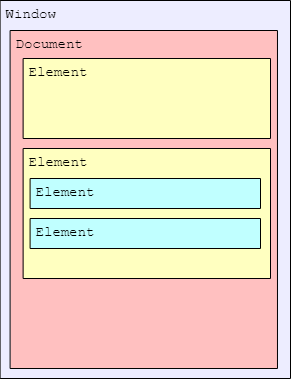

## [JavaScript DOM编程](#)
**介绍**：文档对象模型（DOM，Document Object Model）是 HTML 和 XML 文档的编程接口。DOM 表示
由多层节点构成的文档，通过它开发者可以添加、删除和修改页面的各个部分。

----

- [一、DOM基本概念](#)

----

### [一、DOM基本概念](#)
**DOM**(Document Object Model, 文档对象模型)是文档内容（HTML或XML）在编程语言上的抽象模型，它建模了文档的内容和结构，并提供给编程语言一套完整的操纵文档的API。
* DOM节点：简称节点（Node），是DOM模型的组成单元。HTML的基本单元是标签，节点常常与标签对应，但连续的文本内容也是一个文本标签。
* DOM树：DOM树是DOM结构的表示形式，DOM把文档的每个节点根据父子关系连接，形成DOM树。

```html
<html>
 <head>
    <title>Sample Page</title>
 </head>
 <body>
    <p>Hello World!</p>
 </body>
</html> 
```
以此HTML文档为例：




**document** 节点表示每个文档的根节点。在这里，根节点的唯一子节点是 `<html>` 元素，我们称之为**文档元素**（**documentElement**）。
文档元素是文档最外层的元素，所有其他元素都存在于这个元素之内。每个文档只能有一个文档元素。在 HTML 页面中，文档元素始终是`<html>`元素。

HTML 中的每段标记都可以表示为这个树形结构中的一个节点。元素节点表示 HTML 元素，属性
节点表示属性，文档类型节点表示文档类型，注释节点表示注释。DOM 中总共有**12** 种节点类型，这些
类型都继承一种基本类型。


#### [1.1 Node 类型、nodeType](#)
DOM1 级定义了一个 Node 接口, 该接口将由 DOM 中的所有节点类型实现. 这个 Node
接口在 js 中是作为 Node 类型实现的; js 中的所有节点类型都继承自 Node 类型,
因此所有节点类型都共享着相同的基本属性和方法.

每个节点都有一个 **nodeType(节点类型)** 属性, 用于表明节点的类型. 节点类型由在
Node 类型中定义的下列 12 个数值常量来表示, 任何节点类型都必居其一:
+ `Node.element_node(1)`;
+ `Node.attribute_node(2)`;
+ `Node.text_node(3)`;
+ `Node.cdata_section_node(4)`;
+ `Node.entity_reference_node(5)`;
+ `Node.entity_node(6)`;
+ `Node.processing_instruction_node(7)`;
+ `Node.comment_node(8)`;
+ `Node.document_node(9)`;
+ `Node.document_type_node(10)`;
+ `Node.document_fragment_node(11)`;
+ `Node.notation_node(12)`;

确定一个元素是哪种节点类型:
```js
let btn_rid = document.getElementById("rid");

if (btn_rid.nodeType === Node.DOCUMENT_NODE){
    console.log("this is a document_node");
}else if (btn_rid.nodeType === Node.ELEMENT_NODE){
    console.log("this is a element node");
}
```

浏览器并不支持所有节点类型。开发者最常用到的是元素节点、属性节点和文本节点。
* 元素节点: 类型常量为 `Node.ELEMENT_NODE`或1。最常见的一类节点，对应文档中的元素。大部分DOM操作都是在元素节点层次的。
* 文本节点：类型常量为 `Node.TEXT_NODE` 或2。对应文档中的文本，任何文档内容都有对应的文本节点，即使空格和换行符。
* Document节点：类型常量为 `Node.DOCUMENT_NODE` 或9。它不对应文档的内容，而是作为文档的入口节点，每个文档都有且仅有一个入口，因为这种独特性，赋予一个特殊的变量名称document。
* 注释节点：类型常量为 `Node.COMMENT_NODE` 或8。它对应文档中的注释标签，文档的注释内容也是可读取和修改的。

> 空格和换行不会对页面内容产生影响，但它们确实以文本节点的形式存在于DOM树中。

#### [1.2 nodeName 与 nodeValue](#)
nodeName 与 nodeValue 保存着有关节点的信息。这两个属性的值完全取决于节点类型。在使用
这两个属性前，最好先检测节点类型，如下所示：

```javascript
if (someNode.nodeType == 1){
 value = someNode.nodeName; // 会显示元素的标签名
}

let button = document.getElementById("button_html");

console.warn(button.nodeName);//BUTTON
```
**nodeValue** 是 JavaScript 中用于访问或修改节点值的属性。它适用于文本节点、注释节点等，但不适用于元素节点（对于元素节点，应该使用 `innerHTML` 或 `textContent` 等属性）。

以下是关于如何使用 `nodeValue` 的一些要点：

1. **获取节点值**：你可以通过选择一个节点并访问其 `nodeValue` 属性来获取该节点的值。例如，对于文本节点，`nodeValue` 返回文本内容。
2. **设置节点值**：同样地，你也可以通过给 `nodeValue` 赋值来改变节点的值。
3. **适用范围**：需要注意的是，并不是所有的节点类型都有 `nodeValue`。比如，元素节点（如 `<div>`、`<p>` 等标签）的 `nodeValue` 总是 `null`。通常，`nodeValue` 主要用于处理文本节点和注释节点。

下面是一个简单的例子，演示了如何使用 `nodeValue` 来获取和设置文本节点的值：
```javascript
// 创建一个新的文本节点
let textNode = document.createTextNode("原始文本");

// 获取文本节点的nodeValue
console.log(textNode.nodeValue); // 输出: "原始文本"

// 设置文本节点的nodeValue
textNode.nodeValue = "更新后的文本";
console.log(textNode.nodeValue); // 输出: "更新后的文本"

// 将文本节点添加到文档中某个元素内
document.getElementById("someElementId").appendChild(textNode);
```
在这个例子中，我们首先创建了一个文本节点，并通过 `nodeValue` 属性获取和设置它的值。最后，我们将这个文本节点添加到了文档的一个指定元素中。

请注意，在实际应用中，直接操作 `nodeValue` 的场景相对较少，更多时候我们会操作元素的内容通过 `innerHTML` 或者 `textContent` 等属性。但是了解 `nodeValue` 对于理解 DOM 操作的基础概念仍然是很有帮助的。

#### [1.3 节点、节点类型和节点类](#)
**节点**：前节点是DOM树的组成单元。在JS看来，一个节点就是JS对象。下面用node表示任意的节点。

**节点类型**：并非所有的节点都是一样的，DOM规定文档中有12种节点类型，分别用常量1 ~ 12（有与之对应的常量名称Node.XXX_NODE）表示，可以通过node.nodeType属性获取节点的类型常量。

**节点类/HTML 元素接口**：DOM内置许多节点类，类之间存在继承关系，形成一套节点类框架。每个节点对象都属于节点类，拥有该类和其父类的方法与属性，这使得操作节点十分简单。节点类框架的一部分大概如图：

HTML 元素接口: [https://developer.mozilla.org/zh-CN/docs/Web/API/HTML_DOM_API](https://developer.mozilla.org/zh-CN/docs/Web/API/HTML_DOM_API)

通过引入 HTMLElement 接口，Element 接口被进一步调整为专门表示 HTML 元素，所有更具体的 HTML 元素类都继承自它。这扩展了 Element 类，以向元素节点添加了特定于 HTML 的通用特性。HTMLElement 添加的属性包括 hidden 和 innerText 等。


例如，考虑 `<a>` 元素，在 DOM 中由类型为 HTMLAnchorElement 的对象表示。获得了 `a.target，a.download` 等属性，接着继
承了HTMLElement类上的 `title, hidden` 等属性和 `click()` 等方法，又从 Element 类继承了 `tagName`, `className` 等属
性和 `getAttribute()`, `setAttribute()` 等方法，再从Node类继承了nodeType(前面说过的节点类型), 
`appenChild(), removeChild()` 等方法，最后从EventTarget类中继承了事件相关的属性和方法。

> 不要混淆节点类型和节点类这两个概念。前者是一个生活中的类别，后者是编程意义上的类。节点对象的nodeType属性表示了它的类型，而节点类是该节点的从属的类。因为Dode是一个抽象类，所以，如果知道了某个节点从属的类，我们就知道它的节点类型。

> 区分节点与元素节点。我们经常关心元素节点（简称元素），因为这是一类最常使用的节点，但是并非所有节点都是元素。

```html
<!DOCTYPE HTML>
<html>
<body>
  A simple text.
  <ol title="this is a title">
    <li>czpcalm</li>
    <!-- comment -->
  </ol>
</body>
</html>
```
**DOM结构图**
```html
Document
│
└───HTML
    │
    └───Body
        │
        ├── Text Node: "\n  A simple text.\n  "
        │
        └── OL (Ordered List)
            │ Attributes: title="this is a title"
            │
            ├── Text Node: "\n    " 
            │
            ├── LI (List Item)
            │   │
            │   └── Text Node: "czpcalm"
            │
            ├── Text Node: "\n    "
            │
            └── Comment Node: " comment "
            │
            └── Text Node: "\n  "
        │
        └── Text Node: "\n"
```
文档中的文本都会形成文本节点的内容，包括**空格**和**换行**。
* 第一,单独的空格和换行都会形成对应的文本节点；
* 第二，有内容的文本节点的值包含前导和后继的空白。

不是说HTML中的空白字符都被忽略吗？怎么这里又说全都是有效的字符？
> 在从文档解析生成DOM树的过程中，HTML中的任何字符都是有效的；不过，在接下去的**页面渲染的过程中，空白内容被忽略**。所以从文档到页面的整过过程中，空白确实被忽略了。
#### [1.4 节点关系](#)
文档中所有的节点之间都存在这样或那样的关系. 节点间的各种关系可以用传统的家族关系来描述, 相当于把文档树比喻成家谱. 在 HTML 中,
可以将 `<body>` 元素看成是 `<html>` 元素的子元素; 相应地, 也就可以将`<html>` 元素看成是 `<body>` 元素的父元素. 而 `<head>` 元素,
则可以看成是 `<body>` 元素的同胞元素, 因为它们都是同一个父元素 `<html>`的直接子元素。

**childNodes**
> 每个节点都有一个 `childNodes` 属性, 其中保存着一个 **NodeList**对象.  NodeList 是一种类数组对象, 用于保存一组有序的节点,
可以通过位置来访问这些节点. 请注意, 虽然可以通过方括号语法来访问 NodeList 的值, 而且这个对象也有 `length` 属性, 但它并不是 `Array` 的实例. NodeList
对象的独特之处在于, 它实际上是基于 DOM 结构动态执行查询的结果, 因此 DOM 结构的变化能够自动反映在 NodeList 对象中. 我们常说,  NodeList 是有生命, 有呼吸的对象, 而不是在我们第一次访问它们的某个瞬间拍摄下来的一张快照. 

```javascript
let firstChild = someNode.childNodes[0];
let secondChild = someNode.childNodes.item(1);
let count = someNode.childNodes.length; 
```
使用 Array.prototype.slice()可以像前面介绍 arguments 时一样把 NodeList 对象转换为数组。

```javascript
let arrayOfNodes = Array.prototype.slice.call(someNode.childNodes,0); 
```
当然，使用 ES6 的 Array.from()静态方法，可以替换这种笨拙的方式：
```javascript
let arrayOfNodes = Array.from(someNode.childNodes); 
```