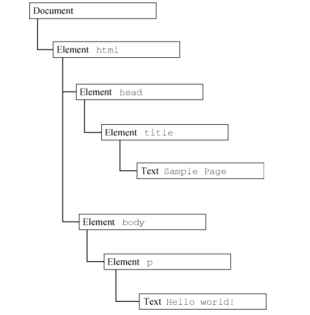
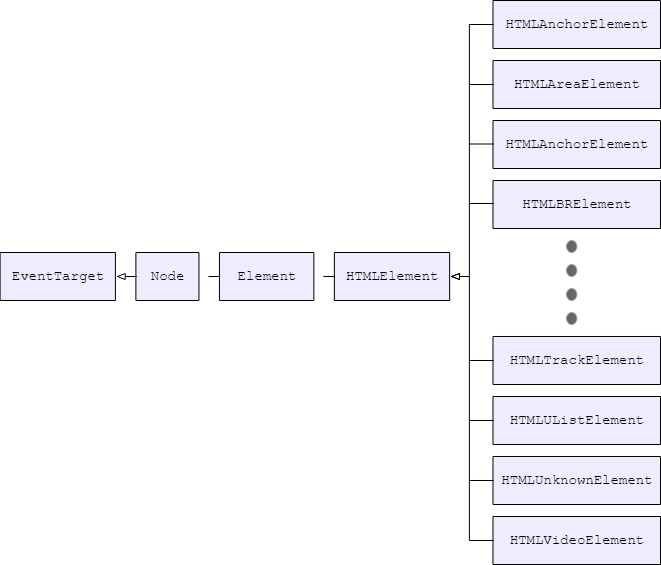
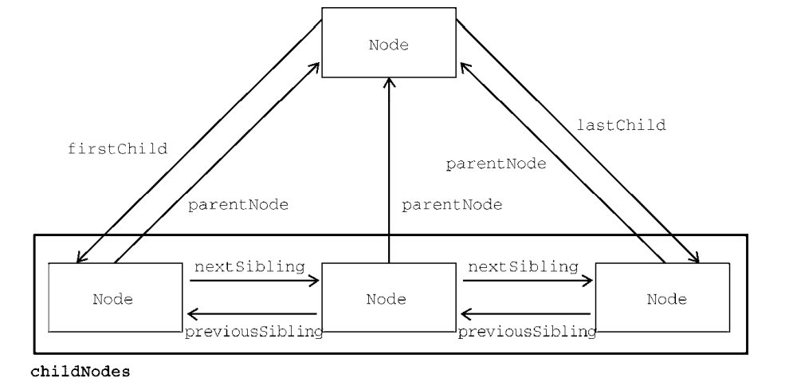
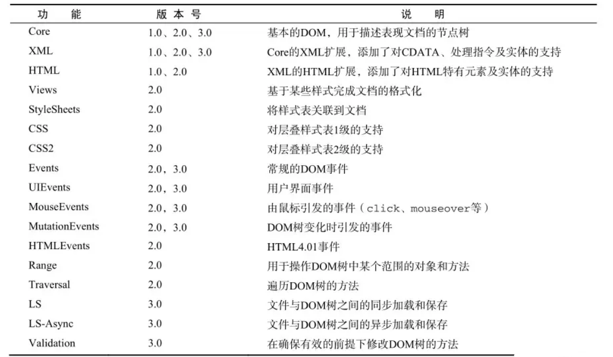
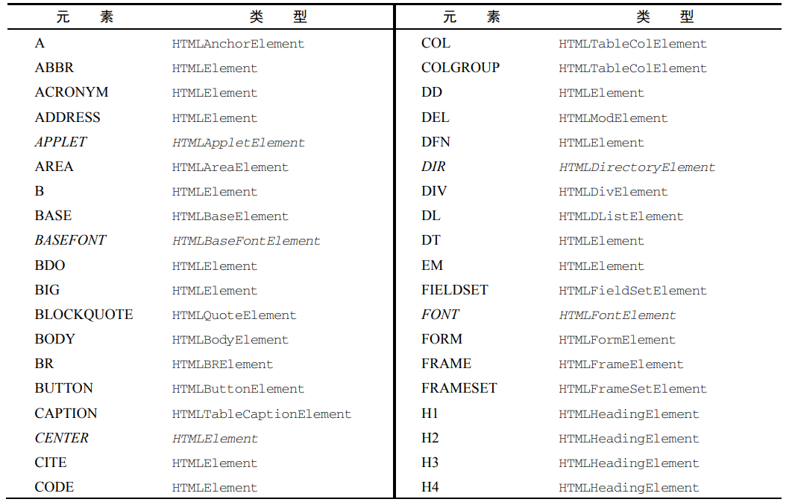
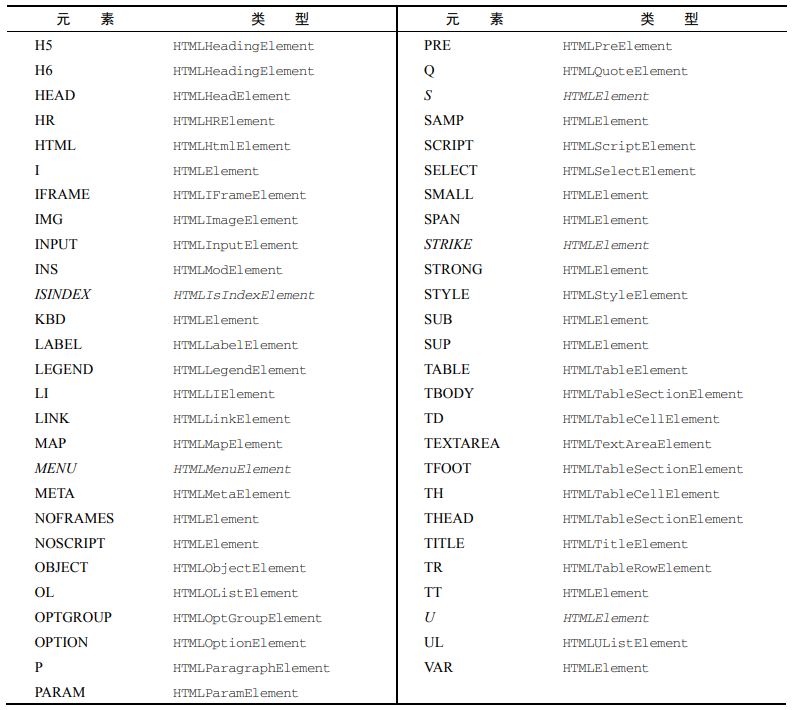

## [JavaScript DOM编程](#)
**介绍**：文档对象模型（DOM，Document Object Model）是 HTML 和 XML 文档的编程接口。DOM 表示
由多层节点构成的文档，通过它开发者可以添加、删除和修改页面的各个部分。

----

- [1、DOM基本概念](#)
- [2、Document节点类型](#2document节点类型)
- [3、Element节点类型](#3element节点类型)
- [4、Text类型](#4text-类型)
- [5、其他Node类型](#5其他node类型)

----

### [1、DOM基本概念](#)
**DOM**(Document Object Model, 文档对象模型)是文档内容（HTML或XML）在编程语言上的抽象模型，它建模了文档的内容和结构，并提供给编程语言一套完整的操纵文档的API。
* DOM节点：简称节点（Node），是DOM模型的组成单元。HTML的基本单元是标签，节点常常与标签对应，但连续的文本内容也是一个文本标签。
* DOM树：DOM树是DOM结构的表示形式，DOM把文档的每个节点根据父子关系连接，形成DOM树。

```html
<html>
 <head>
    <title>Sample Page</title>
 </head>
 <body>
    <p>Hello World!</p>
 </body>
</html> 
```
以此HTML文档为例：



**document** 节点表示每个文档的根节点。在这里，根节点的唯一子节点是 `<html>` 元素，我们称之为**文档元素**（**documentElement**）。
文档元素是文档最外层的元素，所有其他元素都存在于这个元素之内。每个文档只能有一个文档元素。在 HTML 页面中，文档元素始终是`<html>`元素。

HTML 中的每段标记都可以表示为这个树形结构中的一个节点。元素节点表示 HTML 元素，属性
节点表示属性，文档类型节点表示文档类型，注释节点表示注释。DOM 中总共有**12** 种节点类型，这些
类型都继承一种基本类型。


#### [1.1 Node 类型、nodeType](#)
DOM1 级定义了一个 Node 接口, 该接口将由 DOM 中的所有节点类型实现. 这个 Node
接口在 js 中是作为 Node 类型实现的; js 中的所有节点类型都继承自 Node 类型,
因此所有节点类型都共享着相同的基本属性和方法.

每个节点都有一个 **nodeType(节点类型)** 属性, 用于表明节点的类型. 节点类型由在
Node 类型中定义的下列 12 个数值常量来表示, 任何节点类型都必居其一:
+ `Node.element_node(1)`;
+ `Node.attribute_node(2)`;
+ `Node.text_node(3)`;
+ `Node.cdata_section_node(4)`;
+ `Node.entity_reference_node(5)`;
+ `Node.entity_node(6)`;
+ `Node.processing_instruction_node(7)`;
+ `Node.comment_node(8)`;
+ `Node.document_node(9)`;
+ `Node.document_type_node(10)`;
+ `Node.document_fragment_node(11)`;
+ `Node.notation_node(12)`;

确定一个元素是哪种节点类型:
```js
let btn_rid = document.getElementById("rid");

if (btn_rid.nodeType === Node.DOCUMENT_NODE){
    console.log("this is a document_node");
}else if (btn_rid.nodeType === Node.ELEMENT_NODE){
    console.log("this is a element node");
}

node.nodeType === Node.ELEMENT_NODE; //或node.nodeType === 1;
node instanceof Element;       //与上面等效
node instanceof HTMLInputElement;   //判断是否是输入元素
```

浏览器并不支持所有节点类型。开发者最常用到的是元素节点、属性节点和文本节点。
* 元素节点: 类型常量为 `Node.ELEMENT_NODE`或1。最常见的一类节点，对应文档中的元素。大部分DOM操作都是在元素节点层次的。
* 文本节点：类型常量为 `Node.TEXT_NODE` 或2。对应文档中的文本，任何文档内容都有对应的文本节点，即使空格和换行符。
* Document节点：类型常量为 `Node.DOCUMENT_NODE` 或9。它不对应文档的内容，而是作为文档的入口节点，每个文档都有且仅有一个入口，因为这种独特性，赋予一个特殊的变量名称document。
* 注释节点：类型常量为 `Node.COMMENT_NODE` 或8。它对应文档中的注释标签，文档的注释内容也是可读取和修改的。

> 空格和换行不会对页面内容产生影响，但它们确实以文本节点的形式存在于DOM树中。

#### [1.2 nodeName 与 nodeValue](#)
nodeName 与 nodeValue 保存着有关节点的信息。这两个属性的值完全取决于节点类型。在使用
这两个属性前，最好先检测节点类型，如下所示：

```javascript
if (someNode.nodeType == 1){
 value = someNode.nodeName; // 会显示元素的标签名
}

let button = document.getElementById("button_html");

console.warn(button.nodeName);//BUTTON
```
**nodeValue** 是 JavaScript 中用于访问或修改节点值的属性。它适用于文本节点、注释节点等，但不适用于元素节点（对于元素节点，应该使用 `innerHTML` 或 `textContent` 等属性）。

以下是关于如何使用 `nodeValue` 的一些要点：

1. **获取节点值**：你可以通过选择一个节点并访问其 `nodeValue` 属性来获取该节点的值。例如，对于文本节点，`nodeValue` 返回文本内容。
2. **设置节点值**：同样地，你也可以通过给 `nodeValue` 赋值来改变节点的值。
3. **适用范围**：需要注意的是，并不是所有的节点类型都有 `nodeValue`。比如，元素节点（如 `<div>`、`<p>` 等标签）的 `nodeValue` 总是 `null`。通常，`nodeValue` 主要用于处理文本节点和注释节点。

下面是一个简单的例子，演示了如何使用 `nodeValue` 来获取和设置文本节点的值：
```javascript
// 创建一个新的文本节点
let textNode = document.createTextNode("原始文本");

// 获取文本节点的nodeValue
console.log(textNode.nodeValue); // 输出: "原始文本"

// 设置文本节点的nodeValue
textNode.nodeValue = "更新后的文本";
console.log(textNode.nodeValue); // 输出: "更新后的文本"

// 将文本节点添加到文档中某个元素内
document.getElementById("someElementId").appendChild(textNode);
```
在这个例子中，我们首先创建了一个文本节点，并通过 `nodeValue` 属性获取和设置它的值。最后，我们将这个文本节点添加到了文档的一个指定元素中。

请注意，在实际应用中，直接操作 `nodeValue` 的场景相对较少，更多时候我们会操作元素的内容通过 `innerHTML` 或者 `textContent` 等属性。但是了解 `nodeValue` 对于理解 DOM 操作的基础概念仍然是很有帮助的。

#### [1.3 节点、节点类型和节点类](#)
**节点**：前节点是DOM树的组成单元。在JS看来，一个节点就是JS对象。下面用node表示任意的节点。

**节点类型**：并非所有的节点都是一样的，DOM规定文档中有12种节点类型，分别用常量1 ~ 12（有与之对应的常量名称Node.XXX_NODE）表示，可以通过node.nodeType属性获取节点的类型常量。

**节点类/HTML 元素接口**：DOM内置许多节点类，类之间存在继承关系，形成一套节点类框架。每个节点对象都属于节点类，拥有该类和其父类的方法与属性，这使得操作节点十分简单。节点类框架的一部分大概如图：

HTML 元素接口: [https://developer.mozilla.org/zh-CN/docs/Web/API/HTML_DOM_API](https://developer.mozilla.org/zh-CN/docs/Web/API/HTML_DOM_API)

通过引入 HTMLElement 接口，Element 接口被进一步调整为专门表示 HTML 元素，所有更具体的 HTML 元素类都继承自它。这扩展了 Element 类，以向元素节点添加了特定于 HTML 的通用特性。HTMLElement 添加的属性包括 hidden 和 innerText 等。



例如，考虑 `<a>` 元素，在 DOM 中由类型为 HTMLAnchorElement 的对象表示。获得了 `a.target，a.download` 等属性，接着继
承了HTMLElement类上的 `title, hidden` 等属性和 `click()` 等方法，又从 Element 类继承了 `tagName`, `className` 等属
性和 `getAttribute()`, `setAttribute()` 等方法，再从Node类继承了nodeType(前面说过的节点类型), 
`appenChild(), removeChild()` 等方法，最后从EventTarget类中继承了事件相关的属性和方法。

> 不要混淆节点类型和节点类这两个概念。前者是一个生活中的类别，后者是编程意义上的类。节点对象的nodeType属性表示了它的类型，而节点类是该节点的从属的类。因为Dode是一个抽象类，所以，如果知道了某个节点从属的类，我们就知道它的节点类型。

> 区分节点与元素节点。我们经常关心元素节点（简称元素），因为这是一类最常使用的节点，但是并非所有节点都是元素。

```html
<!DOCTYPE HTML>
<html>
<body>
  A simple text.
  <ol title="this is a title">
    <li>czpcalm</li>
    <!-- comment -->
  </ol>
</body>
</html>
```
**DOM结构图**
```html
Document
│
└───HTML
    │
    └───Body
        │
        ├── Text Node: "\n  A simple text.\n  "
        │
        └── OL (Ordered List)
            │ Attributes: title="this is a title"
            │
            ├── Text Node: "\n    " 
            │
            ├── LI (List Item)
            │   │
            │   └── Text Node: "czpcalm"
            │
            ├── Text Node: "\n    "
            │
            └── Comment Node: " comment "
            │
            └── Text Node: "\n  "
        │
        └── Text Node: "\n"
```
文档中的文本都会形成文本节点的内容，包括**空格**和**换行**。
* 第一,单独的空格和换行都会形成对应的文本节点；
* 第二，有内容的文本节点的值包含前导和后继的空白。

不是说HTML中的空白字符都被忽略吗？怎么这里又说全都是有效的字符？
> 在从文档解析生成DOM树的过程中，HTML中的任何字符都是有效的；不过，在接下去的**页面渲染的过程中，空白内容被忽略**。所以从文档到页面的整过过程中，空白确实被忽略了。
#### [1.4 节点关系](#)
文档中所有的节点之间都存在这样或那样的关系. 节点间的各种关系可以用传统的家族关系来描述, 相当于把文档树比喻成家谱. 在 HTML 中,
可以将 `<body>` 元素看成是 `<html>` 元素的子元素; 相应地, 也就可以将`<html>` 元素看成是 `<body>` 元素的父元素. 而 `<head>` 元素,
则可以看成是 `<body>` 元素的同胞元素, 因为它们都是同一个父元素 `<html>`的直接子元素。

**childNodes**
> 每个节点都有一个 `childNodes` 属性, 其中保存着一个 **NodeList**对象.  NodeList 是一种类数组对象, 用于保存一组有序的节点,
 
> 可以通过位置来访问这些节点. 请注意, 虽然可以通过方括号语法来访问 NodeList 的值, 而且这个对象也有 `length` 属性, 但它并不是 `Array` 的实例. NodeList
> 对象的独特之处在于, 它实际上是基于 DOM 结构动态执行查询的结果, 因此 DOM 结构的变化能够自动反映在 NodeList 对象中. 我们常说,  NodeList 是有生命, 有呼吸的对象, 而不是在我们第一次访问它们的某个瞬间拍摄下来的一张快照。 
```javascript
let firstChild = someNode.childNodes[0];
let secondChild = someNode.childNodes.item(1);
let count = someNode.childNodes.length; 
```
使用 Array.prototype.slice()可以像前面介绍 arguments 时一样把 NodeList 对象转换为数组。

```javascript
let arrayOfNodes = Array.prototype.slice.call(someNode.childNodes,0); 
```
当然，使用 ES6 的 Array.from()静态方法，可以替换这种笨拙的方式：
```javascript
let arrayOfNodes = Array.from(someNode.childNodes); 
```

**parentNode** 
> 每个节点都有一个 parentNode 属性，指向其 DOM 树中的父元素。childNodes 中的所有节点都
有同一个父元素，因此它们的 parentNode 属性都指向同一个节点。

**previousSibling、nextSibling** 
> 每个节点都是同一列表中其他节点的同胞节点。而使用 previousSibling 和 nextSibling 可以在这个列
表的节点间导航。这个列表中第一个节点的 previousSibling 属性是 null，最后一个节点的
nextSibling 属性也是 null

```javascript
if (someNode.nextSibling === null){
 alert("Last node in the parent's childNodes list.");
} else if (someNode.previousSibling === null){
 alert("First node in the parent's childNodes list.");
} 
```

**firstChild 和 lastChild**
> 父节点和它的第一个及最后一个子节点也有专门属性：firstChild 和 lastChild 分别指向
childNodes 中的第一个和最后一个子节点。如果只有一个子节点，则 firstChild 和 lastChild 指向同一个节点。如
果没有子节点，则 firstChild 和 lastChild 都是 null。



**hasChildNodes()** 这个方法如果返回 true 则说明节点有一个或多个子节点。相比查询
childNodes 的 length 属性，这个方法无疑更方便。

最后还有一个所有节点都共享的关系。ownerDocument 属性是一个指向代表整个文档的文档节点
的指针。所有节点都被创建它们（或自己所在）的文档所拥有，因为一个节点不可能同时存在于两个或者多个文档中。这个属性为迅速访问文档节点提供了便利，因为无需在文档结构中逐层上溯了。

> 虽然所有节点类型都继承了 Node，但并非所有节点都有子节点。

#### [1.5 操纵节点](#)
因为所有关系指针都是只读的，所以 DOM 又提供了一些操纵节点的方法。

**appendChild()**
> 最常用的方法是 appendChild()，用于在 childNodes 列表末尾添加节点。添加新节点会更新相关的关系指针，包括
父节点和之前的最后一个子节点。

```javascript
let returnedNode = someNode.appendChild(newNode);
window.alert(returnedNode == newNode); // true
window.alert(someNode.lastChild == newNode); // true 
``` 
如果把文档中已经存在的节点传给 appendChild()，则这个节点会从之前的位置被转移到新位置。

**insertBefore(newNode, Node_Inter)**
> 这个方法接收两个参数：要插入的节点和参照节点。调用这个方法后，要插入的节点会变成参照节点的
前一个同胞节点，并被返回。如果参照节点是 null，则 insertBefore()与 appendChild()效果相同。

```javascript
// 作为最后一个子节点插入
returnedNode = someNode.insertBefore(newNode, null);
alert(newNode == someNode.lastChild); // true
// 作为新的第一个子节点插入
returnedNode = someNode.insertBefore(newNode, someNode.firstChild);
alert(returnedNode == newNode); // true
alert(newNode == someNode.firstChild); // true
// 插入最后一个子节点前面
returnedNode = someNode.insertBefore(newNode, someNode.lastChild);
alert(newNode == someNode.childNodes[someNode.childNodes.length - 2]); // true 
```

**replaceChild(newNode, replaced_node)**
> replaceChild()方法接收两个参数：要插入的节点和要替换的节点。要替换的节点会被返回并从文档
树中完全移除，要插入的节点会取而代之。
```javascript
// 替换第一个子节点
let returnedNode = someNode.replaceChild(newNode, someNode.firstChild);
// 替换最后一个子节点
returnedNode = someNode.replaceChild(newNode, someNode.lastChild); 
```
使用 `replaceChild()` 插入一个节点后，所有关系指针都会从被替换的节点复制过来。虽然的节点从技术上说仍然被同一个文档所拥有，但文档中已经没有它的位置。

**removeChild(waiting_removed_node)** 这个方法接收一个参数，即要移除的节点。
```javascript
// 删除第一个子节点
let formerFirstChild = someNode.removeChild(someNode.firstChild);
// 删除最后一个子节点
let formerLastChild = someNode.removeChild(someNode.lastChild); 
```
**cloneNode()** 所有节点类型还共享了这个方法。
> 会返回与调用它的节点一模一样的节点。cloneNode()方法接收一个布尔值参数，表示是否深复制。在传入 true 参数时，会进行深复制，即复制节点及其整个子 DOM 树。
> 如果传入 false，则只会复制调用该方法的节点。复制返回的节点属于文档所有，但尚未指定父节点，所以可称为孤儿节点（orphan）。

```html
<body>
    <ul id="myList">
        <li>item 1</li>
        <li>item 2</li>
        <li>item 3</li>
    </ul>
</body>

<script>
    let myList = document.getElementById("myList");
    
    let deepList = myList.cloneNode(true);
    alert(deepList.childNodes.length); // 3（IE9 之前的版本）或 7（其他浏览器）
    let shallowList = myList.cloneNode(false);
    alert(shallowList.childNodes.length); // 0 
</script>
```
deepList 保存着 myList 的副本。这意味着 deepList 有 3 个列表项，每个列表
项又各自包含文本。变量 shallowList 则保存着 myList 的浅副本，因此没有子节点。

**contains(childNode)** 判断节点是否拥有特定子节点：node.contains(childNode)，返回true当childNode是node的子节点。

**normalize()** 所有节点类型还共享了这个方法。
> 这个方法唯一的任务就是处理文档子树中的文本节点。由于解析器实现的差异或 DOM 操作等原因，可能会出现并不包含文本的文本节点，或者文本节点之间互为同胞关系。在节点上调用 normalize()方法会检测这个节点的所有后代，从中搜索上述两种
情形。如果发现空文本节点，则将其删除；如果两个同胞节点是相邻的，则将其合并为一个文本节点。

```html
<div id="example">
  Some text
  <span>More text</span>
  Even more text
</div>
``` 
如果由于某些原因（例如动态插入），上述 `<div>` 内部产生了多个连续的文本节点，那么你可以使用 normalize() 来清理它们：

```javascript
let div = document.getElementById('example');
div.normalize();
```
执行上述代码后，`<div>` 元素下的所有相邻文本节点将会被合并为一个单一的文本节点，方便后续的查找、修改等操作。

`normalize()` 方法在 DOM 中用于合并相邻或嵌套的文本节点，并移除文档中的空文本节点，以简化DOM结构。关于你的问题，`normalize()` 方法的返回值是 `undefined`。这意味着它是一个对调用对象进行原地修改的方法，并不会返回一个新的值或者修改后的副本。

当你调用一个元素的 `normalize()` 方法时，例如：
```javascript
let element = document.getElementById("yourElementId");
element.normalize();
```
这段代码的作用是直接在 `element` 上操作，合并其下的所有子文本节点，并移除空白文本节点。该方法并不会返回任何值，因此你不能通过如下方式获取返回结果：
```javascript
let result = element.normalize(); // 这里的result将会是undefined
```
简而言之，`normalize()` 的目的是整理指定节点下的子节点结构，使其更加整洁，便于后续处理，而不是为了生成或返回一个新的数据结构或值。因此，在使用 `normalize()` 之后，应该直接检查被操作的DOM结构来确认效果，而非期待一个有意义的返回值。

#### [1.6 导航元素](#)
操作节点前，先要找到节点。导航是从一个节点到另一个节点；搜索是从一个范围中选出满足条件的节点。

Node的类规定了节点具有的许多属性，方便我们从某个节点中找到跟它相关的另外节点。
顶级节点一般直接获取：
- document -- 入口节点。
- document.documentElement --  HTML节点。
- document.head -- head节点。
- document.body -- body节点。

对node节点，有以下属性：
- node.parentNode -- 获取节点的父节点。
- node.previousSibling -- 获取节点的上一个兄弟节点。
- node.nextSibling -- 获取节点的下一个兄弟节点。
- node.childNodes -- 获取节点的孩子节点列表。没有子节点返回空列表。
- node.firstChild和node.lastChild -- 获取第一个和最后一个孩子节点，同node.childNodes[0]和node.childNodes[node.childNodes.length-1]。

因为我们经常只关心元素节点，DOM也提供了一组纯元素的导航属性, 对元素elem或者节点node, 有：
- node.parentElement -- 父元素节点，该属性来自Node类。
- elem.previousElementSibling -- 上一个兄弟元素
- elem.nextElementSibling -- 下一个兄弟元素
- elem.children -- 孩子元素列表
- elem.firstElementChild和elem.lastElementChild，第一个和最后一个孩子元素节点

> 解惑：node.parentNode与node.parentElement有区别吗？父节点不应该都是元素节点吗？一般情况下，二者等效，但html.parentNode === document, document不是元素节点。

#### [1.7 搜索节点](#)
经常地，我们总是直接从文档中找出满足某些条件的元素，从而获取到目标元素。
首先，是两个来自Document类的方法：
* document.getElementById(id) : 根据id获取文档中的元素。
* document.getElementsByName(name): 根据name获取文档中的元素。很少使用。

其次，是Document类和Element类都具有的方法：
- document/element.getElementsByTagName(tagName): 根据标签名称获取文档或某个元素内的元素。
- document/element.getElementByClassName(className)：根据类名获取文档或某个元素内的元素。

> 注意：不要忘记或多加了s。除了document.getElementById()，其它方法的返回结果都是一个集合，没有满足条件的元素则是空集合。

现在，推荐使用一组更强大的搜索新方法, 它们支持CSS选择器：
- document/element.querySelectorAll(CSSSelector)：返回满足选择器的一组节点列表。
- document/element.querySelector(CSSSelector): 返回第一个满足选择器的元素。

> elem.matches(selector)可以检查某个元素是否与选择器匹配。

`querySelector*`源自Selectors API 规范，与CSS选择器结合，更加灵活，强大，已被所有现代浏览器支持。是现在比较推荐的做法。

`getElementBy*`()源自DOM2标准，被认为是传统接口，老项目中广泛使用。或者需要兼容IE8之前使用。但是有较好的性能，现在仍然有人在用。

#### [1.8 特殊的搜索方法](#)
有一些特殊的元素搜索方法，就我所知有：

- elem.closest(selector) -- 在elem的父元素上查找最近一个满足选择器的元素。
- document.elementFromPoint(clientX,clientY) -- 返回相对当前视口坐标嵌套最深的（最上方）的元素。

#### [1.9 创建节点、元素](#)

[Document.createAttribute()](https://developer.mozilla.org/zh-CN/docs/Web/API/Document/createAttribute) 创建并返回一个新的属性节点。这个对象创建一个实现了 Attr 接口的节点。这个方式下 DOM 不限制节点能够添加的属性种类。

```javascript
attribute = document.createAttribute("data-name");
attribute.nodeValue = "nick";
```
[Document.createElement()](https://developer.mozilla.org/zh-CN/docs/Web/API/Document/createElement) Document.createElement() 方法用于创建一个由标签名称 tagName 指定的 HTML 元素。如果用户代理无法识别 tagName，则会生成一个未知 HTML 元素 HTMLUnknownElement。
```javascript
createElement(tagName)
createElement(tagName, options)
```

[Document.createComment()](https://developer.mozilla.org/zh-CN/docs/Web/API/Document/createComment) 方法用来创建并返回一个注释节点。

```javascript
var docu = new DOMParser().parseFromString('<xml></xml>',  "application/xml")
var comment = docu.createComment('这是注释内容');
docu.getElementsByTagName('xml')[0].appendChild(comment);
alert(new XMLSerializer().serializeToString(docu));
// 弹出 <xml><!--这是注释内容--></xml>
```
[Document.createTextNode()](https://developer.mozilla.org/zh-CN/docs/Web/API/Document/createTextNode) 该方法可用于转义 HTML 字符。
```javascript
function addTextNode(text) {
    const newtext = document.createTextNode(text);
    const p1 = document.getElementById("p1");
    p1.appendChild(newtext);
}
```

[Document.createDocumentFragment()](https://developer.mozilla.org/zh-CN/docs/Web/API/Document/createDocumentFragment)
创建一个新的空白的文档片段 ( [DocumentFragment](https://developer.mozilla.org/zh-CN/docs/Web/API/DocumentFragment) )。
```javascript
var element = document.getElementById("ul"); // assuming ul exists
var fragment = document.createDocumentFragment();
var browsers = ["Firefox", "Chrome", "Opera", "Safari", "Internet Explorer"];

browsers.forEach(function (browser) {
  var li = document.createElement("li");
  li.textContent = browser;
  fragment.appendChild(li);
});

element.appendChild(fragment);
```

[Document.createCDATASection()](https://developer.mozilla.org/zh-CN/docs/Web/API/Document/createCDATASection) 创建并返回一个新的 CDATA 片段节点。
了解一下[CDATASection](https://developer.mozilla.org/zh-CN/docs/Web/API/CDATASection)。

[Document.createEvent](https://developer.mozilla.org/zh-CN/docs/Web/API/Document/createEvent)
创建指定类型的事件。应首先初始化返回的对象，然后将其传递给 EventTarget.dispatchEvent。
> 该方法与 createEvent 一起使用的许多方法（例如 initCustomEvent）已被弃用。请使用 event 构造函数代替。
### [2、Document节点类型](#)
介绍一下常见的Document节点类型，它是文档元素。

#### [2.1 Document](#)
Document 类型是 JavaScript 中表示文档节点的类型。文档对象 document 是HTMLDocument 的实例（HTMLDocument 继承 Document），表示整个 HTML 页面。

- `nodeType` 等于 `9`；
- `nodeName` 值为 `"#document"`；
- `nodeValue` 值为 `null`；
- `parentNode` 值为 `null`；
- `ownerDocument` 值为 `null`；
- 子节点可以是 DocumentType（最多一个）、Element（最多一个）、ProcessingInstruction或 Comment 类型。

**文档子节点** 虽然 DOM 规范规定 Document 节点的子节点可以是 DocumentType、Element、ProcessingInstruction 或 Comment，但也提供了两个访问子节点的快捷方式。

第一个是 **documentElement** 属性，始终指向 HTML 页面中的 `<html>` 元素。虽然 document.childNodes 中始终有 `<html>`元素，但使
用 documentElement 属性可以更快更直接地访问该元素。

```javascript
<html>
 <body>
     
 </body>
</html> 
```
浏览器解析完这个页面之后，文档只有一个子节点，即 `<html>` 元素。这个元素既可以通过
documentElement 属性获取，也可以通过 childNodes 列表访问，如下所示：
```javascript
let html = document.documentElement; // 取得对<html>的引用
window.alert(html === document.childNodes[0]); // true
window.alert(html === document.firstChild); // true 
```
document 对象还有一个 body 属性，直接指向 `<body>`元素。因为
这个元素是开发者使用最多的元素，所以 JavaScript 代码中经常可以看到 **document.body**，比如：

```javascript
let body = document.body; // 取得对<body>的引用
```
Document 类型另一种可能的子节点是 **DocumentType**。`<!doctype>` 标签是文档中独立的部分，
其信息可以通过 doctype 属性（在浏览器中是 document.doctype）来访问，比如：
```javascript
let doctype = document.doctype; // 取得对<!doctype>的引用
```
另外，严格来讲出现在 `<html>` 元素外面的注释也是文档的子节点，它们的类型是 Comment。不过，
由于浏览器实现不同，这些注释不一定能被识别，或者表现可能不一致。
```javascript
<!-- 第一条注释 -->
<html>
 <body>
 </body>
</html>
<!-- 第二条注释 --> 
```
**注意**：一般来说，appendChild()、removeChild()和 replaceChild()方法不会用在 document 对象
上。这是因为文档类型（如果存在）是只读的，而且只能有一个 Element 类型的子节点（即<html>，
已经存在了）。

#### [2.2 Document中的文档信息](#)
document 作为 HTMLDocument 的实例，还有一些标准 Document 对象上所没有的属性。

**document.title**: 包含 `<title>` 元素中的文本，通常显示在浏
览器窗口或标签页的标题栏。通过这个属性可以读写页面的标题，修改后的标题也会反映在浏览器标题栏上。
```javascript
// 读取文档标题
let originalTitle = document.title;
// 修改文档标题
document.title = "New page title";
```
**document.URL、domain 和 referrer** URL 包含当前页面的完整 URL（地址栏中的 URL），domain 包含页面的域名，而referrer
包含链接到当前页面的那个页面的 URL。如果当前页面没有来源，则 referrer 属性包含空字符串。
```javascript
// 取得完整的 URL
let url = document.URL; //http://www.wrox.com/WileyCDA/
// 取得域名
let domain = document.domain; //www.wrox.com
// 取得来源
let referrer = document.referrer; 
```
**在这些属性中，只有 domain 属性是可以设置的**。出于安全考虑，给 domain 属性设置的值是有限制的。如果 URL包含子域名如 p2p.wrox.com，则可以将 domain 设置为"wrox.com"（URL包含“www”
时也一样，比如 `www.wrox.com` ）
```javascript
// 页面来自 p2p.wrox.com
document.domain = "wrox.com"; // 成功

document.domain = "nczonline.net"; // 出错！
```

#### [2.3 Document的定位元素](#)
使用 DOM 最常见的情形可能就是获取某个或某组元素的引用，然后对它们执行某些操作。
document 对象上暴露了一些方法，可以实现这些操作。getElementById()和 getElementsByTagName()就是 Document 类型提供的两个方法。

**getElementById()** 方法接收一个参数，即要获取元素的 ID，如果找到了则返回这个元素，如果
没找到则返回 null。参数 ID 必须跟元素在页面中的 id 属性值完全匹配，包括大小写。

```html
<div id="myDiv">Some text</div>

<script>
    //可以使用如下代码取得这个元素：
    let div = document.getElementById("myDiv"); // 取得对这个<div>元素的引用

    //但参数大小写不匹配会返回 null：
    let null_div = document.getElementById("mydiv"); // null 
</script>
```
**getElementsByTagName()** 是另一个常用来获取元素引用的方法。这个方法接收一个参数，即要
获取元素的标签名，返回包含零个或多个元素的 **NodeList**。

在HTML文档中，这个方法返回一个 **HTMLCollection** 对象。考虑到二者都是“实时”列表，HTMLCollection 与 NodeList 是很相似的。
例如，下面的代码会取得页面中所有的 `` 元素并返回包含它们的 HTMLCollection：
```javascript
let images = document.getElementsByTagName("img"); 
```
这里把返回的 HTMLCollection 对象保存在了变量 images 中。与 NodeList 对象一样，也可以
使用中括号或 item()方法从 HTMLCollection 取得特定的元素。而取得元素的数量同样可以通过
length 属性得知，如下所示：
```javascript
alert(images.length); // 图片数量
alert(images[0].src); // 第一张图片的 src 属性
alert(images.item(0).src); // 同上
```
HTMLCollection 对象还有一个额外的方法 namedItem()，可通过标签的 name 属性取得某一项
的引用。例如，假设页面中包含如下的``元素：
```html

```
那么也可以像这样从 images 中取得对这个``元素的引用：
```javascript
let myImage = images.namedItem("myImage");
``` 
这样，HTMLCollection 就提供了除索引之外的另一种获取列表项的方式，从而为取得元素提供了
便利。对于 name 属性的元素，还可以直接使用中括号来获取，如下面的例子所示：
```javascript
let myImage = images["myImage"];
```
要取得文档中的所有元素，可以给 getElementsByTagName()传入`*`。在 JavaScript 和 CSS 中，*
一般被认为是匹配一切的字符。来看下面的例子：
```javascript
let allElements = document.getElementsByTagName("*");
```
**getElementsByName()** 这个方法会返回具有给定 name 属性的所有元素。getElementsByName()方法最常用于单选按钮，因为同
一字段的单选按钮必须具有相同的 name 属性才能确保把正确的值发送给服务器。

```html
<fieldset>
    <legend>Which color do you prefer?</legend>
    <ul>
        <li>
            <input type="radio" value="red" name="color" id="colorRed">
            <label for="colorRed">Red</label>
        </li>
        <li>
            <input type="radio" value="green" name="color" id="colorGreen">
            <label for="colorGreen">Green</label>
        </li>
        <li>
            <input type="radio" value="blue" name="color" id="colorBlue">
            <label for="colorBlue">Blue</label>
        </li>
    </ul>
</fieldset>

<button id="me">Click Me</button>
```
例子：
```javascript
  document.getElementById("me")?.addEventListener("click", e=> {
    let radios = document.getElementsByName("color");
    let ary= Array.prototype.slice.call(radios, 0);
    for (const aryElement of ary) {
        if (aryElement.checked){
            console.log(aryElement.value);
        }
    }
});
```
#### [2.4 Document的特殊集合](#)
document 对象上还暴露了几个特殊集合，这些集合也都是 HTMLCollection 的实例。这些集合是
访问文档中公共部分的快捷方式，列举如下。
* document.anchors 包含文档中所有带 name 属性的 `<a>`元素。
* document.applets 包含文档中所有 `<applet>` 元素（因为`<applet>`元素已经不建议使用，所
以这个集合已经废弃）。
* document.forms 包含文档中所有 `<form>` 元素（与 document.getElementsByTagName ("form")
返回的结果相同）。
* document.images 包含文档中所有 `` 元素（与 document.getElementsByTagName ("img")
返回的结果相同）。
* document.links 包含文档中所有带 href 属性的 `<a>` 元素。

> 这些特殊集合始终存在于 HTMLDocument 对象上，而且与所有 HTMLCollection 对象一样，其内
容也会实时更新以符合当前文档的内容。

#### [2.5 Document的 DOM兼容性检测](#)
由于 DOM 有多个 Level 和多个部分，因此确定浏览器实现了 DOM 的哪些部分是很必要的。
[document.implementation](https://developer.mozilla.org/zh-CN/docs/Web/API/Document/implementation) 属性是一个对象，其中提供了与浏览器 DOM 实现相关的信息和能力。

```javascript
var modName = "HTML";
var modVer = "2.0";
var conformTest = document.implementation.hasFeature(modName, modVer);

alert("DOM " + modName + " " + modVer + " supported?: " + conformTest);

// alerts with: "DOM HTML 2.0 supported?: true" if DOM Level 2 HTML module is supported.
```



**hasFeature** : 是的，hasFeature 方法已经被废弃并不再推荐使用。这个方法原本属于 DOMImplementation 接口，用于检测DOM实现是否支持特定的特性与版本。然而，由于几乎所有现代浏览器实现了完整的DOM标准，并且该方法在实际应用中没有提供足够的细节来描述浏览器的支持情况，它变得不再实用。
```javascript
let hasCoreDom1 = document.implementation.hasFeature('Core','1.0');
let hasCss1 = document.implementation.hasFeature('CSS','2.0');
let hasHTML = document.implementation.hasFeature('HTMLEvents','2.0');

//IE8-浏览器返回false,其他浏览器true
console.log(hasCoreDom1);
console.log(hasCss1);
console.log(hasHTML);
```

**支持的方法**
**createDocument** (namespaceURI, qualifiedNameStr, DocumentType ) 创建并返回一个 XMLDocument对象。
> DOMImplementation.createDocument() 是一个用于创建一个新的 XML 文档（包括 HTML 文档）的方法。这个方法在你需要动态生成整个文档结构时非常有用，特别是在处理非HTML格式的XML数据时。

```javascript
let document = DOMImplementation.createDocument(namespaceURI, qualifiedNameStr, doctype);
```
* namespaceURI：指定文档根元素的命名空间 URI，可以是任何字符串或者 null。对于大多数HTML文档，这将是 null。
* qualifiedNameStr：新文档根元素的限定名称（即前缀和本地名称的组合）。如果你不打算使用命名空间，可以直接提供元素名称。如果为 null 或者空字符串，则不会创建根元素。
* doctype：指定文档类型对象，可以是通过 DOMImplementation.createDocumentType() 创建的对象，也可以是 null。

`DOMImplementation.createDocument()` 是一个用于创建一个新的 XML 文档（包括 HTML 文档）的方法。这个方法在你需要动态生成整个文档结构时非常有用，特别是在处理非HTML格式的XML数据时。

**使用示例** 下面是一个简单的例子，展示如何使用 `createDocument()` 来创建一个基本的 XML 文档：
```javascript
// 获取DOMImplementation对象
var domImpl = document.implementation;

// 创建一个空的XML文档，没有DOCTYPE声明
var xmlDoc = domImpl.createDocument(null, "root", null);

// 创建一个文本节点
var textNode = xmlDoc.createTextNode("Hello World!");

// 为新文档添加一个根元素，并向其中添加文本节点
var rootElement = xmlDoc.documentElement;
rootElement.appendChild(textNode);

// 输出结果以验证
console.log(new XMLSerializer().serializeToString(xmlDoc));
```

这段代码首先获取了当前文档的 `DOMImplementation` 对象，然后使用 `createDocument()` 方法创建了一个新的 XML 文档，其根元素名为 `"root"`。接着，我们创建了一个文本节点并将其添加到文档的根元素中。最后，使用 `XMLSerializer` 将 XML 文档序列化为字符串以便于查看或调试。

**创建带有DOCTYPE的文档**: 如果你想创建一个包含 DOCTYPE 声明的文档，你可以先创建一个 `DocumentType` 对象，然后将其作为参数传递给 `createDocument()` 方法：

```javascript
// 创建一个DOCTYPE
var docType = domImpl.createDocumentType('html', '', '');

// 创建一个HTML文档
var htmlDoc = domImpl.createDocument('http://www.w3.org/1999/xhtml', 'html', docType);

// 现在你可以像操作普通文档一样操作htmlDoc，例如添加head和body等元素
```

请注意，当你在浏览器环境中工作时，通常不需要手动创建整个文档，因为页面已经提供了当前文档的对象。但是，在服务器端JavaScript环境或需要构建和操作独立于当前页面的XML文档时，`createDocument()` 方法就显得特别有用。

**createDocumentType** ( qualifiedNameStr, publicId, systemId ) 方法返回一个 DocumentType 对象，它可以在文档创建时用在 DOMImplementation.createDocument ，或者通过Node.insertBefore() 或 Node.replaceChild() 等方法放在文档中。

```javascript
var dt = document.implementation.createDocumentType(
  "svg:svg",
  "-//W3C//DTD SVG 1.1//EN",
  "http://www.w3.org/Graphics/SVG/1.1/DTD/svg11.dtd",
);
var d = document.implementation.createDocument(
  "http://www.w3.org/2000/svg",
  "svg:svg",
  dt,
);
alert(d.doctype.publicId); // -//W3C//DTD SVG 1.1//EN
```

* createHTMLDocument ( title ) 这是一项实验性技术,用来创建一个新的 HTML 文档。

```javascript
var doc = document.implementation.createHTMLDocument(title);
```

```html
<body>
  <p>
    Click <a href="javascript:makeDocument()">here</a> to create a new document
    and insert it below.
  </p>
  <iframe id="theFrame" src="about:blank" />
</body>
```
例子中用 JavaScript 实现的makeDocument()方法如下：
```javascript
function makeDocument() {
  var frame = document.getElementById("theFrame");

  var doc = document.implementation.createHTMLDocument("New Document");
  var p = doc.createElement("p");
  p.innerHTML = "This is a new paragraph.";

  try {
    doc.body.appendChild(p);
  } catch (e) {
    console.log(e);
  }

  // 将新建的 HTML 文档放到 iframe 中。

  var destDocument = frame.contentDocument;
  var srcNode = doc.documentElement;
  var newNode = destDocument.importNode(srcNode, true);

  destDocument.replaceChild(newNode, destDocument.documentElement);
}
```

#### [2.6 Document的文档写入API](#)
(现代Web开发几乎不用) document 对象有一个古老的能力，即向网页输出流中写入内容。这个能力对应 4 个方法：write()、
writeln()、open()和 close()。其中，write()和 writeln()方法都接收一个字符串参数，可以将
这个字符串写入网页中。write()简单地写入文本，而 writeln()还会在字符串末尾追加一个换行符（`\n`）。

```html
<html>
<head>
    <title>document.write() Example</title>
</head>
<body>
<p>The current date and time is:
    <script type="text/javascript">
        document.write("<strong>" + (new Date()).toString() + "</strong>");
    </script>
</p>
</body>
</html> 
```
open()和 close()方法分别用于打开和关闭网页输出流。在调用 write()和 writeln()时，这两
个方法都不是必需的。
```javascript
document.open();
document.write("<html><body>New Document Content</body></html>");
document.close();
```


### [3、Element节点类型](#)
Element 类型就是Web开发中最常用的类型了。Element 表示XML或HTML元素，对外暴露出访问元素标签名、子节点和属性的能力。

#### [3.1 Element](#)
Element 类型用于表现 XML 或 HTML 元素, 提供了对元素标签名, 子节点及特性的访问.

Element 节点具有以下特征:
+ `nodeType` 的值为 1;
+ `nodeName` 的值为元素的标签名;
+ `nodeValue` 的值为 null;
+ parentNode 可能是 Document 或 Element;
+ 其子节点可能是 Element, Text, Comment, ProcessingInstruction, CDATASection 或 EntityReference. 

要访问元素的标签名, 可以使用 nodeName 属性, 也可以使用 tagName 属性;
这两个属性会返回相同的值(使用后者主要是为了清晰起见). 以下面的元素为例: 
```html
<div id="myDiv"></div>
```
可以像下面这样取得这个元素及其标签名:
```js
const div = document.getElementById("myDiv");
// - 在 HTML 中, 标签名始终都以全部大写表示;
console.log(div.tagName); //"DIV"
console.log(div.tagName == div.nodeName); //true
```

#### [3.2 HTML 元素](#)
所有 HTML 元素都通过 **HTMLElement** 类型表示，包括其直接实例和间接实例。另外，**HTMLElement**
直接继承 Element 并增加了一些属性。每个属性都对应下列属性之一，它们是所有 HTML 元素上都有
的标准属性：

- **id**，元素在文档中的唯一标识符；
- **title**，包含元素的额外信息，通常以提示条形式展示；
- lang，元素内容的语言代码（很少用）；
- dir，语言的书写方向（"ltr"表示从左到右，"rtl"表示从右到左，同样很少用）；
- **className**，相当于 class 属性，用于指定元素的 CSS 类（因为 class 是 ECMAScript 关键字，所以不能直接用这个名字）。

所有这些都可以用来获取对应的属性值，也可以用来修改相应的值。比如有下面的 HTML 元素：
```html
<div id="myDiv" class="bd" title="Body text" lang="en" dir="ltr"></div>

<script>
    let div = document.getElementById("myDiv");
    console.log(div.id); // "myDiv"
    console.log(div.className); // "bd"
    console.log(div.title); // "Body text"
    console.log(div.lang); // "en"
    console.log(div.dir); // "ltr" 
    //而且，可以使用下列代码修改元素的属性：
    div.id = "someOtherId";
    div.className = "ft";
    div.title = "Some other text";
    div.lang = "fr";
    div.dir ="rtl";
</script>
```
并非所有这些属性的修改都会对页面产生影响。比如，**把 id 或 lang 改成其他值对用户是不可见
的（假设没有基于这两个属性应用 CSS 样式）**，而修改 title 属性则只会在鼠标移到这个元素上时才会
反映出来。修改 dir 会导致页面文本立即向左或向右对齐。修改 className 会立即反映应用到新类名
的 CSS 样式（如果定义了不同的样式）。

所有 HTML 元素都是 HTMLElement 或其子类型的实例。下表列出了所有 HTML 元素
及其对应的类型（斜体表示已经废弃的元素），[MDN API参考](https://developer.mozilla.org/zh-CN/docs/Web/API)。





#### [3.3 属性设置与检索](#)
每个元素都有零个或多个属性，通常用于为元素或其内容附加更多信息。与属性相关的 DOM 方法
主要有 3 个：**getAttribute()、setAttribute()和 removeAttribute()**。

这些方法主要用于操纵属性，包括在 HTMLElement 类型上定义的属性。下面看一个例子：

```javascript
let div = document.getElementById("myDiv");

alert(div.getAttribute("id")); // "myDiv"
alert(div.getAttribute("class")); // "bd"
alert(div.getAttribute("title")); // "Body text"
alert(div.getAttribute("lang")); // "en"
alert(div.getAttribute("dir")); // "ltr" 
```
注意传给 getAttribute()的属性名与它们实际的属性名是一样的，因此这里要传"class"而非"className"（className 是作为对象属性时才那么拼写的）。如果给定的属性不存在，则 getAttribute()
返回 null。
getAttribute()方法也能取得不是 HTML 语言正式属性的自定义属性的值。比如下面的元素：
```html
<div id="myDiv" my_special_attribute="hello!"></div> 
```
这个元素有一个自定义属性 my_special_attribute，值为"hello!"。可以像其他属性一样使用getAttribute()取得这个属性的值：
```javascript
let value = div.getAttribute("my_special_attribute");
```
通过 DOM 对象访问的属性中有两个返回的值跟使用 getAttribute()取得的值不一样。首先是
style 属性，这个属性用于为元素设定 CSS 样式。在使用 getAttribute()访问 style 属性时，返回的
是 CSS 字符串。而在通过 DOM 对象的属性访问时，style 属性返回的是一个（CSSStyleDeclaration）对象。

DOM 对象的 style 属性用于以编程方式读写元素样式，因此不会直接映射为元素中 style 属性的字符串值。

第二个属性其实是一类，即事件处理程序（或者事件属性），比如 onclick。在元素上使用事件属
性时（比如 onclick），属性的值是一段 JavaScript 代码。如果使用 getAttribute()访问事件属性，
则返回的是字符串形式的源代码。而通过 DOM 对象的属性访问事件属性时返回的则是一个 JavaScript
函数（未指定该属性则返回 null）。这是因为 onclick 及其他事件属性是可以接受函数作为值的。

> 考虑到以上差异，开发者在进行DOM编程时通常会放弃使用getAttribute()而只使用对象属性。
getAttribute()主要用于取得自定义属性的值。

**设置属性**  getAttribute()配套的方法是 setAttribute()，这个方法接收两个参数：要设置的属性名
和属性的值。如果属性已经存在，则 setAttribute()会以指定的值替换原来的值；如果属性不存在，
则 setAttribute()会以指定的值创建该属性。下面看一个例子：
```javascript
div.setAttribute("id", "someOtherId");
div.setAttribute("class", "ft");
div.setAttribute("title", "Some other text");
div.setAttribute("lang","fr");
div.setAttribute("dir", "rtl"); 
```
setAttribute()适用于 HTML 属性，也适用于自定义属性。另外，使用 setAttribute()方法
设置的属性名会规范为小写形式，因此"ID"会变成"id"。

最后一个方法 **removeAttribute**() 用于从元素中删除属性。这样不单单是清除属性的值，而是会
把整个属性完全从元素中去掉，如下所示：
```javascript
div.removeAttribute("class");
```
这个方法用得并不多，但在序列化 DOM 元素时可以通过它控制要包含的属性。

**setAttributeNode()** Element 接口的 setAttributeNode() 方法为指定的元素添加一个新的 Attr 节点。
```javascript
let d1 = document.getElementById("one");
let d2 = document.getElementById("two");
let a = d1.getAttributeNode("align");

d2.setAttributeNode(a.cloneNode(true));

// 返回：“left”
alert(d2.attributes[1].value);
```

#### [3.4 attributes 属性](#)
Element 类型是唯一使用 attributes 属性的 DOM 节点类型。attributes 属性包含一个NamedNodeMap 实例，是
一个类似 NodeList 的“实时”集合。元素的每个属性都表示为一个 Attr 节点，并保存在这个 NamedNodeMap 对象中。

- **getNamedItem(name)**，返回 nodeName 属性等于 name 的节点；
- **removeNamedItem(name)**，删除 nodeName 属性等于 name 的节点；
- **setNamedItem(node)**，向列表中添加 node 节点，以其 nodeName 为索引；
- **item(pos)**，返回索引位置 pos 处的节点。

attributes 属性中的每个节点的 nodeName 是对应属性的名字，nodeValue 是属性的值。比如，
要取得元素 id 属性的值，可以使用以下代码：
```javascript
let id = element.attributes.getNamedItem("id").nodeValue;
let id_ = element.attributes["id"].nodeValue;

element.attributes["id"].nodeValue = "someOtherId";

let oldAttr = element.attributes.removeNamedItem("id");
```
setNamedItem()方法很少使用，它接收一个属性节点，然后给元素添加一个新属性，如下所示：
```javascript
element.attributes.setNamedItem(newAttr);
```
例子：
```javascript
let div = document.createElement('div');
div.textContent =  new Date(Date.now()).toLocaleString();
let attr = document.createAttribute('data-custom');
attr.value = 'customValue';
div.attributes.setNamedItem(attr);

document.body.appendChild(div);
```
#### [3.5 创建元素](#)
可以使用 document.createElement()方法创建新元素。这个方法接收一个参数，即要创建元素
的标签名。在 HTML 文档中，标签名是不区分大小写的，而 XML 文档（包括 XHTML）是区分大小写
的。要创建`<div>`元素，可以使用下面的代码：
```javascript
let div = document.createElement("div");
```
使用 createElement()方法创建新元素的同时也会将其 ownerDocument 属性设置为 document。
此时，可以再为其添加属性、添加更多子元素。比如：
```javascript
div.id = "myNewDiv";
div.className = "box";
```
在新元素上设置这些属性只会附加信息。因为这个元素还没有添加到文档树，所以不会影响浏览器
显示。要把元素添加到文档树，可以使用 appendChild()、insertBefore()或 replaceChild()。
比如，以下代码会把刚才创建的元素添加到文档的`<body>`元素中：
```javascript
document.body.appendChild(div);
```
元素被添加到文档树之后，浏览器会立即将其渲染出来。之后再对这个元素所做的任何修改，都会
立即在浏览器中反映出来。

#### [3.6 元素后代](#)
元素可以拥有任意多个子元素和后代元素，因为元素本身也可以是其他元素的子元素。childNodes
属性包含元素所有的子节点，这些子节点可能是其他元素、文本节点、注释或处理指令。不同浏览器在
识别这些节点时的表现有明显不同。比如下面的代码：
```javascript
<ul id="myList">
 <li>Item 1</li>
 <li>Item 2</li>
 <li>Item 3</li>
</ul> 
```
在解析以上代码时，`<ul>`元素会包含 7 个子元素，其中 3 个是`<li>`元素，还有 4 个 Text 节点（表
示`<li>`元素周围的空格）。如果把元素之间的空格删掉，变成下面这样，则所有浏览器都会返回同样数
量的子节点：
```html
<ul id="myList"><li>Item 1</li><li>Item 2</li><li>Item 3</li></ul>
```
所有浏览器解析上面的代码后，`<ul>`元素都会包含 3 个子节点。考虑到这种情况，通常在执行某个
操作之后需要先检测一下节点的 nodeType，如下所示：
```javascript
for (let i = 0, len = element.childNodes.length; i < len; ++i) {
    if (element.childNodes[i].nodeType == 1) {
    // 执行某个操作
    }
}
```
以上代码会遍历某个元素的子节点，并且只在 nodeType 等于 1（即 Element 节点）时执行某个操作。

要取得某个元素的子节点和其他后代节点，可以使用元素的 getElementsByTagName()方法。在元素上调用这个方法与在
文档上调用是一样的，只不过搜索范围限制在当前元素之内，即只会返回当前 元素的后代。对于本节前面`<ul>`的例子，可以像下面这样取得其所有的`<li>`元素：
```javascript
let ul = document.getElementById("myList");
let items = ul.getElementsByTagName("li");
```
这里例子中的 `<ul>` 元素只有一级子节点，如果它包含更多层级，则所有层级中的 `<li>`元素都会返回。

### [4、Text 类型](#)
Text 节点由 Text 类型表示，包含按字面解释的纯文本，也可能包含转义后的 HTML 字符，但不含 HTML 代码。Text 类型的节点具有以下特征：

- nodeType 等于 3；
- nodeName 值为"#text"；
- nodeValue 值为节点中包含的文本；
- parentNode 值为 Element 对象；
- 不支持子节点。

Text 节点中包含的文本可以通过 nodeValue 属性访问，也可以通过 data 属性访问，这两个属性
包含相同的值。修改 nodeValue 或 data 的值，也会在另一个属性反映出来。文本节点暴露了以下操
作文本的方法：
- appendData(text)，向节点末尾添加文本 text；
- deleteData(offset, count)，从位置 offset 开始删除 count 个字符；
- insertData(offset, text)，在位置 offset 插入 text；
- replaceData(offset, count, text)，用 text 替换从位置 offset 到 offset + count 的文本；
- splitText(offset)，在位置 offset 将当前文本节点拆分为两个文本节点；
- substringData(offset, count)，提取从位置 offset 到 offset + count 的文本。

除了这些方法，还可以通过 length 属性获取文本节点中包含的字符数量。这个值等于 nodeValue.length 和 data.length。
默认情况下，包含文本内容的每个元素最多只能有一个文本节点。

#### [4.1 创建文本节点](#)
document.createTextNode()可以用来创建新文本节点，它接收一个参数，即要插入节点的文本。
跟设置已有文本节点的值一样，这些要插入的文本也会应用 HTML 或 XML 编码，如下面的例子所示：
```javascript
let textNode = document.createTextNode("<strong>Hello</strong> world!");
```
创建新文本节点后，其 ownerDocument 属性会被设置为 document。但在把这个节点添加到文档
树之前，我们不会在浏览器中看到它。以下代码创建了一个<div>元素并给它添加了一段文本消息：
```javascript
  let text_element = document.createElement("div");
  text_element.className = "message";
  let textNode = document.createTextNode("<strong>Hello</strong> world!");
  text_element.appendChild(textNode);
  document.body.appendChild(text_element);
```
一般来说一个元素只包含一个文本子节点。不过，也可以让元素包含多个文本子节点，如下面的例子所示：
```javascript
let element = document.createElement("div");
element.className = "message";
let textNode = document.createTextNode("Hello world!");
element.appendChild(textNode);
let anotherTextNode = document.createTextNode("Yippee!");
element.appendChild(anotherTextNode);
document.body.appendChild(element);
```

#### [4.2 规范化文本节点](#)
DOM 文档中的同胞文本节点可能导致困惑，因为一个文本节点足以表示一个文本字符串。同样，
DOM 文档中也经常会出现两个相邻文本节点。

在包含两个或多个相邻文本节点的父节点上调用 normalize()时，所有同胞文本节点会被合并为一个文本节点，这个
文本节点的 nodeValue 就等于之前所有同胞节点 nodeValue 拼接在一起得到的字符串。来看下面的例子：
```javascript
let element = document.createElement("div");
element.className = "message";

let textNode = document.createTextNode("Hello world!");
element.appendChild(textNode);

let anotherTextNode = document.createTextNode("Yippee!");
element.appendChild(anotherTextNode);

document.body.appendChild(element);
alert(element.childNodes.length); // 2

element.normalize();
alert(element.childNodes.length); // 1
alert(element.firstChild.nodeValue); // "Hello world!Yippee!" 
```

#### [4.3  拆分文本节点](#)
Text 类型定义了一个与 normalize()相反的方法——splitText()。这个方法可以在指定的偏移
位置拆分 nodeValue，将一个文本节点拆分成两个文本节点。

```javascript
let element = document.createElement("div");
element.className = "message";

let textNode = document.createTextNode("Hello world!");
element.appendChild(textNode);
document.body.appendChild(element);
let newNode = element.firstChild.splitText(5);

alert(element.firstChild.nodeValue); // "Hello"
alert(newNode.nodeValue); // " world!"
alert(element.childNodes.length); // 2 
```

### [5、其他Node类型](#)
介绍其他的注释节点、CDATA节点、DocumentType、DocumentFragment、Attr。

#### [5.1 Comment 注释类型](#)
DOM 中的注释通过 Comment 类型表示。Comment 类型的节点具有以下特征：

- `nodeType` 等于 8；
- `nodeName` 值为 `"#comment"`；
- `nodeValue` 值为注释的内容；
- `parentNode` 值为 Document 或 Element 对象；
- 不支持子节点。

Comment 类型与 Text 类型继承同一个基类（CharacterData），因此拥有除 splitText()之外Text 节点所有的字符串操作方法。与 Text 类型相似，注释的实际内容可以通过 nodeValue 或 data属性获得。

这里的注释是 `<div>` 元素的子节点，这意味着可以像下面这样访问它：

```javascript
let div = document.getElementById("myDiv");
let comment = div.firstChild;
alert(comment.data); // "A comment" 
```
可以使用 document.createComment()方法创建注释节点，参数为注释文本，如下所示：
```javascript
let comment = document.createComment("A comment");
```
显然，注释节点很少通过 JavaScrpit 创建和访问，因为注释几乎不涉及算法逻辑。此外，浏览器不
承认结束的</html>标签之后的注释。如果要访问注释节点，则必须确定它们是`<html>`元素的后代。

#### [5.2 CDATASection 类型](#)
CDATASection 类型表示 XML 中特有的 CDATA 区块。CDATASection 类型继承 Text 类型，因
此拥有包括 splitText()在内的所有字符串操作方法。CDATASection 类型的节点具有以下特征：

- nodeType 等于 4；
- nodeName 值为"#cdata-section"；
- nodeValue 值为 CDATA 区块的内容；
- parentNode 值为 Document 或 Element 对象；
- 不支持子节点。

CDATA 区块只在 XML 文档中有效，因此某些浏览器比较陈旧的版本会错误地将 CDATA 区块解析
为 Comment 或 Element。比如下面这行代码：
```html
<div id="myDiv"><![CDATA[This is some content.]]></div> 
```
这里 `<div>`的第一个子节点应该是 CDATASection 节点。但主流的四大浏览器没有一个将其识别为
CDATASection。即使在有效的 XHTML 文档中，这些浏览器也不能恰当地支持嵌入的 CDATA 区块。

在真正的 XML 文档中，可以使用 document.createCDataSection()并传入节点内容来创建CDATA 区块。

#### [5.3 DocumentType](#)
DocumentType 类型的节点包含文档的文档类型（doctype）信息，具有以下特征：

- nodeType 等于 10；
- nodeName 值为文档类型的名称；
- nodeValue 值为 null；
- parentNode 值为 Document 对象；
- 不支持子节点。

DocumentType 对象在 DOM Level 1 中不支持动态创建，只能在解析文档代码时创建。

对于支持这个类型的浏览器，DocumentType 对象保存在 document.doctype 属性中。DOM Level 1 规定了
DocumentType 对象的 3 个属性：name、entities 和 notations。

```html
<!DOCTYPE HTML PUBLIC "-// W3C// DTD HTML 4.01// EN http:// www.w3.org/TR/html4/strict.dtd">

<script>
    alert(document.doctype.name); // "html"
</script>
```
**只有 name 属性是有用的**,这个属性包含文档类型的名称，即紧跟在<!DOCTYPE 后面的那串文本。比如下面的 HTML 4.01 严格文档类型：

对于这个文档类型，name 属性的值是"html"：

#### [5.4 DocumentFragment](#)
在所有节点类型中，DocumentFragment 类型是唯一一个在标记中没有对应表示的类型。DOM 将
文档片段定义为“轻量级”文档，能够包含和操作节点，却没有完整文档那样额外的消耗。
DocumentFragment 节点具有以下特征：

- nodeType 等于 11；
- nodeName 值为"#document-fragment"；
- nodeValue 值为 null；
- parentNode 值为 null；
- 子节点可以是 Element、ProcessingInstruction、Comment、Text、CDATASection 或 EntityReference。

不能直接把文档片段添加到文档。相反，文档片段的作用是充当其他要被添加到文档的节点的仓库。
可以使用 document.createDocumentFragment()方法像下面这样创建文档片段：

```javascript
let fragment = document.createDocumentFragment();
```
使用：
```javascript
let fragment = document.createDocumentFragment();
let ul = document.getElementById("myList");

for (let i = 0; i < 3; ++i) {
     let li = document.createElement("li");
     li.appendChild(document.createTextNode(`Item ${i + 1}`));
     fragment.appendChild(li);
}
ul.appendChild(fragment); 
```

#### [5.5 Attr 类型](#)
元素数据在 DOM 中通过 Attr 类型表示。Attr 类型构造函数和原型在所有浏览器中都可以直接访问。
技术上讲，属性是存在于元素 attributes 属性中的节点。Attr 节点具有以下特征：

- nodeType 等于 2；
- nodeName 值为属性名；
- nodeValue 值为属性值；
- parentNode 值为 null；
- 在 HTML 中不支持子节点；
- 在 XML 中子节点可以是 Text 或 EntityReference。

**属性节点尽管是节点，却不被认为是 DOM 文档树的一部分。Attr 节点很少直接被引用，通常开
发者更喜欢使用 getAttribute()、removeAttribute()和 setAttribute()方法操作属性**。

可以使用 document.createAttribute()方法创建新的 Attr 节点，参数为属性名。比如，要给
元素添加 align 属性，可以使用下列代码：
```javascript
let attr = document.createAttribute("align");
attr.value = "left";

element.setAttributeNode(attr);
alert(element.attributes["align"].value); // "left"
alert(element.getAttributeNode("align").value); // "left"
alert(element.getAttribute("align")); // "left" 
```