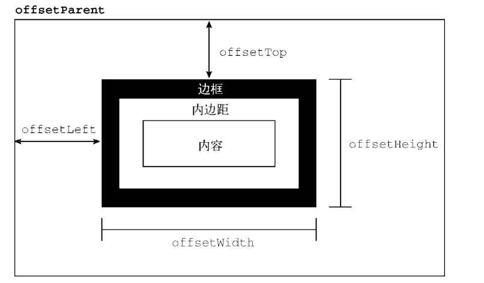
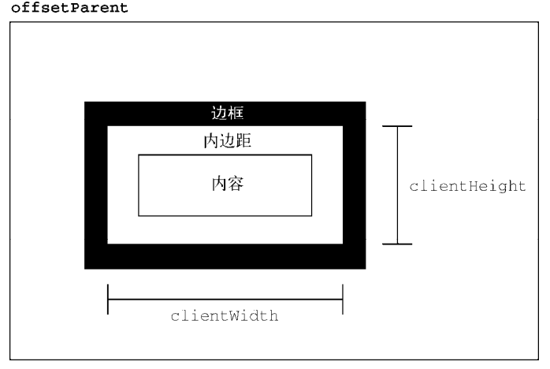
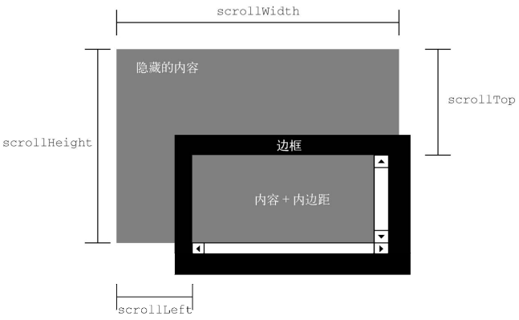
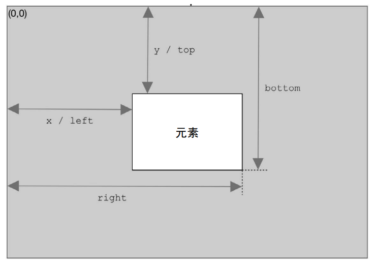
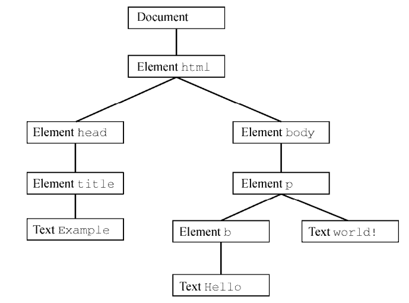
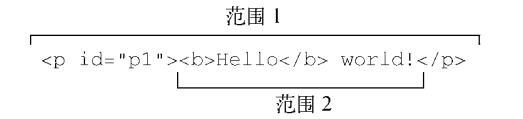

## [JavaScript DOM2、DOM3](#)
**介绍**：DOM1（DOM Level 1）主要定义了 HTML 和 XML 文档的底层结构。DOM2（DOM Level 2）和
DOM3（DOM Level 3）在这些结构之上加入更多交互能力，提供了更高级的 XML 特性。

-----

- [1. DOM 的演进](#1-dom-的演进)
- [2. XML 命名空间](#2-xml-命名空间)
- [3. 其他变化](#3-其他变化)
- [4. Node 的变化](#4-node-的变化)
- [5. 内嵌窗格iframe](#5-内嵌窗格iframe的变化)
- [6. 样式](#6-样式)
- [7. 元素尺寸](#7-元素尺寸)
- [8. 遍历](#8-遍历)
- [9. 范围](#9-范围)

----

### [1. DOM 的演进](#)
DOM1（DOM Level 1）主要定义了 HTML 和 XML 文档的底层结构。DOM2（DOM Level 2）和DOM3（DOM Level 3）在这些
结构之上加入更多交互能力，提供了更高级的 XML 特性。DOM2 和 DOM3 Core 模块的目标是扩展 DOM API，满足 XML 的所有
需求并提供更好的错误处理和特性检测。 

> DOM2 和 DOM3 Core 模块的目标是扩展 DOM API，满足 XML 的所有需求并提供更好的错误处理和特性检测。

- **DOM Core**：在 DOM1 核心部分的基础上，为节点增加方法和属性。
- **DOM Views**：定义基于样式信息的不同视图。
- **DOM Events**：定义通过事件实现 DOM 文档交互。
- **DOM Style**：定义以编程方式访问和修改 CSS 样式的接口。
- **DOM Traversal and Range**：新增遍历 DOM 文档及选择文档内容的接口。
- **DOM HTML**：在 DOM1 HTML 部分的基础上，增加属性、方法和新接口。
- **DOM Mutation Observers**：定义基于 DOM 变化触发回调的接口。这个模块是 DOM4 级模块，用于取代 Mutation Events。

### [2. XML 命名空间](#)
XML 命名空间可以实现在一个格式规范的文档中混用不同的 XML 语言，而不必担心元素命名冲突。严格来
讲，XML 命名空间在 XHTML 中才支持，HTML 并不支持。因此，本节的示例使用 XHTML。

```html
<html xmlns="http://www.w3.org/1999/xhtml" lang="">
 <head>
    <title>Example XHTML page</title>
 </head>
 <body>
     Hello world!
 </body>
</html> 
```
对这个例子来说，所有元素都默认属于 XHTML 命名空间。可以使用 xmlns 给命名空间创建一个前缀，格式为“xmlns: 前缀”，如下面的例子所示：
```javascript
<xhtml:html xmlns:xhtml="http://www.w3.org/1999/xhtml">
 <xhtml:head>
    <xhtml:title>Example XHTML page</xhtml:title>
 </xhtml:head>
 <xhtml:body>
     Hello world!
 </xhtml:body>
</xhtml:html>
```

#### [2.1 Node 的变化](#)
在 DOM2 中，Node 类型包含以下特定于命名空间的属性：
- localName，不包含命名空间前缀的节点名；
- namespaceURI，节点的命名空间 URL，如果未指定则为 null；
- prefix，命名空间前缀，如果未指定则为 null。

在节点使用命名空间前缀的情况下，nodeName 等于 prefix + ":" + localName。比如下面这个例子：

```html
<html xmlns="http://www.w3.org/1999/xhtml">
 <head>
 <title>Example XHTML page</title>
 </head>
 <body>
     <s:svg xmlns:s="http://www.w3.org/2000/svg" version="1.1"
         viewBox="0 0 100 100" style="width:100%; height:100%">
        <s:rect x="0" y="0" width="100" height="100" style="fill:red" />
     </s:svg>
 </body>
</html> 
```
其中的 `<html>` 元素的 localName 和 tagName 都是"html"，namespaceURL 是
"http://www.w3.org/1999/xhtml"，而prefix 是 null。对于 `<s:svg>` 元素，localName
是"svg"，tagName 是"s:svg"，namespaceURI 是"https://www.w3.org/2000/svg"，而 prefix 是"s"。

DOM3 进一步增加了如下与命名空间相关的方法：
- isDefaultNamespace(namespaceURI)，返回布尔值，表示 namespaceURI 是否为节点的默认命名空间；
- lookupNamespaceURI(prefix)，返回给定 prefix 的命名空间 URI；
- lookupPrefix(namespaceURI)，返回给定 namespaceURI 的前缀。

**对前面的例子，可以执行以下代码**：
```javascript
console.log(document.body.isDefaultNamespace("http://www.w3.org/1999/xhtml")); // true

// 假设 svg 包含对<s:svg>元素的引用
console.log(svg.lookupPrefix("http://www.w3.org/2000/svg")); // "s"
console.log(svg.lookupNamespaceURI("s")); // "http://www.w3.org/2000/svg" 
```
这些方法主要用于通过元素查询前面和命名空间 URI，以确定元素与文档的关系。

#### [2.2 Document 的变化](#)
DOM2 在 Document 类型上新增了如下命名空间特定的方法：

- createElementNS(namespaceURI, tagName)，以给定的标签名 tagName 创建指定命名空间 namespaceURI 的一个新元素；
- createAttributeNS(namespaceURI, attributeName)，以给定的属性名 attributeName创建指定命名空间 namespaceURI 的一个新属性；
- getElementsByTagNameNS(namespaceURI, tagName)，返回指定命名空间 namespaceURI 中所有标签名为 tagName 的元素的 NodeList。

使用这些方法都需要传入相应的命名空间 URI（不是命名空间前缀），如下面的例子所示：
```javascript
// 创建一个新 SVG 元素
let svg = document.createElementNS("http://www.w3.org/2000/svg", "svg");
// 创建一个任意命名空间的新属性
let att = document.createAttributeNS("http://www.somewhere.com", "random");
// 获取所有 XHTML 元素
let elems = document.getElementsByTagNameNS("http://www.w3.org/1999/xhtml", "*"); 
```
这些命名空间特定的方法只在文档中包含两个或两个以上命名空间时才有用。

#### [2.3 Element 的变化](#)
DOM2 Core 对 Element 类型的更新主要集中在对属性的操作上。下面是新增的方法：

- getAttributeNS(namespaceURI, localName)，取得指定命名空间 namespaceURI 中名为localName 的属性；
- getAttributeNodeNS(namespaceURI, localName)，取得指定命名空间 namespaceURI 中名为 localName 的属性节点；
- getElementsByTagNameNS(namespaceURI, tagName)，取得指定命名空间 namespaceURI 中标签名为 tagName 的元素的 NodeList；
- hasAttributeNS(namespaceURI, localName)，返回布尔值，表示元素中是否有命名空间
namespaceURI 下名为 localName 的属性（注意，DOM2 Core 也添加不带命名空间的
hasAttribute()方法）；
- removeAttributeNS(namespaceURI, localName)，删除指定命名空间 namespaceURI 中
名为 localName 的属性；
- setAttributeNS(namespaceURI, qualifiedName, value)，设置指定命名空间 namespaceURI
中名为 qualifiedName 的属性为 value；
- setAttributeNodeNS(attNode)，为元素设置（添加）包含命名空间信息的属性节点 attNode。

> 在DOM（文档对象模型）Level 2和Level 3中引入命名空间（namespaceURI）主要是为了应对XML命名空间所带来的挑战，以及提高文档处理的灵活性和准确性。

#### [2.4 NamedNodeMap 的变化](#)
NamedNodeMap 也增加了以下处理命名空间的方法。因为 NamedNodeMap 主要表示属性，所以这些方法大都适用于属性：

- getNamedItemNS(namespaceURI, localName)，取得指定命名空间 namespaceURI 中名为localName 的项；
- removeNamedItemNS(namespaceURI, localName)，删除指定命名空间 namespaceURI 中名为 localName 的项；
- setNamedItemNS(node)，为元素设置（添加）包含命名空间信息的节点。

### [3. 其他变化](#)

#### [3.1 DocumentType](#)
DocumentType 新增了 3 个属性：publicId、systemId 和 internalSubset。publicId、
systemId 属性表示文档类型声明中有效但无法使用 DOM1 API 访问的数据。

```html
<!DOCTYPE HTML PUBLIC "-// W3C// DTD HTML 4.01// EN"
"http://www.w3.org/TR/html4/strict.dtd">
```
其 publicId 是 `"-// W3C// DTD HTML 4.01// EN"`，而 systemId 是 `"http://www.w3.org/TR/html4/strict.dtd"` 。支持 DOM2 的浏览器应该可以运行以下 JavaScript 代码：
```javascript
console.log(document.doctype.publicId);
console.log(document.doctype.systemId);
```
通常在网页中很少需要访问这些信息。
internalSubset 用于访问文档类型声明中可能包含的额外定义，如下面的例子所示：
```html
<!DOCTYPE html PUBLIC "-// W3C// DTD XHTML 1.0 Strict// EN"
"http://www.w3.org/TR/xhtml1/DTD/xhtml1-strict.dtd"
[<!ELEMENT name (#PCDATA)>] >
```
对于以上声明，document.doctype.internalSubset 会返回 `"<!ELEMENT name (#PCDATA)>"`。
HTML 文档中几乎不会涉及文档类型的内部子集，XML 文档中稍微常用一些。

#### [3.2 Document.importNode 的变化](#)
Document 类型的更新中唯一跟命名空间无关的方法是 importNode()。这个方法的目的是从其他
文档获取一个节点并导入到新文档，以便将其插入新文档。每个节点都有一个 ownerDocument 属性，表示所属文档。

如果调用 appendChild()方法时传入节点的 ownerDocument 不是指向当前文档，则
会发生错误。而调用 importNode()导入其他文档的节点会返回一个新节点，这个新节点的ownerDocument 属性是正确的。

importNode()方法跟 cloneNode()方法类似，同样接收两个参数：要复制的节点和表示是否同时
复制子树的布尔值，返回结果是适合在当前文档中使用的新节点。
```javascript
let newNode = document.importNode(oldNode, true); // 导入节点及所有后代
document.body.appendChild(newNode); 
```
这个方法在 HTML 中使用得并不多，在 XML 文档中的使用会更多一些

#### [3.3 defaultView](#)
DOM2 View 给 Document 类型增加了新属性 defaultView，是一个指向拥有当前文档的窗口（或窗格 `<frame>`）的指针。这个规范中并没有明确视图何时可用，因此这是添加的唯一一个属性。defaultView
属性得到了除 IE8 及更早版本之外所有浏览器的支持。

IE8 及更早版本支持等价的 parentWindow 属性，Opera 也支持这个属性。因此要确定拥有文档的窗口，可以使用以下代码：
```javascript
let parentWindow = document.defaultView || document.parentWindow;
```

#### [3.4 createDocumentType、createDocument](#)
除了上面这一个方法和一个属性，DOM2 Core 还针对 document.implementation 对象增加了两
个新方法：createDocumentType()和 createDocument()。

前者用于创建 DocumentType 类型的新节点，接收 3 个参数：**文档类型名称**、**publicId** 和 **systemId**。比如，以下代码可以创建一个新的 HTML 4.01 严格型文档：
```javascript
let doctype = document.implementation.createDocumentType("html",
 "-// W3C// DTD HTML 4.01// EN",
 "http://www.w3.org/TR/html4/strict.dtd"); 
```
已有文档的文档类型不可更改，因此 createDocumentType()只在创建新文档时才会用到，而创
建新文档要使用 createDocument()方法。createDocument()接 收 3 个参数：**文档元素的namespaceURI**、**文档元素的标签名**和文档类型。
```javascript
let doctype = document.implementation.createDocumentType("html",
 "-// W3C// DTD XHTML 1.0 Strict// EN",
 "http://www.w3.org/TR/xhtml1/DTD/xhtml1-strict.dtd");

let doc = document.implementation.createDocument("http://www.w3.org/1999/xhtml",
 "html", doctype); 
```

#### [3.5 createHTMLDocument](#)

这里使用了适当的命名空间和文档类型创建一个新 XHTML文档。这个文档只有一个文档元素`<html>`，其他一切都需要另行添加。
DOM2 HTML 模块也为 document.implamentation 对象添加了 **createHTMLDocument**()方法。
使用这个方法可以创建一个完整的 HTML 文档，包含`<html>`、`<head>`、`<title>`和`<body>`元素。这个
方法只接收一个参数，即新创建文档的标题（放到`<title>`元素中），返回一个新的 HTML 文档。比如：
```javascript
let htmldoc = document.implementation.createHTMLDocument("New Doc");
console.log(htmldoc.title); // "New Doc"
console.log(typeof htmldoc.body); // "object"
```
createHTMLDocument()方法创建的对象是 HTMLDocument 类型的实例，因此包括该类型所有相
关的方法和属性，包括 title 和 body 属性。

### [4. Node 的变化](#)
DOM3 新增了两个用于比较节点的方法：isSameNode()和 isEqualNode()。这两个方法都接收
一个节点参数，如果这个节点与参考节点相同或相等，则返回 true。
```javascript
let div1 = document.createElement("div");
div1.setAttribute("class", "box");
let div2 = document.createElement("div");

div2.setAttribute("class", "box");
console.log(div1.isSameNode(div1)); // true
console.log(div1.isEqualNode(div2)); // true
console.log(div1.isSameNode(div2)); // false
```

DOM3 也增加了给 DOM 节点附加额外数据的方法。setUserData()方法接收 3 个参数：键、值、
处理函数，用于给节点追加数据。可以像下面这样把数据添加到一个节点：
```javascript
document.body.setUserData("name", "Nicholas", function() {}); 
```
然后，可以通过相同的键再取得这个信息，比如：
```javascript
let value = document.body.getUserData("name"); 
```
setUserData()的处理函数会在包含数据的节点被复制、删除、重命名或导入其他文档的时候执行，可以在这时候决定如何处理用户数据。

处理函数接收 5 个参数：
- 表示操作类型的数值（1 代表复制，2 代表导入，3 代表删除，4 代表重命名）
- 数据的键
- 数据的值
- 源节点,删除节点时，源节点为 null；
- 目标节点,除复制外，目标节点都为 null。
```javascript
let div = document.createElement("div");

div.setUserData("name", "Nicholas", function(operation, key, value, src, dest) {
 if (operation == 1) {
 dest.setUserData(key, value, function() {}); }
});

let newDiv = div.cloneNode(true);
console.log(newDiv.getUserData("name")); // "Nicholas" 
```

### [5. 内嵌窗格iframe的变化](#)
DOM2 HTML 给 HTMLIFrameElement（即 `<iframe>` ，内嵌窗格）类型新增了一个属性，叫
contentDocument。这个属性包含代表子内嵌窗格中内容的 document 对象的指针。下面的例子展示
了如何使用这个属性：
```javascript
let iframe = document.getElementById("myIframe");
let iframeDoc = iframe.contentDocument;
```
**contentDocument** 属性是 Document 的实例，拥有所有文档属性和方法，因此可以像使用其他
HTML 文档一样使用它。还有一个属性 **contentWindow**，返回相应窗格的 window 对象，这个对象上
有一个 document 属性。所有现代浏览器都支持 contentDocument 和 contentWindow 属性。

> 跨源访问子内嵌窗格的 document 对象会受到安全限制。如果内嵌窗格中加载了不同域名（或子域名）的页面，或者该页面使用了不同协议，则访问其 document 对象会抛出错误。

### [6. 样式](#)
HTML 中的样式有 3 种定义方式：外部样式表（通过 `<link>` 元素）、文档样式表（使用 `<style>`元
素）和元素特定样式（使用 style 属性）。DOM2 Style 为这 3 种应用样式的机制都提供了 API。

#### [6.1 存取元素样式](#)
任何支持 style 属性的 HTML 元素在 JavaScript 中都会有一个对应的 **style** 属性。这个 style 属
性是 **CSSStyleDeclaration** 类型的实例，其中包含通过 HTML style 属性为元素设置的所有样式信
息，但不包含通过层叠机制从文档样式和外部样式中继承来的样式。

> HTML style 属性中的 CSS 属性在 JavaScript style 对象中都有对应的属性。因为 CSS 属性名使用连字符表示
> 法（用连字符分隔两个单 词，如 background-image），所以在 JavaScript 中这些属性必须转换为**驼峰大小写形式**（如
> backgroundImage）。下表给出了几个常用的 CSS 属性与 style 对象中等价属性的对比。

|CSS 属性 | JavaScript 属性|
|:----|:----|
|background-image | style.backgroundImage|
|color |style.color|
|display| style.display|
|font-family| style.fontFamily|

大多数属性名会这样直接转换过来。但有一个 CSS 属性名不能直接转换，它就是 float。因为float 是 JavaScript 的保留字，所以不
能用作属性名。DOM2 Style 规定它在 style 对象中对应的属性应该是 **cssFloat**。

任何时候，只要获得了有效 DOM 元素的引用，就可以通过 JavaScript 来设置样式。来看下面的例子：

```javascript
let myDiv = document.getElementById("myDiv");
// 设置背景颜色
myDiv.style.backgroundColor = "red";
// 修改大小
myDiv.style.width = "100px";
myDiv.style.height = "200px";
// 设置边框
myDiv.style.border = "1px solid black"; 
```
通过 style 属性设置的值也可以通过 style 对象获取。比如下面的 HTML：
```html
<div id="myDiv" style="background-color: blue; width: 10px; height: 25px"></div>
```
这个元素 style 属性的值可以像这样通过代码获取：
```javascript
console.log(myDiv.style.backgroundColor); // "blue"
console.log(myDiv.style.width); // "10px"
console.log(myDiv.style.height); // "25px" 
```
如果元素上没有 style 属性，则 style 对象包含所有可能的 CSS 属性的空值。

#### [6.2 DOM 样式属性和方法](#)
DOM2 Style 规范也在 style 对象上定义了一些属性和方法。这些属性和方法提供了元素 style 属性的信息并支持修改，列举如下。

- cssText，包含 style 属性中的 CSS 代码。**设置 cssText 是一次性修改元素多个样式最快捷的方式，因为所有变化会同时生效** 。
- length，应用给元素的 CSS 属性数量。
- parentRule，表示 CSS 信息的 CSSRule 对象（下一节会讨论 CSSRule 类型）。
- getPropertyCSSValue(propertyName)，返回包含 CSS 属性 propertyName 值的 CSSValue
对象（已废弃）。
- getPropertyPriority(propertyName)，如果 CSS 属性 propertyName 使用了!important
则返回"important"，否则返回空字符串。
- **getPropertyValue**(propertyName)，返回属性 propertyName 的字符串值。
- **item**(index)，返回索引为 index 的 CSS 属性名。
- **removeProperty**(propertyName)，从样式中删除 CSS 属性 propertyName。
- **setProperty**(propertyName, value, priority)，设置 CSS 属性 propertyName 的值为value，priority 是"important"或空字符串。

通过 cssText 属性可以存取样式的 CSS 代码。在读模式下，cssText 返回 style 属性 CSS 代码
在浏览器内部的表示。在写模式下，给 cssText 赋值会重写整个 style 属性的值，意味着之前通过
style 属性设置的属性都会丢失。

**removeProperty**()方法用于从元素样式中删除指定的 CSS 属性。使用这个方法删除属性意味着会
应用该属性的默认（从其他样式表层叠继承的）样式。例如，可以像下面这样删除 style 属性中设置的 border 样式： 
```javascript
myDiv.style.removeProperty("border"); 
```
在不确定给定 CSS 属性的默认值是什么的时候，可以使用这个方法。只要从 style 属性中删除，就可以使用默认值。

#### [6.3 计算样式](#)
style 对象中包含支持 style 属性的元素为这个属性设置的样式信息，但不包含从其他样式表层叠继承的同样影响该元素的样式信息。

DOM2 Style在document.defaultView 上增加了getComputedStyle()
方法。这个方法接收两个参数：要取得计算样式的元素和伪元素字符串（如":after"）。如果不需要查
询伪元素，则第二个参数可以传 null。getComputedStyle()方法返回一个 CSSStyleDeclaration
对象（与 style 属性的类型一样），包含元素的计算样式。

```html
<!DOCTYPE html>
<html>
<head>
 <title>Computed Styles Example</title>
 <style type="text/css">
     #myDiv {
     background-color: blue;
         width: 100px;
         height: 200px;
     }
 </style>
</head>
<body>
 <div id="myDiv" style="background-color: red; border: 1px solid black"></div>
</body>
</html> 
```
这里的 `<div>` 元素从文档样式表（ `<style>` 元素）和自己的 style 属性获取了样式。
```javascript
let myDiv = document.getElementById("myDiv");
let computedStyle = document.defaultView.getComputedStyle(myDiv, null);

console.log(computedStyle.backgroundColor); // "red"
console.log(computedStyle.width); // "100px"
console.log(computedStyle.height); // "200px"
console.log(computedStyle.border); // "1px solid black"（在某些浏览器中）
```
关于计算样式要记住一点，在所有浏览器中计算样式都是只读的，不能修改 getComputedStyle()方法返回的对象。

#### [6.4 操作样式表](#)
CSSStyleSheet 类型表示 CSS 样式表，包括使用 `<link>` 元素和通过 `<style>` 元素定义的样式表。

注意，这两个元素本身分别是 HTMLLinkElement 和 HTMLStyleElement。CSSStyleSheet 类型是一
个通用样式表类型，可以表示以任何方式在 HTML 中定义的样式表。

> 元素特定的类型允许修改HTML 属性，而 CSSStyleSheet 类型的实例则是一个只读对象（只有一个属性例外）。

- disabled，布尔值，表示样式表是否被禁用了（这个属性是可读写的，因此将它设置为 true
会禁用样式表）。
- href，如果是使用 `<link>` 包含的样式表，则返回样式表的 URL，否则返回 null。
- media，样式表支持的媒体类型集合，这个集合有一个 length 属性和一个 item()方法，跟所有 DOM 集合一样。同样跟所有 DOM 集合一样，也可以使用中括号访问集合中特定的项。如果样式表可用于所有媒体，则返回空列表。
- ownerNode，指向拥有当前样式表的节点，在 HTML 中要么是`<link>`元素要么是`<style>`元素（在 XML 中可以是处理指令）。如果当前样式表是通过@import 被包含在另一个样式表中，则这个属性值为 null。
- parentStyleSheet，如果当前样式表是通过@import 被包含在另一个样式表中，则这个属性指向导入它的样式表。
- title，ownerNode 的 title 属性。
- type，字符串，表示样式表的类型。对 CSS 样式表来说，就是"text/css"。上述属性里除了 disabled，其他属性都是只读的。除了上面继承的属性，CSSStyleSheet 类型
  还支持以下属性和方法。
- cssRules，当前样式表包含的样式规则的集合。
- ownerRule，如果样式表是使用@import 导入的，则指向导入规则；否则为 null。
- deleteRule(index)，在指定位置删除 cssRules 中的规则。
- insertRule(rule, index)，在指定位置向 cssRules 中插入规则。

document.styleSheets 表示文档中可用的样式表集合。这个集合的 length 属性保存着文档中
样式表的数量，而每个样式表都可以使用中括号或 item()方法获取。来看这个例子：

```javascript
let sheet = null;
for (let i = 0, len = document.styleSheets.length; i < len; i++) {
    sheet = document.styleSheets[i];
    console.log(sheet.href);
}
```

document.styleSheets 返回的样式表可能会因浏览器而异。所有浏览器都会包含`<style>`元素
和 rel 属性设置为"stylesheet"的`<link>`元素。IE、Opera、Chrome 也包含 rel 属性设置为
"alternate stylesheet"的`<link>`元素。

通过 `<link>`或`<style>`元素也可以直接获取 CSSStyleSheet 对象。DOM 在这两个元素上暴露了
sheet 属性，其中包含对应的 CSSStyleSheet 对象。

#### [6.5 CSS 规则](#)
CSSRule 类型表示样式表中的一条规则。这个类型也是一个通用基类，很多类型都继承它，但其中
最常用的是表示样式信息的 CSSStyleRule（其他 CSS 规则还有`@import`、`@font-face`、`@page` 和
@charset 等，不过这些规则很少需要使用脚本来操作）。

以下是 **CSSStyleRule** 对象上可用的属性。

- cssText，返回整条规则的文本。这里的文本可能与样式表中实际的文本不一样，因为浏览器
内部处理样式表的方式也不一样。Safari 始终会把所有字母都转换为小写。
- parentRule，如果这条规则被其他规则（如@media）包含，则指向包含规则，否则就是 null。
- parentStyleSheet，包含当前规则的样式表。
- selectorText，返回规则的选择符文本。这里的文本可能与样式表中实际的文本不一样，因为浏览器内部处理样式表的方式也不一样。这个属性在 Firefox、Safari、Chrome 和 IE 中是只读的，在 Opera 中是可以修改的。
- style，返回 CSSStyleDeclaration 对象，可以设置和获取当前规则中的样式。
- type，数值常量，表示规则类型。对于样式规则，它始终为 1。

在这些属性中，使用最多的是 cssText、selectorText 和 style。cssText 属类似，不过并不完全一样。
多数情况下，使用 style 属性就可以实现操作样式规则的任务了。

```css
div.box {
 background-color: blue;
 width: 100px;
 height: 200px;
} 
```
假设这条规则位于页面中的第一个样式表中，而且是该样式表中唯一一条 CSS 规则，则下列代码可以获取它的所有信息：
```javascript
let sheet = document.styleSheets[0];
let rules = sheet.cssRules || sheet.rules; // 取得规则集合
let rule = rules[0]; // 取得第一条规则
console.log(rule.selectorText); // "div.box"
console.log(rule.style.cssText); // 完整的 CSS 代码
console.log(rule.style.backgroundColor); // "blue"
console.log(rule.style.width); // "100px"
console.log(rule.style.height); // "200px" 
```
使用这些接口，可以像确定元素 style 对象中包含的样式一样，确定一条样式规则的样式信息。
与元素的场景一样，也可以修改规则中的样式，如下所示：
```javascript
let sheet = document.styleSheets[0];
let rules = sheet.cssRules || sheet.rules; // 取得规则集合
let rule = rules[0]; // 取得第一条规则
rule.style.backgroundColor = "red" 
```
注意，这样修改规则会影响到页面上所有应用了该规则的元素。如果页面上有两个<div>元素有
"box"类，则这两个元素都会受到这个修改的影响。

**创建规则**:
DOM 规定，可以使用 insertRule()方法向样式表中添加新规则。这个方法接收两个参数：
规则 的文本和表示插入位置的索引值。下面是一个例子：
```javascript
sheet.insertRule("body { background-color: silver }", 0); // 使用 DOM 方法
```

**删除规则**
支持从样式表中删除规则的 DOM 方法是 deleteRule()，它接收一个参数：要删除规则的索引。
要删除样式表中的第一条规则，可以这样做：
```javascript
sheet.deleteRule(0); // 使用 DOM 方法
```
与添加规则一样，删除规则并不是 Web 开发中常见的做法。考虑到可能影响 CSS 层叠的效果，删
除规则时要慎重。

### [7. 元素尺寸](#)
DOM 一直缺乏页面中元素实际尺寸的规定。IE 率先增加了一些属性，向开发者暴露元素的尺寸信息。这些属性现在已经得到所有主流浏览器支持。

#### [7.1 偏移尺寸](#)
第一组属性涉及偏移尺寸（offset dimensions），包含元素在屏幕上占用的所有视觉空间。元素在页
面上的视觉空间由其高度和宽度决定，包括所有内边距、滚动条和边框（但不包含外边距）。以下 4 个
属性用于取得元素的偏移尺寸。

- offsetHeight，元素在垂直方向上占用的像素尺寸，包括它的高度、水平滚动条高度（如果可
见）和上、下边框的高度。
- offsetLeft，元素左边框外侧距离包含元素左边框内侧的像素数。
- offsetTop，元素上边框外侧距离包含元素上边框内侧的像素数。
- offsetWidth，元素在水平方向上占用的像素尺寸，包括它的宽度、垂直滚动条宽度（如果可
见）和左、右边框的宽度。



其中，offsetLeft 和 offsetTop 是相对于包含元素的，包含元素保存在 **offsetParent** 属性中。

要确定一个元素在页面中的偏移量，可以把它的 offsetLeft 和 offsetTop 属性分别与 offsetParent
的相同属性相加，一直加到根元素。下面是一个例子：

```javascript
function getElementLeft(element) {
  let actualLeft = element.offsetLeft;
  let current = element.offsetParent;
  while (current !== null) {
   actualLeft += current.offsetLeft;
   current = current.offsetParent;
  }
  return actualLeft;
}

function getElementTop(element) {
  let actualTop = element.offsetTop;
  let current = element.offsetParent;
  while (current !== null) {
    actualTop += current.offsetTop;
    current = current.offsetParent;
  }
  return actualTop;
} 
```
这两个函数使用 offsetParent 在 DOM 树中逐级上溯，将每一级的偏移属性相加，最终得到元素的实际偏移量。

一般来说，包含在`<div>`元素中所有元素都以 `<body>`为其 offsetParent，因此 **getElementleft**()
和 getElementTop()返回的值与 offsetLeft 和 offsetTop 返回的值相同。

> 所有这些偏移尺寸属性都是只读的，每次访问都会重新计算。因此，应该尽量减少
查询它们的次数。比如把查询的值保存在局量中，就可以避免影响性能。

#### [7.2 元素的客户端尺寸](#)
元素的客户端尺寸（client dimensions）包含元素内容及其内边距所占用的空间。客户端尺寸只有两
个相关属性：clientWidth 和 clientHeight。其中，clientWidth 是内容区宽度加左、右内边距宽
度，clientHeight 是内容区高度加上、下内边距高度。



客户端尺寸实际上就是元素内部的空间，因此不包含滚动条占用的空间。这两个属性最常用于确定
浏览器视口尺寸，即检测 document.documentElement 的 clientWidth 和 clientHeight。这两个
属性表示视口（`<html>`或`<body>`元素）的尺寸。

```html
<body>
    <div class="container">
        <div class="content">

        </div>
    </div>
</body>
<style>
    *{
        padding: 0;
        margin: 0;
    }
    :root {
        --containerWidth: 1000px;
        --containerHeight: 500px;
    }
    .container{
        background-color: rgba(0,0,0,0.01);
        height: var(--containerHeight);
        width: var(--containerWidth);
        margin: 15px auto;

        --contentHW: 200px;
        .content{
            height: var(--contentHW);
            width: var(--contentHW);
            background-color: red;
            box-sizing: border-box;
            border: 5px solid green;
            padding: 10px;
            margin-top: 15px;
            margin-left: auto;
            margin-right: auto;
        }
    }
</style>
<script>
  let content = document.querySelector(".content");
  if (content){
    console.log(`content.offsetWidth: ${content.offsetWidth}`);
    //content.offsetWidth: 230
    console.log(`content.offsetHeight: ${content.offsetHeight}`);
    //content.offsetHeight: 230
    console.log(`content.clientWidth: ${content.clientWidth}`);
    //content.clientWidth: 220
    console.log(`content.clientHeight: ${content.clientHeight}`);
    //content.clientHeight: 220
  }
</script>
```
如果盒子模型为 `box-sizing: border-box;`
```javascript
console.log(`content.offsetWidth: ${content.offsetWidth}`);
//content.offsetWidth: 200
console.log(`content.offsetHeight: ${content.offsetHeight}`);
//content.offsetHeight: 200
console.log(`content.clientWidth: ${content.clientWidth}`);
//content.clientWidth: 190
console.log(`content.clientHeight: ${content.clientHeight}`);
//content.clientHeight: 190
```

#### [7.3 滚动尺寸](#)
最后一组尺寸是滚动尺寸（scroll dimensions），提供了元素内容滚动距离的信息。有些元素，比如
`<html>`无须任何代码就可以自动滚动，而其他元素则需要使用 CSS 的 overflow 属性令其滚动。滚动
尺寸相关的属性有如下 4 个。

- scrollHeight，没有滚动条出现时，元素内容的总高度。
- scrollLeft，内容区左侧隐藏的像素数，设置这个属性可以改变元素的滚动位置。
- scrollTop，内容区顶部隐藏的像素数，设置这个属性可以改变元素的滚动位置。
- scrollWidth，没有滚动条出现时，元素内容的总宽度。



scrollWidth 和 scrollHeight 可以用来确定给定元素内容的实际尺寸。

`<html>` 元素是浏览器中滚动视口的元素。因此，document.documentElement.scrollHeight 就是整个页面垂直方向的总高度。

> scrollWidth 和 scrollHeight 与 clientWidth 和 clientHeight 之间的关系在不需要滚动的
文档上是分不清的。如果文档尺寸超过视口尺寸，则在所有主流浏览器中这两对属性都不相等，scrollWidth 和 scollHeight 等于文档内容的宽度，而 clientWidth 和 clientHeight 等于视口的大小。

#### [7.4 确定元素尺寸](#)
浏览器在每个元素上都暴露了 getBoundingClientRect()方法，返回一个 DOMRect 对象，包含
6 个属性：left、top、right、bottom、height 和 width。这些属性给出了元素在页面中相对于视
口的位置。下图展示了这些属性的含义：




### [8. 遍历](#)
DOM2 Traversal and Range 模块定义了两个类型用于辅助顺序遍历 DOM 结构。这两个类型——NodeIterator 和 TreeWalker——从某个起点开始执行对 DOM 结构的 **深度优先遍历**。

如前所述，DOM 遍历是对 DOM 结构的深度优先遍历，至少允许朝两个方向移动（取决于类型）。 遍历以给定节点为根，不能在 DOM 中向上超越这个根节点。

```html
<!DOCTYPE html>
<html>
 <head>
    <title>Example</title>
 </head>
 <body>
    <p><b>Hello</b> world!</p>
 </body>
</html> 
```
这段代码构成的 DOM 树如图:



其中的任何节点都可以成为遍历的根节点。

#### [8.1 NodeIterator](#)
NodeIterator 类型是两个类型中比较简单的，可以通过 document.createNodeIterator()方
法创建其实例。这个方法接收以下 4 个参数,在浏览器中其实只有3个参数会生效。
- root，作为遍历根节点的节点。
- whatToShow，数值代码，表示应该访问哪些节点。
- filter，NodeFilter 对象或函数，表示是否接收或跳过特定节点。
- entityReferenceExpansion，布尔值，表示是否扩展实体引用。这个参数在 HTML 文档中没有效果，因为实体引用永远不扩展。

```javascript
createNodeIterator(root)
createNodeIterator(root, whatToShow)
createNodeIterator(root, whatToShow, filter)
```

whatToShow 参数是一个位掩码，通过应用一个或多个过滤器来指定访问哪些节点。这个参数对应
的常量是在 NodeFilter 类型中定义的。
- NodeFilter.SHOW_ALL，所有节点。
- NodeFilter.SHOW_ELEMENT，元素节点。
- NodeFilter.SHOW_ATTRIBUTE，属性节点。由于 DOM 的结构，因此实际上用不上。
- NodeFilter.SHOW_TEXT，文本节点。
- NodeFilter.SHOW_CDATA_SECTION，CData 区块节点。不是在 HTML 页面中使用的。
- NodeFilter.SHOW_ENTITY_REFERENCE，实体引用节点。不是在 HTML 页面中使用的。
- NodeFilter.SHOW_ENTITY，实体节点。不是在 HTML 页面中使用的。
- NodeFilter.SHOW_PROCESSING_INSTRUCTION，处理指令节点。不是在 HTML 页面中使用的。
- NodeFilter.SHOW_COMMENT，注释节点。
- NodeFilter.SHOW_DOCUMENT，文档节点。
- NodeFilter.SHOW_DOCUMENT_TYPE，文档类型节点。
- NodeFilter.SHOW_DOCUMENT_FRAGMENT，文档片段节点。不是在 HTML 页面中使用的。
- NodeFilter.SHOW_NOTATION，记号节点。不是在 HTML 页面中使用的。

这些值除了 NodeFilter.SHOW_ALL 之外，都可以组合使用。比如，可以像下面这样使用按位或操作组合多个选项：
```javascript
let whatToShow = NodeFilter.SHOW_ELEMENT | NodeFilter.SHOW_TEXT; 
```

createNodeIterator()方法的 filter 参数可以用来指定自定义 NodeFilter 对象，或者一个
作为节点过滤器的函数。NodeFilter 对象只有一个方法 acceptNode()，如果给定节点应该访问就返
回 NodeFilter.FILTER_ACCEPT，否则返回 NodeFilter.FILTER_SKIP。

> 因为 NodeFilter 是一个抽象类型，所以不可能创建它的实例。只要创建一个包含 acceptNode()的对象，然后把它传给createNodeIterator()就可以了。

```javascript
//以下代码定义了只接收<p>元素的节点过滤器对象：
let filter = {
  acceptNode(node) {
    return node.tagName.toLowerCase() === "p" ? 
            NodeFilter.FILTER_ACCEPT : NodeFilter.FILTER_SKIP;
  }
};

let root = document.body;
let iterator = document.createNodeIterator(root, NodeFilter.SHOW_ELEMENT, filter);
```
要创建一个简单的遍历所有节点的 NodeIterator，可以使用以下代码：
```javascript
let iterator = document.createNodeIterator(document, NodeFilter.SHOW_ALL, null);
```
NodeIterator 的两个主要方法是 nextNode()和 previousNode()。nextNode()方法在 DOM
子树中以深度优先方式进前一步，而 previousNode()则是在遍历中后退一步。

创建 NodeIterator对象的时候，会有一个内部指针指向根节点，因此第一次调用 nextNode()返回的是根节点。当遍历到
达 DOM 树最后一个节点时，nextNode()返回 null。previousNode()方法也是类似的。当遍历到达
DOM 树最后一个节点时，调用 previousNode()返回遍历的根节点后，再次调用也会返回 null。

```html
<div id="div1">
 <p><b>Hello</b> world!</p>
 <ul>
   <li>List item 1</li>
   <li>List item 2</li>
   <li>List item 3</li>
 </ul>
</div>
```

假设想要遍历<div>元素内部的所有元素，那么可以使用如下代码：
```javascript
let div = document.getElementById("div1");
let iterator = document.createNodeIterator(div, NodeFilter.SHOW_ELEMENT, null, false);
let node = iterator.nextNode();
while (node !== null) {
   console.log(node.tagName); // 输出标签名
   node = iterator.nextNode();
} 
//DIV P B UL LI LI LI 
```
如果只想遍历`<li>`元素，可以传入一个过滤器，比如：

在这个例子中，遍历只会输出`<li>`元素的标签。nextNode()和 previousNode()方法共同维护 NodeIterator 对 DOM 结构的内部指针，因此修
改 DOM 结构也会体现在遍历中。

#### [8.2 TreeWalker](#)
TreeWalker 是 NodeIterator 的高级版。除了包含同样的 nextNode()、previousNode()方法，
TreeWalker 还添加了如下在 DOM 结构中向不同方向遍历的方法。
- parentNode()，遍历到当前节点的父节点。
- firstChild()，遍历到当前节点的第一个子节点。
- lastChild()，遍历到当前节点的最后一个子节点。
- nextSibling()，遍历到当前节点的下一个同胞节点。
- previousSibling()，遍历到当前节点的上一个同胞节点。

TreeWalker 对象要调用 **document.createTreeWalker**()方法来创建，这个方法接收与
document.createNodeIterator()同样的参数：作为遍历起点的根节点、要查看的节点类型、节点
过滤器和一个表示是否扩展实体引用的布尔值。因为两者很类似，所以 TreeWalker 通常可以取代
NodeIterator，比如：
```javascript
let div = document.getElementById("div1");
let filter = function(node) {
   return node.tagName.toLowerCase() == "li" ?
   NodeFilter.FILTER_ACCEPT :
   NodeFilter.FILTER_SKIP;
};

let walker = document.createTreeWalker(div, NodeFilter.SHOW_ELEMENT,
        filter, false);
let node = iterator.nextNode();
while (node !== null) {
  console.log(node.tagName); // 输出标签名
  node = iterator.nextNode();
}
```

不同的是，节点过滤器（filter）除了可以返回 NodeFilter.FILTER_ACCEPT 和 NodeFilter.
FILTER_SKIP，还可以返回 NodeFilter.FILTER_REJECT。而 NodeFilter.FILTER_REJECT 则表示**跳过该节点以及该节点的整个子树**。

当然，TreeWalker 真正的威力是可以在 DOM 结构中四处游走。如果不使用过滤器，单纯使用
TreeWalker 的漫游能力同样可以在 DOM 树中访问<li>元素，比如：

```javascript
let div = document.getElementById("div1");
let walker = document.createTreeWalker(div, NodeFilter.SHOW_ELEMENT, null, false);

walker.firstChild(); // 前往<p>
walker.nextSibling(); // 前往<ul>

let node = walker.firstChild(); // 前往第一个<li>
while (node !== null) {
  console.log(node.tagName);
  node = walker.nextSibling();
}
```

TreeWalker 类型也有一个名为 currentNode 的属性，表示遍历过程中上一次返回的节点（无论
使用的是哪个遍历方法）。可以通过修改这个属性来影响接下来遍历的起点，如下面的例子所示：

```javascript
let node = walker.nextNode();
console.log(node === walker.currentNode); // true
walker.currentNode = document.body; // 修改起点
```
相比于 NodeIterator，TreeWalker 类型为遍历 DOM 提供了更大的灵活性。

### [9. 范围](#)
为了支持对页面更细致的控制，DOM2 Traversal and Range 模块定义了范围接口。范围可用于在文
档中选择内容，而不用考虑节点之间的界限。（选择在后台发生，用户是看不到的。）范围在常规 DOM
操作的粒度不够时可以发挥作用。

**尽管DOM2 范围非常强大，但在现代Web开发中，它的直接使用并不常见**。这是因为许多常见的用例已经
被更高层次的API或库所封装，例如jQuery或其他JavaScript框架提供的功能。此外，随着浏览器原
生支持的功能日益增强，开发者通常会优先使用这些更为便捷的方法来进行DOM操作。
#### [9.1 DOM 范围](#)
DOM2 在 Document 类型上定义了一个 createRange()方法，暴露在 document 对象上。使用这
个方法可以创建一个 DOM 范围对象，如下所示：
```javascript
let range = document.createRange(); 
```
每个范围都是 Range 类型的实例，拥有相应的属性和方法。
- startContainer，范围起点所在的节点（选区中第一个子节点的父节点）。
- startOffset，范围起点在 startContainer 中的偏移量。如果 startContainer 是文本节
点、注释节点或 CData 区块节点，则 startOffset 指范围起点之前跳过的字符数；否则，表示
范围中第一个节点的索引。
- endContainer，范围终点所在的节点（选区中最后一个子节点的父节点）。
- endOffset，范围起点在 startContainer 中的偏移量（与 startOffset 中偏移量的含义相同）。
- commonAncestorContainer，文档中以startContainer和endContainer为后代的最深的节点。

这些属性会在范围被放到文档中特定位置时获得相应的值。

#### [9.2 简单选择](#)
通过范围选择文档中某个部分最简单的方式，就是使用 selectNode()或 selectNodeContents()方法。
```html
<!DOCTYPE html>
<html>
 <body>
 <p id="p1"><b>Hello</b> world!</p>
 </body>
</html>
```
以下 JavaScript 代码可以访问并创建相应的范围：这两个方法都接收一个节点作为参数，并将该节点的信息添加到调用它的范围。selectNode()方
法选择整个节点，包括其后代节点，而 selectNodeContents()只选择节点的后代。
```javascript
let range1 = document.createRange(),
range2 = document.createRange(),
p1 = document.getElementById("p1");
range1.selectNode(p1);
range2.selectNodeContents(p1); 
```
例子中的这两个范围包含文档的不同部分。range1 包含`<p>`元素及其所有后代，而 range2 包含
`<b>`元素、文本节点"Hello"和文本节点" world!"，



