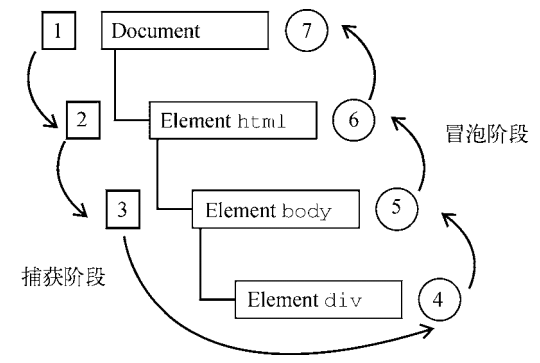
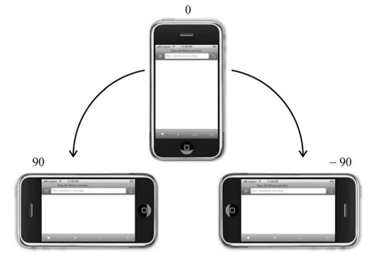
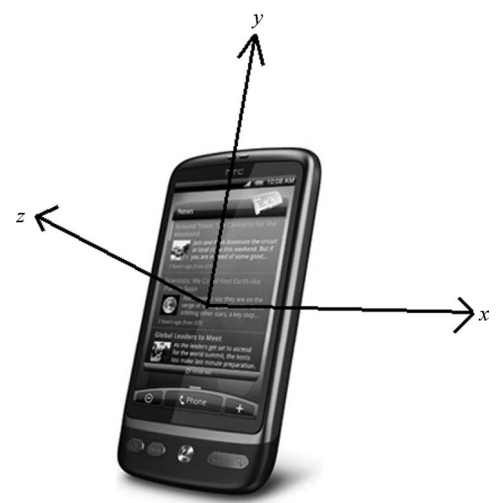
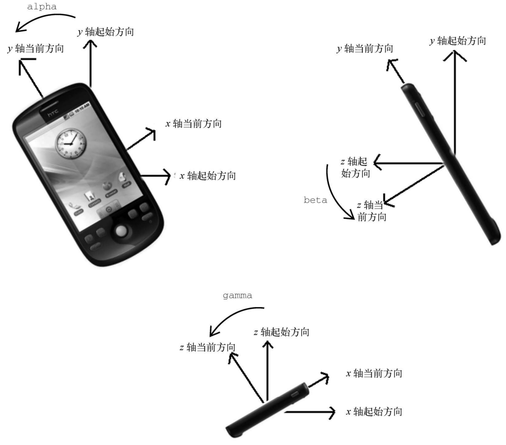

## [JavaScript 原生Event](#)
**介绍** ： JS与HTML之间的交互式通过事件实现的,事件代表文档或浏览器窗口某个有意义的时刻,可以使用仅在事件发生时才执行的侦听器来预订事件, 这种模型叫 “订阅者模式”。

----

- [1. 事件概念](#1-事件概念)
- [2. 事件流](#2-事件流)
- [3. 事件处理程序](#3-事件处理程序)
- [4. 事件对象](#4-事件对象)
- [5. 事件类型](#5-事件类型)
- [6. 用户界面事件](#6-用户界面事件)
- [7. 焦点事件](#7-焦点事件)
- [8. 鼠标和滚轮事件](#8-鼠标和滚轮事件)
- [9. 键盘与输入事件](#9-键盘与输入事件)
- [10. 合成事件](#10-合成事件)
- [11. 变化事件](#11-变化事件)
- [12. html5事件](#12-html5-事件)
- [13. 设备事件](#13-设备事件)
- [14. 触摸及手势事件](#14-触摸及手势事件)

----
### [1. 事件概念](#)
JS与HTML之间的交互式通过事件实现的,事件代表文档或浏览器窗口某个有意义的时刻,可以使用仅在事件发生时才执行的侦听器来预订事件, 这种模型叫 “订阅者模式”。

由于存在不同的DOM版本 又有不同DOM级别的事件,比如DOM0级事件DOM1 级事件,现在主要浏览器已经实现了DOM2级事件，BOM也支持事件。DOM3也新增了一些API。原生事件就更复杂了！
但是实践中不常会用到那些复杂的功能！

JavaScript 事件是 JavaScript 的核心概念之一，它允许网页对用户的行为或环境的变化做出响应。通过事件，可以捕获用户的交互（比如点击按钮、提交表单、页面加载完成等）或者浏览器的动作（如窗口大小调整、滚动等），然后执行相应的代码逻辑。

#### [1.1 事件类型](#)
JavaScript 支持多种类型的事件，这里列举一些常见的：

- 鼠标事件：例如 click（点击）、dblclick（双击）、mouseover（鼠标悬停）、mouseout（鼠标移出）。
- 键盘事件：例如 keydown（按下键）、keyup（释放键）、keypress（按下一个字符键）。
- 表单事件：例如 submit（提交表单）、reset（重置表单）、change（值改变）、focus（获得焦点）、blur（失去焦点）。
- 文档/窗口事件：例如 load（文档或图像加载完成）、resize（窗口大小调整）、scroll（滚动条移动）。

#### [1.2 事件处理程序](#)
事件处理程序（Event Handler）是指在用户与网页交互或浏览器发生某些动作时，用来指定要执行的代码或函数。简单来说，它是一种机制，允许网页对特定事件作出响应。事件可以是用户的操作，如点击鼠标、按键输入，或者是浏览器的行为，比如页面加载完成、窗口大小调整等。

在 JavaScript 中，可以通过几种不同的方式为事件绑定处理程序：

**事件处理程序的工作原理**: 当一个特定的事件被触发时，例如用户点击了一个按钮，浏览器会查找并执行与此事件关联的处理程序。这个处理程序通常是一个函数，其中包含了希望在该事件发生时执行的代码逻辑。

**HTML属性中直接定义**：虽然这种方法最直观，但并不推荐使用，因为它将行为和结构混合在一起，不利于维护。
```html
<button onclick="alert('你点击了按钮！')">点我</button>
```
**通过JavaScript设置对象属性**：可以直接在DOM对象上设置相应的事件处理程序属性。
```javascript
document.getElementById("myButton").onclick = function() {
  alert('你点击了按钮！');
};
```
这种方式简单直接，但是每个事件类型只能绑定一个处理程序。
**使用addEventListener()方法**：这是更灵活的方式，支持为同一个事件类型添加多个处理程序，并且可以指定在捕获阶段还是冒泡阶段触发处理程序。
```javascript
document.getElementById("myButton").addEventListener('click', function() {
  alert('你点击了按钮！');
});
```

#### [1.3 事件对象](#)
当事件发生时，浏览器会创建一个**事件对象**，该对象包含有关事件的信息。这个对象通常作为参数传递给事件处理程序，使得
处理程序能够访问到事件相关的数据，如触发事件的元素、鼠标位置、键盘按键等。
事件对象（Event Object）是在某个事件发生时，由浏览器自动创建并传递给对应的事件处理程序的对象。它包含了关于该事件的详细信息，如事件类型、触发事件的元素、鼠标或键盘的具体操作等。开发者可以通过访问这个对象来获取事件的相关数据，并据此执行相应的操作。下面详细介绍事件对象及其相关属性和方法。

**事件对象的主要属性**
1. **`type`**：返回一个字符串，表示事件的类型。例如 `"click"`、`"mouseover"` 等。
2. **`target`**：指向触发事件的DOM元素。对于冒泡阶段的事件，这可能是最深层嵌套的元素；而在捕获阶段，这可能是外层的父级元素。它帮助你确定哪个元素实际触发了事件。
3. **`currentTarget`**：与 `target` 类似，但它始终指向附加了事件监听器的元素。在事件冒泡过程中，这个值可能会随着事件从子元素向父元素传播而变化。
4. **`bubbles`**：一个布尔值，指示事件是否会在DOM树中冒泡。如果为 `true`，则事件会从目标元素向上冒泡直到文档根节点。
5. **`cancelable`**：一个布尔值，指示事件是否有默认行为，以及这些行为是否可以通过调用 `preventDefault()` 方法来阻止。如果为 `true`，可以阻止默认行为。
6. **`timeStamp`**：返回事件创建时的时间戳，基于毫秒数。可用于计算事件发生的时间点。
7. **鼠标事件相关的属性**
    - `clientX`, `clientY`：相对于浏览器窗口可视区域的坐标。
    - `pageX`, `pageY`：相对于整个文档的坐标，考虑到了页面滚动。
    - `screenX`, `screenY`：相对于用户屏幕的坐标。
8. **键盘事件相关的属性**
    - `key`：表示按下的键的字符串值。
    - `code`：表示物理按键的代码。
    - `keyCode`（已过时）：用于兼容性目的，表示按下的键的ASCII码。
9. **`defaultPrevented`**：一个布尔值，表示是否已经调用了 `preventDefault()` 来阻止默认行为。

**事件对象的方法**
- **`stopPropagation()`**：停止事件传播，防止事件在DOM树中进一步冒泡或捕获。
- **`preventDefault()`**：阻止事件的默认行为。例如，点击链接时阻止其跳转，或表单提交时阻止其提交。
- **`composedPath()`**（现代浏览器支持）：返回一个数组，包含事件路径上的所有对象，适用于Shadow DOM上下文。

使用示例 这里有一个简单的例子，演示如何使用事件对象：
```javascript
document.getElementById("myButton").addEventListener('click', function(event) {
    console.log('事件类型:', event.type); // "click"
    console.log('触发事件的元素:', event.target.id);
    console.log('鼠标点击位置相对于视口的X坐标:', event.clientX);
    console.log('鼠标点击位置相对于视口的Y坐标:', event.clientY);

    // 阻止默认行为（如果有）
    if (event.cancelable) {
        event.preventDefault();
    }

    // 停止事件传播
    event.stopPropagation();
});
```

通过理解和利用事件对象提供的信息，开发者能够更加灵活和精准地控制网页的行为，以响应用户的交互或其他环境的变化。

### [2. 事件流](#)
事件流描述了页面接收事件的顺序，利用同心圆的思想去理解事件的流动，就像数个同心圆一样,当你手指触碰到了中心的圆,相当
于所有的圆你都触碰到了,事件也是一样的当一个Button 产生了点击事件那么 包含 Button 所在的外层的Div 之内的父类
元素也产生了点击事件! 当年IE和Netscape提出了两个相反的事件流概念,IE采用事件冒泡,Netscape采用事件捕获流。

> **后来IE、NetScape都死了**。

DOM2 Events 规范把事件流分为三个阶段: **事件捕获**、 **到达目标**、**事件冒泡** 事件捕获最先发生它从 document 到html 再到 body。我们可以在捕获阶段拦截事件。然后是到达目标，最后才是冒泡。 以下图为例
```html
document             document
  ↓ 1                 ↑ 7
  html              html
   ↓ 2             ↑ 6
   body           body
     ↓ 3        ↑ 5
         button  
       [4 发生事件]
```

#### [1.1 事件冒泡](#)
IE采用,事件开始时由最具体的元素(文档嵌套层次最深的那个节点接受) 如下图的 button,然后逐级向上传播！现代浏览器都支持事件冒泡，只是在实现方式上有一些变化，现代浏览器中的
事件会一直冒泡到window对象。

```html
document 发生事件
    /|\
     |
    html 发生事件 向上传播到document 
    /|\
     |
      body 发生事件 向上传播到html
        /|\
         |
        button 发生事件 向上传播到body
```

#### [1.2 事件捕获](#)
事件捕获和事件冒泡正好相反,它的思想是最不具体的节点应该更早的接受到事件,最具体的节点应该最后接受事件。现代浏览器都支持事件捕获，所有的浏览器都是从window对象开始
捕获事件，而DOM2 Events 规范规定的是从document开始。

```html
document 发生事件 向下传播到 html
    ↓
    ↓
    html 发生事件 向下传播到 body
        ↓
        ↓
        body 发生事件 向下传播到button
            ↓
            ↓
            button 发生事件
```

#### [1.3 DOM 事件流](#)
DOM2 Events 规范规定事件流分为 3 个阶段：事件捕获、到达目标和事件冒泡。事件捕获最先发生，
为提前拦截事件提供了可能。然后，实际的目标元素接收到事件。最后一个阶段是冒泡，最迟要在这个阶段响应事件。



在 DOM 事件流中，实际的目标（`<div>`元素）在捕获阶段不会接收到事件。这是因为捕获阶段从
document 到`<html>`再到`<body>`就结束了。下一阶段，即会在`<div>`元素上触发事件的“到达目标”
阶段，通常在事件处理时被认为是冒泡阶段的一部分（稍后讨论）。然后，冒泡阶段开始，事件反向传
播至文档。

大多数支持 DOM 事件流的浏览器实现了一个小小的拓展。虽然 DOM2 Events 规范明确捕获阶段不
命中事件目标，但现代浏览器都会在捕获阶段在事件目标上触发事件。最终结果是在事件目标上有两个
机会来处理事件。

> 所有现代浏览器都支持 DOM 事件流，只有 IE8 及更早版本不支持。

### [3. 事件处理程序](#)
事件意味着用户或浏览器执行的某种动作。比如,单击(click)、加载(load)，鼠标悬停(mouseover)。为响应事件而调用的函数就是事件处理程序(事件监听器)。

事件处理程序的名字以 on 开头因此click 事件的事件处理程序就是onclick,load事件的处理程 序就是onload,为事件处理程序制定处理函数的方式有好多种。

但现代JS框架，例如React、Vue都支持类似的HTML事件处理方式，实现了的螺旋式前进。

#### [3.1 HTML事件处理程序](#)
HTML事件处理程序将Js代码嵌入到HTML标签中,可以在点击的时候执行一段js代码 ,或者执行一个函数,当然绑定的函数要声明在HTML渲染之前才有效。

```html
<input type="button" value="点击我" onclick="(function(msg) {alert(msg);})('弹出一条消息')" >
```
注意，因为属性的值是 JavaScript 代码，所以不能在未经转义的情况下使用 HTML 语法字符，比如和号（&）、双引号（"）、小于号（<）和大于号（>）。此时，为了避免使用 HTML 实体，
可以使用单引号代替双引号。如果确实需要使用双引号，则要把代码改成下面这样：
```html
<input type="button" value="Click Me" onclick="console.log(&quot;Clicked&quot;)"/>
```
**JS可以是代码也可以是函数**！在 HTML 中定义的事件处理程序可以包含精确的动作指令，也可以调用在页面其他地方定义的脚本，比如： 
```html
<script>
   function Deal(){
      console.log("你点击了我Button");
   }
</script>

<button onclick="Deal()" class="btn btn-danger">点我吧</button>
<button onclick="console.log(confirm(`你确定要删除吗`))" class="btn btn-danger">点我吧Html事件</button>
```
总结:在前端框架 React Vue Angular流行前，缺点很大，将JS代码和HTML代码紧密耦合,不方便改动前端代码。但是web组件化流行之后。这就是变成了主流方式了。方便web组件化！但是
这些框架不是使用原生的 onclick 他们都是经过封装处理的 例如React里面HTML事件处理 绑定属性为 onClick;

```html
<!-- 输出"Click Me" --> 
<input type="button" value="Click Me" onclick="console.log(this.value)">
```
这个动态创建的包装函数还有一个特别有意思的地方，**就是其作用域链被扩展了**。在这个函数中，document 和元素自身的成员都可以被当成局部变量来访问。这是通过使用 with 实现的：

```javascript
function() {
     with(document) {
         with(this) {
         // 属性值
         }
     }
} 
```
这意味着事件处理程序可以更方便地访问自己的属性。下面的代码与前面的示例功能一样：
```javascript
<!-- 输出"Click Me" -->
<input type="button" value="Click Me" onclick="console.log(value)"> 
```
如果这个元素是一个表单输入框，则作用域链中还会包含表单元素，事件处理程序对应的函数等价
于如下这样：
```javascript
function() {
     with(document) {
         with(this.form) {
             with(this) {
             // 属性值
             }
         }
     }
} 
```

#### [3.2 Dom0级事件处理程序](#)
每个元素(window和document)都有通常小写的事件处理程序。DOM0级事件处理,所有浏览器都支持这种绑定事件的方式,使用JS给HTML元素指定事件
处理程序,首先要取得操作对象的引用,每个元素都有自己的事件处理 程序 HTML事件属性 这些属性通常全部小写,例如onclick 将这种属性的值设置为 一个函数。

```html
<!DOCTYPE html>
<html>
  <head>
      <meta charset="utf-8" />
      <meta http-equiv="X-UA-Compatible" content="IE=edge">
      <title>Node</title>
      <meta name="viewport" content="width=device-width, initial-scale=1">
      <script>
          //window.onload 在整个页面渲染后才执行js代码,不加这个 需要把js代码放到最下面
          window.onload=function(){
              //获得引用
              let btn=document.getElementById("clkmy");
              //绑定事件侦听器
              btn.onclick=function(){
                  var str=btn.innerText;
                  if(str=="点我吧")
                  btn.innerText="我被点了";
                  else{
                      btn.innerText="点我吧";
                  }
              }

              let btnDom0=document.getElementById("mybutton");
              btnDom0.onclick=function(){
                  alert("我被点了怎么办!");
              }    
          }
      </script>
  </head>
  <body>
      <button  id="clkmy" >点我吧</button>
      <button id="mybutton"  >Dom0事件处理程序</button>
  </body>
</html>
```
通过将事件处理程序属性的值设置为null，可以移除通过DOM0方式添加的事件处理程序。
```javascript
let btn =document.getElementById("mybutton");
btn.onclick = null;
```
总结: 跨浏览器且简单大家都支持;

#### [3.3 Dom2级事件处理程序](#)
DOM2级事件,提供了两个方法addEventListener、removeEventListener,用于处理指定和删除事件处理程序的操作,所以节点都包含这两种方法,并且它们都接受三个参数。
-  **要处理的事件名** 。
-  作为事件处理程序的**函数** 。
-  **一个布尔值** 。后这个布尔值参数如果是 true，表示在捕获 阶段调用事件处理程序；如果是 false，表示在冒泡阶段调用事件处理程序处理函数接受一个事件对象，后面有解释！

**事件绑定**

```javascript
element.removeEventListener("EventName",function(event){/*etc*/},false)
```
**事件解绑**

```javascript
element.removeEventListener("EventName",function(event){/*etc*/},false)
```
**注意**:DOM2级事件 使用addEventListener 添加的事件就必须使用removeEventListener移除,移除传入的参数与添加处理程序时使用的参数相同,这就意味着通过addEventListener添加的匿名函数无法移除。

```html
<body>
    <button class="btn btn-primary">点击我吧</button>
    <button class="btn btn-danger">取消事件</button>
</body>
<script>
    let buttons = document.querySelectorAll('button');
    let btnNumber = buttons[0];

    function dealBtnNumberClick(event) {
        let number = Math.ceil(Math.random() * 100);
        event.target.innerHTML = `随机数字: ${number}`;
    }

    btnNumber.addEventListener('click', dealBtnNumberClick, false);
    
    buttons[1].addEventListener('click', function (e) {
        btnNumber.removeEventListener('click', dealBtnNumberClick);
        btnNumber = null; //消除引用
        buttons = null;
    }, false);
</script>
```
**注意：如果绑定的是箭头函数将无法撤销**。

```javascript
btnNumber.addEventListener('click', (event) => {
    let number = Math.ceil(Math.random() * 100);
    event.target.innerHTML = `随机数字: ${number}`;
}, false);
```

#### [3.4 跨浏览器的事件处理程序](#)
IE实现了两个与DOM类似的方法 **attachEvent**() **detachEvent**() 这两个方法接受相同的两个参数,IE8.0之前只支持冒泡所以没有第三个参数, 事件处理程序会在全局作用域中运行,因此this等于window。 

总结: 跨浏览器事件的解决方法,本人认为放弃兼容IE浏览器,一切完美,否则用框架吧,JQ VUE REACT....之类的。

```javascript
const EventUtil = {
   addHandler: function (element, type, handler) {
       if (element.addEventListener) {
           element.addEventListener(type, handler, false);
       } else if (element.attachEvent) {
           element.attachEvent("on" + type, handler);
       } else {
           element["on" + type] = handler;
       }
   }, removeHandler: function (element, type, handler) {
       if (element.removeEventListener) {
           element.removeEventListener(type, handler, false);
       } else if (element.detachEvent) {
           element.detachEvent("on" + type, handler);
       } else {
           element["on" + type] = null;
       }
   }
};     

let btn = document.getElementById("myBtn");
let handler = function () {
   alert("Clicked");
};
EventUtil.addHandler(btn, "click", handler);

//这里省略了其他代码 
EventUtil.removeHandler(btn, "click", handler);
```

#### [3.5 事件触发时机](#)
事件处理程序的触发可以发生在事件流的不同阶段，主要包括两个主要阶段：捕获阶段和冒泡阶段。事件流从窗口对象开始，向下遍历DOM树直到目标元素（捕获阶段），然后从目标元素开始返回到窗口对象（冒泡阶段）。理解这两个阶段对于有效地管理事件处理至关重要。

在使用 addEventListener 方法添加事件监听器时，可以通过第三个参数指定事件监听器是在捕获阶段还是冒泡阶段触发。默认情况下，如果没有指定或者该参数为 false，则监听器将在冒泡阶段触发。如果想要在捕获阶段触发，可以将此参数设置为 true。
```javascript
document.getElementById("myElement").addEventListener('click', function() {
    console.log('捕获阶段');
}, true); // 第三个参数为 true 表示在捕获阶段触发

document.getElementById("myElement").addEventListener('click', function() {
    console.log('冒泡阶段');
}, false); // 第三个参数为 false 或者省略表示在冒泡阶段触发
```
**HTML事件处理程序和DOM0级事件处理程序实际上是指同一种方式**：直接在HTML标签内定义事件处理程序，或者通过直接赋值给DOM元素的事件属性来定义。
**这种方式默认只会在事件的冒泡阶段触发，并不支持指定捕获阶段执行**。

###  [4. 事件对象](#)

 DOM 中发生事件时，所有相关信息都会被收集并存储在一个名为 event 的对象中。

#### [4.1 DOM中的事件对象](#)

标准Dom规范，**event是传给事件处理程序的唯一参数**。无论指定事件处理程序使用的什么方式(html事件处理,dom0,dom2),都会传入一个event对象。

```javascript
let btn = document.querySelectorAll('button')[0];
btn.addEventListener('click', event =>{
    console.info("事件类型:"+event.type);
    console.log("事件是否支持冒泡:"+event.bubbles);
    console.log("事件是否取消事件的默认行为:"+event.cancelable);
    console.log("当前正在处理事件的元素:"+event.currentTarget);
    console.log("是否取消的事件的默认行为:"+event.defaultPrevented);
    console.log("事件详细信息:"+event.detail);
    console.log("调用事件处理程序的阶段:"+event.eventPhase);
    // 1.捕获 2:处于目标 3:冒泡
    console.log("事件的目标:"+event.target);
} , false);
```
**Event事件** 对象中包含许多的属性和方法,列表如下：

|属性/方法|类型|读写| 说明                                                               |
|:---|:----:|:---:|:-----------------------------------------------------------------|
|`bubbles`|`Boolean`|`只读`| `一个布尔值，指示事件是否冒泡。`                                                |
|`cancelable`|`Boolean`|`只读`| `表明是否可以取消事件的默认行为`                                                |
|`currentTarget`|`Element` |`只读`| `事件处理程序注册的元素。`                                                   |
|`target`|`Element`|`只读`| `当前事件的目标！`                                                       | 
|`defaultPrevented` |`Boolean`|`只读`| `指示是否event.preventDefault()已在事件上调用。`                             |
|[eventPhase](https://developer.mozilla.org/en-US/docs/Web/API/Event/eventPhase) |`int` |`只读` | `指示正在处理事件流的哪个阶段。1 代表捕获阶段，2 代表到达目标，3 代表冒泡阶段`                      |
|`detail`|`Int` |`只读` | `只读信息,事件的详细信息`                                                   |
|`type`|`string`|`只读`| `事件类型`                                                           |
|`createEvent()`|`Event`|`方法可执行` | `创建一个新事件，然后必须通过调用其initEvent() 方法对其进行初始化。`                        |
|`stopPropagation()` |`Function` |`方法可执行` | `阻止事件进一步捕获或冒泡,如果bubbles`                                         |
|`preventDefault()` |`Function` |`方法可执行` | `取消事件的默认行为 如果cancelable是true 就可以使用这个方法`                          |
|`stopImmediatePropagation()` |`Function` |`方法可执行` | `取消所有后续事件的捕获和冒泡，并阻止调用任何后续事件处理程序  DOM3Events中新增`                  |
|`trusted`|`Boolean`|`只读`| `true表示事件由浏览器生成，false表示是开发者通过JavaScript创建中的， DOM3Events中新增了事件创建` |
|`View`| `AbstractView`| `只读` | `与事件相关的抽象视图。等于事件所发生的 window 对象`                                  |

在事件处理程序内部，this对象始终等于`currentTarget`的值。而Target 只包含事件的实际目标。

如果事件处理程序直接添加到了意图的目标上面则，`this`, `currentTarget, target`的值是一样的。

如果我们吧事件注册在button上面，而实际点击的也是button。那么 `this`, `currentTarget`, `target` 的值是一样的
就是 这个 `button`对象即 `[object HTMLButtonElement] `
```javascript
let btn = document.getElementById("myBtn");
btn.onclick = function(event) {
    console.log(event.currentTarget === this); // true
    console.log(event.target === this); // true
};
```
or
```html
<style>
    #panel{
        background-color: ghostwhite;
        width: 500px;
        height: 200px;
        padding: 10px;
        border: 1px solid gainsboro;
        margin: 10px auto;
        text-align: center;
    }
</style>
<div id="panel">
    <button class="btn btn-primary">点击我吧</button>
</div>
<script>
    let panel = document.getElementById('panel');
    panel.addEventListener('click', event => {
        console.log(event.target == event.currentTarget); //点击就是 true 点击 button 就是false
        /* 当你点击button  target 是button currentTarget是 div */
        /* 当你点击div  target 是 div currentTarget 也是 div */
        console.log(event.target);
        console.log(event.currentTarget);
    }, false);
</script>
```
如果这个事件处理程序是添加到按钮的父节点（如 document.body）上，那么它们的值就不一样了。比如下面的例子在 document.body 上添加了单击处理程序：
```javascript
document.body.onclick = function(event) {
   console.log(event.currentTarget === document.body); // true
   console.log(this === document.body); // true
   console.log(event.target === document.getElementById("myBtn")); // true
};
```
这种情况下点击按钮，this 和 currentTarget 都等于 document.body，这是因为它是注册事件处理程序的元素。
而 target 属性等于按钮本身，这是因为那才是 click 事件真正的目标。由于按钮本身并没有注册事件处理程序，因此 click 事件冒泡到 document.body，从而触发了在它上面注册的
处理程序。


type 属性在一个处理程序处理多个事件时很有用。比如下面的处理程序中就使用了 event.type：
```javascript
 let btn = document.getElementById("myBtn");
 let handler = function(event) {
     switch(event.type) {
         case "click":
             console.log("Clicked");
             break;
         case "mouseover":event.target.style.backgroundColor = "red";
             break;
         case "mouseout":
             event.target.style.backgroundColor = "";
             break;
     }
 };
 btn.onclick = handler;
 btn.onmouseover = handler;
 btn.onmouseout = handler;
```

#### [4.2 一个函数完成多个事件](#)
`我们可以给多个Dom元素绑定同一个函数，通过事件对象的target属性区分不同的事件对象来处理不同的事务。`

```html
<div id="panel">
    <button class="btn btn-primary" id="random">得到一个随机数字</button>
    <button class="btn btn-primary" id="alert" >弹出消息</button>
</div>
```

```javascript
let buttons = document.querySelectorAll('button');

function handier(event){
    let id = event.target.id;
    switch (id) {
        case 'random':{
            let number = Math.ceil(Math.random() * 100);
            event.target.innerHTML = `随机数字: ${number}`;
        } break;
        case 'alert':{
            confirm("我可以弹出一消息吗？");
        } break;
        default: break;
    }
}
buttons[0].addEventListener('click', handier, false);
buttons[1].addEventListener('click', handier, false);
```

#### [4.3 阻止浏览器默认的障碍事件](#)
preventDefault()方法用于阻止特定事件的默认动作。比如，链接的默认行为就是在被单击时导
航到 href 属性指定的 URL。如果想阻止这个导航行为，可以在 onclick 事件处理程序中取消，如下
面的例子所示：
```javascript
let link = document.getElementById("myLink");
link.onclick = function(event) {
event.preventDefault();
};
```
例如我们通常会阻止表单的提交。当submit事件触发的时候为了进行表单验证而阻止表单提交。和手机端的滑动操作。
```javascript
document.ontouchstart = function(event){
	event.preventDefault(); //手机上浏览器 手指滑动时  组织浏览器默认切换页面是事件
}
```
#### [4.4 阻止事件捕获或者冒泡 stopPropagation](#)
stopPropagation()方法用于立即阻止事件流在 DOM 结构中传播，取消后续的事件捕获或冒泡。
例如，直接添加到按钮的事件处理程序中调用 stopPropagation()，可以阻止 document.body 上注
册的事件处理程序执行。比如：
```javascript
let btn = document.getElementById("myBtn");
btn.onclick = function(event) {
 console.log("Clicked");
 event.stopPropagation();
};

document.body.onclick = function(event) {
 console.log("Body clicked");
}; 
```
如果这个例子中不调用stopPropagation()，那么点击按钮就会打印两条消息。但这里由于click事件不会传播到 document.body，因此 onclick 事件处理程序永远不会执行。

#### [4.5 IE 事件对象](#)
不做介绍、别用IE浏览器了。

### [5. 事件类型](#)
Web浏览器中的事件有很多的类型，DOM3级事件规定了一下几类事件： 

- 用户界面事件（UIEvent）：涉及与 BOM 交互的通用浏览器事件。
- 焦点事件（FocusEvent）：在元素获得和失去焦点时触发。
- 鼠标事件（MouseEvent）：使用鼠标在页面上执行某些操作时触发。
- 滚轮事件（WheelEvent）：使用鼠标滚轮（或类似设备）时触发。
- 输入事件（InputEvent）：向文档中输入文本时触发。
- 键盘事件（KeyboardEvent）：使用键盘在页面上执行某些操作时触发。
- 合成事件（CompositionEvent）：在使用某种 IME（Input Method Editor，输入法编辑器）输入字符时触发。

除了这些事件类型之外，HTML5 还定义了另一组事件，而浏览器通常在 DOM 和 BOM 上实现专有事件。DOM3 Events 在 DOM2 Events 基础上重新定义了事件，并增加了新的事件类型。所有主流浏览器
都支持 DOM2 Events 和 DOM3 Events。

确定浏览器是否支持某些事件:
```javascript
//浏览器是否支持DOM2 HTML事件
let isSupport = document.implementation.hasFeature("HTMLEvent","2.0");
alert(isSupport);
//浏览器是否支持DOM2 UI事件
let isSupportUiD3 = document.implementation.hasFeature("UIEvent","3.0");
alert(isSupportUiD3);
```

### [6. 用户界面事件](#)
用户界面事件或 UI 事件不一定跟用户操作有关。这类事件在 DOM 规范出现之前就已经以某种形式存在了，保留它们是为了向后兼容。UI 事件主要有以下几种。

- **DOMActivate**：元素被用户通过鼠标或键盘操作激活时触发（比 click 或 keydown 更通用）。
这个事件在 DOM3 Events 中已经废弃。因为浏览器实现之间存在差异，所以不要使用它。
- **load**：在 window 上当页面加载完成后触发，在窗套（`<frameset>`）上当所有窗格（`<frame>`）
都加载完成后触发，在``元素上当图片加载完成后触发，在`<object>`元素上当相应对象加载完成后触发。
- **unload**：在 window 上当页面完全卸载后触发，在窗套上当所有窗格都卸载完成后触发，在`<object>`元素上当相应对象卸载完成后触发。
- **abort**：在`<object>`元素上当相应对象加载完成前被用户提前终止下载时触发。
- **error**：在 window 上当 JavaScript 报错时触发，在``元素上当无法加载指定图片时触发，
在`<object>`元素上当无法加载相应对象时触发，在窗套上当一个或多个窗格无法完成加载时触发。
- **select**：在文本框（`<input>`或 textarea）上当用户选择了一个或多个字符时触发。
- **resize**：在 window 或窗格上当窗口或窗格被缩放时触发。
- **scroll**：当用户滚动包含滚动条的元素时在元素上触发。`<body>`元素包含已加载页面的滚动条。

除了 DOMActivate，这些事件在 DOM2 Events 中都被归为 HTML Events（DOMActivate 在 DOM2中仍旧是 UI 事件）。

#### [6.1 load 事件](#)
**load** 事件可能是 JavaScript 中最常用的事件。在 window 对象上，load 事件会在整个页面（包括所有外部资源如图片、JavaScript 文件和 CSS 文件）加载完成后触发。

```javascript
window.addEventListener("load", (event) => {
 console.log("Loaded!");
}); 
```
> 与其他事件一样，事件处理程序会接收到一个 event 对象。这个 event 对象并没有提供关于这种类型事件的额外信
> 息，虽然在 DOM 合规的浏览器中，event.target 会被设置为 document，但在 IE8 之前的版本中，不会设
> 置这个对象的srcElement 属性。

第二种指定 load 事件处理程序的方式是向 `<body>` 元素添加 onload 属性，如下所示：
```html
<!DOCTYPE html>
<html>
<head>
 <title>Load Event Example</title>
</head>
<body onload="console.log('Loaded!')">
</body>
</html>
```
图片上也会触发load事件，包括DOM中的图片和非DOM中的图片。可以在HTML中直接给 ``
元素的 onload 属性指定事件处理程序，比如：
```html
 
```
这个例子会在图片加载完成后输出一条消息。同样，使用 JavaScript 也可以为图片指定事件处理程序：
```javascript
let image = document.getElementById("myImage");
image.addEventListener("load", (event) => {
   console.log(event.target.src);
});

window.addEventListener("load", () => {
   let link = document.createElement("link");
   link.type = "text/css";
   link.rel= "stylesheet";
   link.addEventListener("load", (event) => {
      console.log("css loaded");
   });
   link.href = "example.css";
   document.getElementsByTagName("head")[0].appendChild(link);
}); 
```
这里使用 JavaScript 为图片指定了 load 事件处理程序。处理程序会接收到 event 对象，虽然这个
对象上没有多少有用的信息。这个事件的目标是 `` 元素，因此可以直接从 event.target.src 属
性中取得图片地址并打印出来。

#### [6.2 unload](#)
与 load 事件相对的是 unload 事件，unload 事件会在文档卸载完成后触发。unload 事件一般是
在从一个页面导航到另一个页面时触发，最常用于清理引用，以避免内存泄漏。
```html
 <body onload="alert('请问要将此页面设置为主页吗？');" onunload="alert('再见');"></body>
```

`如果你要在用户离开之前弹个提示框的话，可以这样做！`
```javascript
// 只有屏幕和用户互动过后，用户离开页面（关闭、刷新、跳转其他页面）才会触发
window.onbeforeunload = event => {
    console.log('onbeforeload！！！！！')
    if (event) {
        event.returnValue = '关闭提示';
    }
}
```

#### [6.3 resize](#)
当浏览器窗口被缩放到新高度或宽度时，会触发 resize 事件。这个事件在 window 上触发，因此
可以通过 JavaScript 在 window 上或者为 `<body>`元素添加 onresize 属性来指定事件处理程序。

```javascript
window.addEventListener("resize", (event) => {
    console.log("Resized");
}); 
```
当页面大小改变时候会触发，window的resize事件,每次发生此事件可以重新调用一下GetViewportWidthAndHeight方法，返回最新值。
```javascript
function GetViewportWidthAndHeight(){
    let [width,height] = [window.innerWidth, window.innerHeight];
    if (typeof width != "number"){
        if (document.compatMode == "CSS1Compat"){
            width = document.documentElement.clientWidth;
            height =document.documentElement.clientHeight;
        }else {
            //混杂模式下使用 body访问视口大小
            width = document.body.clientWidth;
            height =document.body.clientHeight;
        }
    }
    return [width, height];
}
```

#### [6.4 scroll](#)
document.compatMode用来判断当前浏览器采用的渲染方式。
* **BackCompat**：标准兼容模式关闭。document.documentElement.scrollLeft scrollTop 检测滚动。
* **CSS1Compat**：标准兼容模式开启。可以通过body检测 scrollLeft scrollTop 属性的变化。

```javascript
window.addEventListener('scroll', e => {
    if (document.compatMode == 'CSS1Compat'){
        console.log(document.documentElement.scrollTop);
    }else if (document.compatMode == 'BackCompat'){
        console.log(document.body.scrollTop);
    }
});
```
类似于 resize，scroll 事件也会随着文档滚动而重复触发，因此最好保持事件处理程序的代码尽可能简单。

### [7. 焦点事件](#)
焦点事件在页面元素获得或失去焦点时触发。这些事件可以与 document.hasFocus()和document.activeElement 
一起为开发者提供用户在页面中导航的信息。焦点事件有以下 6 种。

- **blur**：当元素失去焦点时触发。这个事件不冒泡，所有浏览器都支持。
- DOMFocusIn：当元素获得焦点时触发。这个事件是 focus 的冒泡版。**Opera 是唯一支持这个事件的主流浏览器**。DOM3 Events 废弃了 DOMFocusIn，推荐 focusin。
- DOMFocusOut：当元素失去焦点时触发。这个事件是 blur 的通用版。**Opera 是唯一支持这个事件的主流浏览器**。DOM3 Events 废弃了 DOMFocusOut，推荐 focusout。
- **focus**：当元素获得焦点时触发。这个事件不冒泡，所有浏览器都支持。
- **focusin**：当元素获得焦点时触发。这个事件是 focus 的冒泡版。
- **focusout**：当元素失去焦点时触发。这个事件是 blur 的通用版。

> 焦点事件中的两个主要事件是 focus 和 blur，这两个事件在 JavaScript 早期就得到了浏览器支持。
> 它们最大的问题是不冒泡。这导致 IE后来又增加了 focusin 和 focusout，Opera又增加了 DOMFocusIn
和 DOMFocusOut。IE 新增的这两个事件已经被 DOM3 Events 标准化。

当焦点从页面中的一个元素移到另一个元素上时，会依次发生如下事件。
1. focuscout 在失去焦点的元素上触发。
2. focusin 在获得焦点的元素上触发。
3. blur 在失去焦点的元素上触发。
4. DOMFocusOut 在失去焦点的元素上触发。
5. focus 在获得焦点的元素上触发。
6. DOMFocusIn 在获得焦点的元素上触发。

其中，blur、DOMFocusOut 和 focusout 的事件目标是失去焦点的元素，而 focus、DOMFocusIn和 focusin 的事件目标是获得焦点的元素。

### [8. 鼠标和滚轮事件](#)
鼠标事件是 Web 开发中最常用的一组事件，这是因为鼠标是用户的主要定位设备。DOM3 Events定义了 9 种鼠标事件。

- click：在用户单击鼠标主键（通常是左键）或按键盘回车键时触发。这主要是基于无障碍的考虑，让键盘和鼠标都可以触发 onclick 事件处理程序。
- dblclick：在用户双击鼠标主键（通常是左键）时触发。这个事件不是在 DOM2 Events 中定义的，但得到了很好的支持，DOM3 Events 将其进行了标准化。
- mousedown：在用户按下任意鼠标键时触发。这个事件不能通过键盘触发。
- mouseenter：在用户把鼠标光标从元素外部移到元素内部时触发。这个事件不冒泡，也不会在光标经过后代元素时触发。mouseenter 事件不是在 DOM2 Events 中定义的，而是 DOM3 Events中新增的事件。
- mouseleave：在用户把鼠标光标从元素内部移到元素外部时触发。这个事件不冒泡，也不会在光标经过后代元素时触发。mouseleave 事件不是在 DOM2 Events 中定义的，而是 DOM3 Events 中新增的事件。
- mousemove：在鼠标光标在元素上移动时反复触发。这个事件不能通过键盘触发。
- mouseout：在用户把鼠标光标从一个元素移到另一个元素上时触发。移到的元素可以是原始元素的外部元素，也可以是原始元素的子元素。这个事件不能通过键盘触发。
- mouseover：在用户把鼠标光标从元素外部移到元素内部时触发。这个事件不能通过键盘触发。
- mouseup：在用户释放鼠标键时触发。这个事件不能通过键盘触发。

页面中的所有元素都支持鼠标事件。**除了 mouseenter 和 mouseleave**，所有鼠标事件都会冒泡，都可以被取消，而这会影响浏览器的默认行为。

由于事件之间存在关系，因此取消鼠标事件的默认行为也会影响其他事件。
> 比如，click 事件触发的前提是 mousedown 事件触发后，紧接着又在同一个元素上触发了 mouseup 事件。如果 mousedown 和 mouseup 中的任意一个事件被取消，那么 click 事件就不会触发。类似地，
> 两次连续的 click 事件会导致 dblclick 事件触发。只要有任何逻辑阻止了这两个 click 事件发生（比如取消其中一个 click 事件或者取消 mousedown 或 mouseup 事件中的任一个），dblclick 事件就不会发生。

这 4 个事件永远会按照如下顺序触发：
(1) mousedown
(2) mouseup
(3) click
(4) mousedown
(5) mouseup
(6) click
(7) dblclick

click 和 dblclick 在触发前都依赖其他事件触发，mousedown 和 mouseup 则不会受其他事件影响。

IE8 及更早版本的实现中有个问题，这会导致双击事件跳过第二次 mousedown 和 click 事件。相应的顺序变成了：
(1) mousedown
(2) mouseup
(3) click
(4) mouseup
(5) dblclick

鼠标事件在 DOM3 Events 中对应的类型是"MouseEvent"，而不是"MouseEvents"。
鼠标事件还有一个名为滚轮事件的子类别。滚轮事件只有一个事件 mousewheel，反映的是鼠标滚轮或带滚轮的类似设备上滚轮的交互。

#### [8.1 客户端坐标](#)
鼠标事件都是在浏览器视口中的某个位置上发生的。这些信息被保存在 event 对象的 clientX 和clientY 属性中。
**这两个属性表示事件发生时鼠标光标在视口中的坐标**，所有浏览器都支持。

可以通过下面的方式获取鼠标事件的客户端坐标：
```javascript
let div = document.getElementById("myDiv");
div.addEventListener("click", (event) => {
    console.log(`Client coordinates: ${event.clientX}, ${event.clientY}`);
}); 
```
这个例子为 `<div>`元素指定了一个 onclick 事件处理程序。当元素被点击时，会显示事件发生时
鼠标光标在客户端视口中的坐标。注意客户端坐标不考虑页面滚动，因此这两个值并不代表鼠标在页面
上的位置。

#### [8.2 页面坐标](#)
客户端坐标是事件发生时鼠标光标在客户端视口中的坐标，而页面坐标是事件发生时鼠标光标在页
面上的坐标，通过 event 对象的 pageX 和 pageY 可以获取。这两个属性表示鼠标光标在页面上的位置，因此反映的是光标到页面而非视口左边与上边的距离。

```javascript
let div = document.getElementById("myDiv");
div.addEventListener("click", (event) => {
    console.log(`Page coordinates: ${event.pageX}, ${event.pageY}`);
}); 
```
在页面没有滚动时，pageX 和 pageY 与 clientX 和 clientY 的值相同。

IE8 及更早版本没有在 event 对象上暴露页面坐标。不过，可以通过客户端坐标和滚动信息计算出
来。滚动信息可以从 document.body（混杂模式）或 document.documentElement（标准模式）的
scrollLeft 和 scrollTop 属性获取。计算过程如下所示：

```javascript
let div = document.getElementById("myDiv");
div.addEventListener("click", (event) => {
  let pageX = event.pageX,
      pageY = event.pageY;
  if (pageX === undefined) {
      pageX = event.clientX + (document.body.scrollLeft ||
          document.documentElement.scrollLeft);
  }
  if (pageY === undefined) {
      pageY = event.clientY + (document.body.scrollTop ||
          document.documentElement.scrollTop);
  }
  console.log(`Page coordinates: ${pageX}, ${pageY}`);
});
```

#### [8.3 屏幕坐标](#)
鼠标事件不仅是在浏览器窗口中发生的，也是在整个屏幕上发生的。可以通过 event 对象的 screenX 和 screenY 属性获取鼠标光标在屏幕上的坐标。

可以像下面这样获取鼠标事件的屏幕坐标：

```javascript
let div = document.getElementById("myDiv");
div.addEventListener("click", (event) => {
 console.log(`Screen coordinates: ${event.screenX}, ${event.screenY}`);
}); 
```

#### [8.4 修饰键](#)
虽然鼠标事件主要是通过鼠标触发的，但有时候要确定用户想实现的操作，还要考虑键盘按键的状态。
键盘上的修饰键 Shift、Ctrl、Alt 和 Meta 经常用于修改鼠标事件的行为。DOM 规定了 4 个属性来表示这几个修饰键的
状态：shiftKey、ctrlKey、altKey 和 metaKey。

```javascript
let div = document.getElementById("myDiv");
div.addEventListener("click", (event) => {
   let keys = new Array();
   if (event.shiftKey) {
    keys.push("shift");
   }
   if (event.ctrlKey) {
    keys.push("ctrl");
   }
   if (event.altKey) {
    keys.push("alt");
   }
   if (event.metaKey) {
    keys.push("meta");
   }
   console.log("Keys: " + keys.join(","));
}); 
```
> 现代浏览器支持所有这 4 个修饰键。IE8 及更早版本不支持 metaKey 属性。

#### [8.5 相关元素](#)
对 mouseover 和 mouseout 事件而言，还存在与事件相关的其他元素。这两个事件都涉及从一个
元素的边界之内把光标移到另一个元素的边界之内。对 mouseover 事件来说，事件的主要目标是获得
光标的元素，相关元素是失去光标的元素。类似地，对 mouseout 事件来说，事件的主要目标是失去光
标的元素，而相关元素是获得光标的元素。
 
```html
<!DOCTYPE html>
<html>
<head>
 <title>Related Elements Example</title>
</head>
<body>
 <div id="myDiv" style="background-color:red;height:100px;width:100px;"></div>
</body>
</html> 
```
这个页面中只包含一个`<div>`元素。如果光标开始在`<div>`元素上，然后从它上面移出，则`<div>`
元素上会触发 mouseout 事件，相关元素为`<body>`元素。与此同时，`<body>`元素上会触发 mouseover
事件，相关元素是`<div>`元素。

DOM通过 event 对象的 relatedTarget 属性提供了相关元素的信息。这个属性只有在 mouseover
和 mouseout 事件发生时才包含值，其他所有事件的这个属性的值都是 null。IE8 及更早版本不支持
relatedTarget 属性，但提供了其他的可以访问到相关元素的属性。在 mouseover 事件触发时，IE
会提供 fromElement 属性，其中包含相关元素。而在 mouseout 事件触发时，IE 会提供 toElement
属性，其中包含相关元素。（IE9 支持所有这些属性。）因此，可以在 EventUtil 中增加一个通用的获
取相关属性的方法：

```javascript
 var EventUtil = {
     // 其他代码
     getRelatedTarget: function(event) {
         if (event.relatedTarget) {
             return event.relatedTarget;
         } else if (event.toElement) {
             return event.toElement;
         } else if (event.fromElement) {
             return event.fromElement;
         } else {
             return null;
         }
     },
     // 其他代码
 };
```
与前面介绍的其他跨浏览器方法一样，这个方法同样使用特性检测来确定要返回哪个值。可以像下面这样使用 EventUtil.getRelatedTarget()方法：
```javascript
 let div = document.getElementById("myDiv");
 div.addEventListener("mouseout", (event) => {
     let target = event.target;
     let relatedTarget = EventUtil.getRelatedTarget(event);
     console.log(
         `Moused out of ${target.tagName} to ${relatedTarget.tagName}`);
 });
```
这个例子在`<div>`元素上注册了 mouseout 事件处理程序。当事件触发时，就会打印出一条消息说
明鼠标从哪个元素移出，移到了哪个元素上。

#### [8.5 鼠标按键](#)
只有在元素上单击鼠标主键（或按下键盘上的回车键）时 click 事件才会触发，因此按键信息并
不是必需的。对 mousedown 和 mouseup 事件来说，event 对象上会有一个 button 属性，表示按下或
释放的是哪个按键。DOM 为这个 button 属性定义了 3 个值：0 表示鼠标主键、1 表示鼠标中键（通常
也是滚轮键）、2 表示鼠标副键。按照惯例，鼠标主键通常是左边的按键，副键通常是右边的按键。

IE8 及更早版本也提供了 button 属性，但这个属性的值与前面说的完全不同：
- 0，表示没有按下任何键；
- 1，表示按下鼠标主键；
- 2，表示按下鼠标副键；
- 3，表示同时按下鼠标主键、副键；
- 4，表示按下鼠标中键；
- 5，表示同时按下鼠标主键和中键；
- 6，表示同时按下鼠标副键和中键；
- 7，表示同时按下 3 个键。

很显然，DOM 定义的 button 属性比 IE 这一套更简单也更有用，毕竟同时按多个鼠标键的情况很
少见。为此，实践中基本上都以 DOM 的 button 属性为准，这是因为除 IE8 及更早版本外的所有主流
浏览器都原生支持。主、中、副键的定义非常明确，而 IE 定义的其他情形都可以翻译为按下其中某个
键，而且优先翻译为主键。比如，IE 返回 5 或 7 时，就会对应到 DOM 的 0。


#### [8.6 额外事件信息](#)
DOM2 Events 规范在 event 对象上提供了 detail 属性，以给出关于事件的更多信息。对鼠标事
件来说，detail 包含一个数值，表示在给定位置上发生了多少次单击。单击相当于在同一个像素上发
生一次 mousedown 紧跟一次 mouseup。detail 的值从 1 开始，每次单击会加 1。如果鼠标在 mousedown
和 mouseup 之间移动了，则 detail 会重置为 0。
IE 还为每个鼠标事件提供了以下额外信息：
- altLeft，布尔值，表示是否按下了左 Alt 键（如果 altLeft 是 true，那么 altKey 也是 true）；
- ctrlLeft，布尔值，表示是否按下了左 Ctrl 键（如果 ctrlLeft 是 true，那么 ctrlKey 也是 true）；
- offsetX，光标相对于目标元素边界的 x 坐标；
- offsetY，光标相对于目标元素边界的 y 坐标；
- shiftLeft，布尔值，表示是否按下了左 Shift 键（如果 shiftLeft 是 true，那么 shiftKey 也是 true）。

这些属性的作用有限，这是因为只有 IE 支持。而且，它们提供的信息要么没必要，要么可以通过其他方式计算。

#### [8.7 mousewheel 事件](#)
IE6 首先实现了 mousewheel 事件。之后，Opera、Chrome 和 Safari 也跟着实现了。mousewheel
事件会在用户使用鼠标滚轮时触发，包括在垂直方向上任意滚动。这个事件会在任何元素上触发，并（在
IE8 中）冒泡到 document 和（在所有现代浏览器中）window。mousewheel 事件的 event 对象包含
鼠标事件的所有标准信息，此外还有一个名为 wheelDelta 的新属性。当鼠标滚轮向前滚动时，
wheelDelta 每次都是+120；而当鼠标滚轮向后滚动时，wheelDelta 每次都是–120。

可以为页面上的任何元素或文档添加 onmousewheel 事件处理程序，以处理所有鼠标滚轮交互，比如：
```javascript
document.addEventListener("mousewheel", (event) => {
   console.log(event.wheelDelta);
});
```
这个例子简单地显示了鼠标滚轮事件触发时 wheelDelta 的值。多数情况下只需知道滚轮滚动的方
向，而这通过 wheelDelta 值的符号就可以知道。

#### [8.8 触摸屏设备](#)
iOS 和 Android 等触摸屏设备的实现大相径庭，因为触摸屏通常不支持鼠标操作。在为触摸屏设备开发时，要记住以下事项。
- 不支持 dblclick 事件。双击浏览器窗口可以放大，但没有办法覆盖这个行为。
- 单指点触屏幕上的可点击元素会触发 mousemove 事件。如果操作会导致内容变化，则不会再触发其他事件。如果屏幕上没有变化，则会相继触发 mousedown、mouseup 和 click 事件。点
触不可点击的元素不会触发事件。可点击元素是指点击时有默认动作的元素（如链接）或指定了 onclick 事件处理程序的元素。
- mousemove 事件也会触发 mouseover 和 mouseout 事件。
- 双指点触屏幕并滑动导致页面滚动时会触发 mousewheel 和 scroll 事件。

#### [8.9 无障碍问题](#)
如果 Web 应用或网站必须考虑残障人士，特别是使用屏幕阅读器的用户，那么必须小心使用鼠标
事件。如前所述，按回车键可以触发 click 事件，但其他鼠标事件不能通过键盘触发。因此，建议不
要使用 click 事件之外的其他鼠标事件向用户提示功能或触发代码执行，这是因为其他鼠标事件会严
格妨碍盲人或视障用户使用。以下是几条使用鼠标事件时应该遵循的无障碍建议。

- 使用 click 事件执行代码。有人认为，当使用 onmousedown 执行代码时，应用程序会运行得更快。对视力正常用户来说确实如此。但在屏幕阅读器上，这样会导致代码无法执行，这是因为屏幕阅读器无法触发 mousedown 事件。
- 不要使用 mouseover 向用户显示新选项。同样，原因是屏幕阅读器无法触发 mousedown 事件。 如果必须要通过这种方式显示新选项，那么可以考虑显示相同信息的键盘快捷键。
- 不要使用 dblclick 执行重要的操作，这是因为键盘不能触发这个事件。 遵循这些简单的建议可以极大提升 Web 应用或网站对残障人士的无障碍性。

### [9. 键盘与输入事件](#)
**键盘事件** 是用户操作键盘时触发的。DOM2 Events 最初定义了键盘事件，但该规范在最终发布前删除了相应内容。
因此，键盘事件很大程度上是基于原始的 DOM0 实现的。

DOM3 Events 为键盘事件提供了一个首先在 IE9 中完全实现的规范。其他浏览器也开始实现该规范，但仍然存在很多遗留的实现。

键盘事件包含 3 个事件：
- **keydown**，用户按下键盘上某个键时触发，而且持续按住会重复触发。
- **keypress**，用户按下键盘上某个键并产生字符时触发，而且持续按住会重复触发。Esc 键也会触发这个事件。DOM3 Events 废弃了 keypress 事件，而推荐 textInput 事件。
- **keyup**，用户释放键盘上某个键时触发。

虽然所有元素都支持这些事件，但当用户在文本框中输入内容时最容易看到。

输入事件只有一个，即 textInput。这个事件是对 keypress 事件的扩展，用于在文本显示给用
户之前更方便地截获文本输入。textInput 会在文本被插入到文本框之前触发。

当用户按下键盘上的某个字符键时，首先会触发 keydown 事件，然后触发 keypress 事件，最后
触发 keyup 事件。注意，这里 keydown 和 keypress 事件会在文本框出现变化之前触发，而 keyup
事件会在文本框出现变化之后触发。如果一个字符键被按住不放，keydown 和 keypress 就会重复触
发，直到这个键被释放。

对于非字符键，在键盘上按一下这个键，会先触发 keydown 事件，然后触发 keyup 事件。如果按
住某个非字符键不放，则会重复触发 keydown 事件，直到这个键被释放，此时会触发 keyup 事件。

> 键盘事件支持与鼠标事件相同的修饰键。shiftKey、ctrlKey、altKey 和metaKey属性在键盘事件中都是可用的。IE8 及更早版本不支持 metaKey 属性。

#### [9.1 键码](#)
对于 keydown 和 keyup 事件，event 对象的 keyCode 属性中会保存一个键码，对应键盘上特定的一个键。
对于字母和数字键，keyCode 的值与小写字母和数字的 ASCII 编码一致。比如数字 7 键的 keyCode 为 55，
而字母 A 键的 keyCode 为 65，而且跟是否按了 Shift 键无关。DOM 和 IE 的 event 对象都支持 keyCode 属性。

```javascript
let textbox = document.getElementById("myText");
textbox.addEventListener("keyup", (event) => {
    console.log(event.keyCode);
}); 
```
这个例子在 keyup 事件触发时直接显示出 event 对象的 keyCode 属性值。下表给出了键盘上所有非字符键的键码, [键码查询表](https://developer.mozilla.org/zh-CN/docs/Web/API/KeyboardEvent/keyCode)。

#### [9.2 字符编码](#)
keypress 事件发生时，意味着按键会影响屏幕上显示的文本。对插入或移除字符的键，所有浏览器都会触发 keypress 事件，
其他键则取决于浏览器。因为 DOM3 Events 规范才刚刚开始实现，所以不同浏览器之间的实现存在显著差异。

浏览器在 event 对象上支持 **charCode** 属性，只有发生 keypress 事件时这个属性才会被设置值，包
含的是按键字符对应的 ASCII 编码。通常，charCode 属性的值是 0，在 keypress 事件发生时则是对应按键的键码。
```javascript
var EventUtil = {
 // 其他代码
 getCharCode: function(event) {
 if (typeof event.charCode == "number") {
        return event.charCode;
    } else {
        return event.keyCode;
    }
 },
 // 其他代码
}; 
```
这个方法检测 charCode 属性是否为数值（在不支持的浏览器中是 undefined）。如果是数值，则
返回。否则，返回 keyCode 值。可以像下面这样使用：
```javascript
let textbox = document.getElementById("myText");
textbox.addEventListener("keypress", (event) => {
    console.log(EventUtil.getCharCode(event));
}); 
```
一旦有了字母编码，就可以使用 String.fromCharCode()方法将其转换为实际的字符了。

#### [9.3  DOM3 的变化](#)
尽管所有浏览器都实现了某种形式的键盘事件，DOM3 Events 还是做了一些修改。比如，DOM3 Events 规范并未
规定 charCode 属性，而是定义了 key 和 char 两个新属性。

其中，key 属性用于替代 keyCode，且包含字符串。在按下字符键时，key 的值等于文本字符（如
“k”或“M”）；在按下非字符键时，key 的值是键名（如“Shift”或“ArrowDown”）。char 属性在按
下字符键时与 key 类似，在按下非字符键时为 null。

IE 支持 key 属性但不支持 char 属性。Safari 和 Chrome 支持 keyIdentifier 属性，在按下非字
符键时返回与 key 一样的值（如“Shift”）。对于字符键，keyIdentifier 返回以“U+0000”形式表示
Unicode 值的字符串形式的字符编码。

```javascript
let textbox = document.getElementById("myText");

textbox.addEventListener("keypress", (event) => {
 let identifier = event.key || event.keyIdentifier;
 if (identifier) {
    console.log(identifier);
 }
}); 
```
由于缺乏跨浏览器支持，因此不建议使用 key、keyIdentifier、和 char。

DOM3 Events 也支持一个名为 location 的属性，该属性是一个数值，表示是在哪里按的键。可能 的值为：0 是默认键，
1 是左边（如左边的 Alt 键），2 是右边（如右边的 Shift 键），3 是数字键盘，4 是移动设备（即虚拟键盘），5 
是游戏手柄（如任天堂 Wii 控制器）。IE9 支持这些属性。Safari 和 Chrome 支持一个等价的 keyLocation 属性，
但由于实现有问题，这个属性值始终为 0，除非是数字键盘（此时值为 3），值永远不会是 1、2、4、5。

```javascript
let textbox = document.getElementById("myText");

textbox.addEventListener("keypress", (event) => {
 let loc = event.location || event.keyLocation;
 if (loc) {
    console.log(loc);
 }
}); 
```
与 key 属性类似，location 属性也没有得到广泛支持，因此不建议在跨浏览器开发时使用。
最后一个变化是给 event 对象增加了 getModifierState()方法。这个方法接收一个参数，一个
等于 Shift、Control、Alt、AltGraph 或 Meta 的字符串，表示要检测的修饰键。如果给定的修饰
键处于激活状态（键被按住），则方法返回 true，否则返回 false：

```javascript
let textbox = document.getElementById("myText");

textbox.addEventListener("keypress", (event) => {
   if (event.getModifierState) {
      console.log(event.getModifierState("Shift"));
   }
});
```

当然，event 对象已经通过 shiftKey、altKey、ctrlKey 和 metaKey 属性暴露了这些信息。

#### [9.4 textInput 事件](#)
DOM3 Events 规范增加了一个名为 textInput 的事件，其在字符被输入到可编辑区域时触发。作
为对 keypress 的替代，textInput 事件的行为有些不一样。一个区别是 keypress 会在任何可以获
得焦点的元素上触发，而 textInput 只在可编辑区域上触发。另一个区别是 textInput 只在有新字
符被插入时才会触发，而 keypress 对任何可能影响文本的键都会触发（包括退格键）。

因为 textInput 事件主要关注字符，所以在 event 对象上提供了一个 data 属性，包含要插入的
字符（不是字符编码）。data 的值始终是要被插入的字符，因此如果在按 S 键时没有按 Shift 键，data
的值就是"s"，但在按 S 键时同时按 Shift 键，data 的值则是"S"。

textInput 事件可以这样来用：
```javascript
let textbox = document.getElementById("myText");
    textbox.addEventListener("textInput", (event) => {
    console.log(event.data);
}); 
```
这个例子会实时把输入文本框的文本通过日志打印出来。

event 对象上还有一个名为 inputMethod 的属性，该属性表示向控件中输入文本的手段。可能的值如下：

- 0，表示浏览器不能确定是什么输入手段；
- 1，表示键盘；
- 2，表示粘贴；
- 3，表示拖放操作；
- 4，表示 IME；
- 5，表示表单选项；
- 6，表示手写（如使用手写笔）；
- 7，表示语音；
- 8，表示组合方式；
- 9，表示脚本。

使用这些属性，可以确定用户是如何将文本输入到控件中的，从而可以辅助验证。

### [10. 合成事件](#)
合成事件是 DOM3 Events 中新增的，用于处理通常使用 IME 输入时的复杂输入序列。IME 可以让
用户输入物理键盘上没有的字符。例如，使用拉丁字母键盘的用户还可以使用 IME 输入日文。IME 通
常需要同时按下多个键才能输入一个字符。合成事件用于检测和控制这种输入。合成事件有以下 3 种：
- compositionstart，在 IME 的文本合成系统打开时触发，表示输入即将开始；
- compositionupdate，在新字符插入输入字段时触发；
- compositionend，在 IME 的文本合成系统关闭时触发，表示恢复正常键盘输入。

合成事件在很多方面与输入事件很类似。在合成事件触发时，事件目标是接收文本的输入字段。唯
一增加的事件属性是 data，其中包含的值视情况而异：
- 在 compositionstart 事件中，包含正在编辑的文本（例如，已经选择了文本但还没替换）；
- 在 compositionupdate 事件中，包含要插入的新字符；
- 在 compositionend 事件中，包含本次合成过程中输入的全部内容。

与文本事件类似，合成事件可以用来在必要时过滤输入内容。可以像下面这样使用合成事件：
```javascript
let textbox = document.getElementById("myText");

textbox.addEventListener("compositionstart", (event) => {
   console.log(event.data);
});
textbox.addEventListener("compositionupdate", (event) => {
   console.log(event.data);
});
textbox.addEventListener("compositionend", (event) => {
   console.log(event.data);
}); 
```

### [11. 变化事件](#)
浏览器已经在有计划地停止对它们的支持。变化事件已经被 Mutation Observers 所取代。

### [12. HTML5 事件](#)
DOM 规范并未涵盖浏览器都支持的所有事件。很多浏览器根据特定的用户需求或使用场景实现了自定义事件。

#### [12.1 contextmenu 事件](#)
Windows 95 通过单击鼠标右键为 PC 用户增加了上下文菜单的概念。不久，这个概念也在 Web 上得以实现。开发者面临的问题是如何确定何时该显示上下文菜单（在 Windows 上是右击鼠标，在 Mac 上
是 Ctrl+单击），以及如何避免默认的上下文菜单起作用。结果就出现了 contextmenu 事件，以专门用于表示何时该显示上下文菜单，从而允许开发者取消默认的上下文菜单并提供自定义菜单。

```html
<!DOCTYPE html>
<html>
<head>
 <title>ContextMenu Event Example</title>
</head>
<body>
   <div id="myDiv">Right click or Ctrl+click me to get a custom context menu.
      Click anywhere else to get the default context menu.</div>
   <ul id="myMenu" style="position:absolute;visibility:hidden;background-color:silver">
      <li><a href="http://www.somewhere.com"> somewhere</a></li>
      <li><a href="http://www.wrox.com">Wrox site</a></li>
      <li><a href="http://www.somewhere-else.com">somewhere-else</a></li>
   </ul>
</body>
</html>
```
这个例子中的`<div>`元素有一个上下文菜单`<ul>`。作为上下文菜单，`<ul>`元素初始时是隐藏的。
以下是实现上下文菜单功能的 JavaScript 代码：

```javascript
window.addEventListener("load", (event) => {
   let div = document.getElementById("myDiv");
   div.addEventListener("contextmenu", (event) => {
      event.preventDefault();
      let menu = document.getElementById("myMenu");
      menu.style.left = event.clientX + "px";
      menu.style.top = event.clientY + "px";
      menu.style.visibility = "visible";
   });
   document.addEventListener("click", (event) => {
      document.getElementById("myMenu").style.visibility = "hidden";
   });
});
```

#### [12.2 beforeunload 事件](#)
**beforeunload** 事件会在 window 上触发，用意是给开发者提供阻止页面被卸载的机会。这个事件会在页面
即将从浏览器中卸载时触发，如果页面需要继续使用，则可以不被卸载。这个事件不能取消，否则就意味着可以把用户永久阻拦在一个页面上。

```javascript
window.addEventListener("beforeunload", (event) => {
   let message = "I'm really going to miss you if you go.";
   event.returnValue = message;
   return message;
}); 
```

#### [12.3  DOMContentLoaded 事件](#)
window 的 load 事件会在页面完全加载后触发，因为要等待很多外部资源加载完成，所以会花费
较长时间。而 DOMContentLoaded 事件会在 DOM 树构建完成后立即触发，而不用等待图片、JavaScript
文件、CSS 文件或其他资源加载完成。

> 相对于 load 事件，DOMContentLoaded 可以让开发者在外部资源下载的同时就能指定事件处理程序，从而让用户能够更快地与页面交互。

要处理 DOMContentLoaded 事件，需要给 document 或 window 添加事件处理程序（实际的事件
目标是 document，但会冒泡到 window）。下面是一个在 document 上监听 DOMContentLoaded 事件的例子：
```javascript
document.addEventListener("DOMContentLoaded", (event) => {
   console.log("Content loaded");
});
```
DOMContentLoaded 事件的 event 对象中不包含任何额外信息（除了 target 等于 document）。

DOMContentLoaded 事件通常用于添加事件处理程序或执行其他 DOM操作。这个事件始终在 load事件之前触发。

对于不支持 DOMContentLoaded 事件的浏览器，可以使用超时为 0 的 setTimeout()函数，通过
其回调来设置事件处理程序，比如：
```javascript
setTimeout(() => {
// 在这里添加事件处理程序
}, 0);
```
以上代码本质上意味着在当前 JavaScript 进程执行完毕后立即执行这个回调。页面加载和构建期间，
只有一个 JavaScript 进程运行。所以可以在这个进程空闲后立即执行回调，至于是否与同一个浏览器或
同一页面上不同脚本的 DOMContentLoaded 触发时机一致并无绝对把握。为了尽可能早一些执行，以
上代码最好是页面上的第一个超时代码。即使如此，考虑到各种影响因素，也不一定保证能在 load 事
件之前执行超时回调。

#### [12.4 readystatechange 事件](#)
IE 首先在 DOM 文档的一些地方定义了一个名为 **readystatechange** 事件。这个有点神秘的事件
旨在提供文档或元素加载状态的信息，但行为有时候并不稳定。支持 readystatechange 事件的每个
对象都有一个 readyState 属性，该属性具有一个以下列出的可能的字符串值。

- **uninitialized**：对象存在并尚未初始化。
- **loading**：对象正在加载数据。
- **loaded**：对象已经加载完数据。
- **interactive**：对象可以交互，但尚未加载完成。
- **complete**：对象加载完成。

看起来很简单，其实并非所有对象都会经历所有 readystate 阶段。文档中说有些对象会完全跳过
某个阶段，但并未说明哪些阶段适用于哪些对象。这意味着 readystatechange 事件经常会触发不到
4 次，而 readyState 未必会依次呈现上述值。

在 document 上使用时，值为"interactive"的 readyState 首先会触发 readystatechange
事件，时机类似于 DOMContentLoaded。进入交互阶段，意味着 DOM 树已加载完成，因而可以安全地
交互了。此时图片和其他外部资源不一定都加载完了。可以像下面这样使用 readystatechange 事件：
```javascript
document.addEventListener("readystatechange", (event) => {
 if (document.readyState == "interactive") {
    console.log("Content loaded");
 }
});
```
这个事件的 event 对象中没有任何额外的信息，连事件目标都不会设置。

在与 load 事件共同使用时，这个事件的触发顺序不能保证。在包含特别多或较大外部资源的页面
中，交互阶段会在 load 事件触发前先触发。而在包含较少且较小外部资源的页面中，这个
readystatechange 事件有可能在 load 事件触发后才触发。

让问题变得更加复杂的是，交互阶段与完成阶段的顺序也不是固定的。在外部资源较多的页面中，很可能交互阶段会早于完成阶段，而
在外部资源较少的页面中，很可能完成阶段会早于交互阶段。因此，实践中为了抢到较早的时机，需要同时检测交互阶段和完成阶段。
```javascript
document.addEventListener("readystatechange", (event) => {
 if (document.readyState == "interactive" || document.readyState == "complete") {
    document.removeEventListener("readystatechange", arguments.callee);
    console.log("Content loaded");
 }
});
```
当 **readystatechange** 事件触发时，这段代码会检测 document.readyState 属性，以确定当前是不是交互或完成状态。

#### [12.5 pageshow 与 pagehide 事件](#)
Firefox 和 Opera 开发了一个名为往返缓存（bfcache，back-forward cache）的功能，此功能旨在使用浏览器
“前进”和“后退”按钮时加快页面之间的切换。

`pageshow` 和 `pagehide` 事件是与页面加载和卸载相关的两个重要事件，它们提供了比传统的 `load` 和 `unload` 事件更多的控制和信息，尤其是在处理页面缓存时显得尤为重要。

**pageshow 事件**
- **用途**：当用户导航到一个页面时触发，无论这个页面是否是从浏览器的缓存中加载的。这意味着即使页面是从缓存加载（比如点击“后退”按钮），`pageshow` 事件也会被触发。
- **特点**：
   - 它可以用来执行一些需要在页面显示时运行的操作，而不仅仅是首次加载时。
   - 通过事件对象的 `persisted` 属性可以判断页面是否是从缓存中加载的。如果为 `true`，则表示页面是从缓存中恢复；如果是 `false`，则表示这是一个全新的加载或刷新。

使用示例：

```javascript
window.addEventListener('pageshow', function(event) {
    if (event.persisted) {
        console.log('页面是从缓存中加载的');
    } else {
        console.log('页面是一个新的加载或刷新');
    }
});
```

**pagehide 事件**
- **用途**：当用户离开当前页面时触发，这可能是因为他们导航到了另一个页面或者关闭了浏览器标签/窗口。它允许开发者在页面即将被隐藏之前执行某些操作。
- **特点**：
   - 类似于 `pageshow`，你也可以通过检查事件对象的 `persisted` 属性来确定页面是否会被缓存以便后续访问。
   - 可以用来清理资源、保存状态等，确保应用的状态在用户返回时能够正确恢复。

使用示例：
```javascript
window.addEventListener('pagehide', function(event) {
    if (event.persisted) {
        console.log('页面将被缓存');
    } else {
        console.log('页面不会被缓存');
    }
});
```

这两个事件对于那些希望提供更流畅用户体验的应用特别有用，特别是在处理页面缓存时。例如，你可以利用这些
事件来优化性能，避免不必要的数据重新加载，或者确保在页面切换过程中保持某些临时数据不丢失。
通过监听 `pageshow` 和 `pagehide` 事件，开发者可以获得对页面生命周期更细致的控制。

#### [12.6 hashchange 事件](#)
HTML5 增加了 hashchange 事件，用于在 URL 散列值（URL 最后#后面的部分）发生变化时通知
开发者。这是因为开发者经常在 Ajax 应用程序中使用 URL 散列值存储状态信息或路由导航信息。

onhashchange 事件处理程序必须添加给 window，每次 URL 散列值发生变化时会调用它。event
对象有两个新属性：oldURL 和 newURL。这两个属性分别保存变化前后的 URL，而且是包含散列值的
完整 URL。下面的例子展示了如何获取变化前后的 URL：
```javascript
window.addEventListener("hashchange", (event) => {
    console.log(`Old URL: ${event.oldURL}, New URL: ${event.newURL}`);
});
```
如果想确定当前的散列值，最好使用 location 对象：
```javascript
window.addEventListener("hashchange", (event) => {
    console.log(`Current hash: ${location.hash}`);
}); 
```

### [13. 设备事件](#)
随着智能手机和平板计算机的出现，用户与浏览器交互的新方式应运而生。为此，一批新事件被发明了出来,
设备事件可以用于确定用户使用设备的方式。

#### [13.1 orientationchange 事件](#)
苹果公司在移动 Safari 浏览器上创造了 orientationchange 事件，以方便开发者判断用户的设备是处于垂直模式还是水平模式。

移动 Safari 在 window 上暴露了 window.orientation 属性，它有以下 3 种值之一： 0 表示垂直模式，90 表示左转
水平模式（主屏幕键在右侧），–90 表示右转水平模式（主屏幕键在左）。虽然相关文档也提及设备倒置后的值为 180，但设备本身
至今还不支持。



每当用户旋转设备改变了模式，就会触发 orientationchange 事件。但 event 对象上没有暴露
任何有用的信息，这是因为相关信息都可以从 window.orientation 属性中获取。以下是这个事件典型的用法：

```javascript
window.addEventListener("load", (event) => {
   let div = document.getElementById("myDiv");
   div.innerHTML = "Current orientation is " + window.orientation;
   
   window.addEventListener("orientationchange", (event) => {
      div.innerHTML = "Current orientation is " + window.orientation;
   });
});
```
这个例子会在 load 事件触发时显示设备初始的朝向。然后，又指定了 **orientationchange** 事件处理程序。

#### [13.2 deviceorientation 事件](#)
deviceorientation 是DeviceOrientationEvent规范定义的事件。如果可以获取设备的加速计信息，
而且数据发生了变化，这个事件就会在 window 上触发。要注意的是，deviceorientation 事件只反映
设备在空间中的朝向，而不涉及移动相关的信息。

设备本身处于 3D 空间即拥有 x 轴、y 轴和 z 轴的坐标系中。如果把设备静止放在水平的表面上，那
么三轴的值均为 0，其中，x 轴方向为从设备左侧到右侧，y 轴方向为从设备底部到上部，z 轴方向为从
设备背面到正面，如图所示。



当 deviceorientation 触发时，event 对象中会包含各个轴相对于设备静置时坐标值的变化，主要是以下 5 个属性。
- alpha：0~360 范围内的浮点值，表示围绕 z 轴旋转时 y 轴的度数（左右转）。
- beta：–180~180 范围内的浮点值，表示围绕 x 轴旋转时 z 轴的度数（前后转）。
- gamma：–90~90 范围内的浮点值，表示围绕 y 轴旋转时 z 轴的度数（扭转）。
- absolute：布尔值，表示设备是否返回绝对值。
- compassCalibrated：布尔值，表示设备的指南针是否正确校准。



下面是一个输出 alpha、beta 和 gamma 值的简单例子：
```javascript
window.addEventListener("deviceorientation", (event) => {
 let output = document.getElementById("output");
 output.innerHTML =
 `Alpha=${event.alpha}, Beta=${event.beta}, Gamma=${event.gamma}<br>`;
});
```
基于这些信息，可以随着设备朝向的变化重新组织或修改屏幕上显示的元素。例如，以下代码会随
着朝向变化旋转一个元素：
```javascript
window.addEventListener("deviceorientation", (event) => {
   let arrow = document.getElementById("arrow");
   arrow.style.webkitTransform = `rotate(${Math.round(event.alpha)}deg)`;
});
```
这个例子只适用于移动 WebKit 浏览器，因为使用的是专有的 webkitTransform 属性（CSS 标准
的 transform 属性的临时版本）。“箭头”（arrow）元素会随着 event.alpha 值的变化而变化，呈现
出指南针的样子。这里给 CSS3 旋转变形函数传入了四舍五入后的值，以确保平顺。

#### [13.3 devicemotion 事件](#)
DeviceOrientationEvent 规范也定义了 devicemotion 事件。这个事件用于提示设备实际上在移动，
而不仅仅是改变了朝向。例如，devicemotion 事件可以用来确定设备正在掉落或者正拿在一个行走的人手里。

当 devicemotion 事件触发时，event 对象中包含如下额外的属性。
- acceleration：对象，包含 x、y 和 z 属性，反映不考虑重力情况下各个维度的加速信息。
- accelerationIncludingGravity：对象，包含 x、y 和 z 属性，反映各个维度的加速信息，包含 z 轴自然重力加速度。
- interval：毫秒，距离下次触发 devicemotion 事件的时间。此值在事件之间应为常量。
- rotationRate：对象，包含 alpha、beta 和 gamma 属性，表示设备朝向。

如果无法提供 acceleration、accelerationIncludingGravity 和 rotationRate 信息，则属性值为 null。为此，在使用这些属性前必须先检测它们的值是否为 null。比如：
```javascript
window.addEventListener("devicemotion", (event) => {
 let output = document.getElementById("output");
 if (event.rotationRate !== null) {
 output.innerHTML += `Alpha=${event.rotationRate.alpha}` +
    `Beta=${event.rotationRate.beta}` +
    `Gamma=${event.rotationRate.gamma}`;
 }
}); 
```

### [14. 触摸及手势事件](#)
Safari 为 iOS 定制了一些专有事件，以方便开发者。因为 iOS 设备没有鼠标和键盘，所以常规的鼠
标和键盘事件不足以创建具有完整交互能力的网页。同时，WebKit 也为 Android 定制了很多专有事件，
成为了事实标准，并被纳入 W3C 的 Touch Events 规范。

#### [14.1  触摸事件](#)
iPhone 3G 发布时，iOS 2.0 内置了新版本的 Safari。这个新的移动 Safari 支持一些与触摸交互有关的
新事件。后来的 Android 浏览器也实现了同样的事件。当手指放在屏幕上、在屏幕上滑动或从屏幕移开
时，触摸事件即会触发。触摸事件有如下几种。

- touchstart：手指放到屏幕上时触发（即使有一个手指已经放在了屏幕上）。
- touchmove：手指在屏幕上滑动时连续触发。在这个事件中调用 preventDefault()可以阻止滚动。
- touchend：手指从屏幕上移开时触发。
- touchcancel：系统停止跟踪触摸时触发。文档中并未明确什么情况下停止跟踪。

这些事件都会冒泡，也都可以被取消。尽管触摸事件不属于 DOM 规范，但浏览器仍然以兼容 DOM
的方式实现了它们。因此，每个触摸事件的 event 对象都提供了鼠标事件的公共属性：bubbles、cancelable、view
、clientX、clientY、screenX、screenY、detail、altKey、shiftKey、ctrlKey 和 metaKey。

除了这些公共的 DOM 属性，触摸事件还提供了以下 3 个属性用于跟踪触点。
- touches：Touch 对象的数组，表示当前屏幕上的每个触点。
- targetTouches：Touch 对象的数组，表示特定于事件目标的触点。
- changedTouches：Touch 对象的数组，表示自上次用户动作之后变化的触点。每个 Touch 对象都包含下列属性。
- clientX：触点在视口中的 x 坐标。
- clientY：触点在视口中的 y 坐标。
- identifier：触点 ID。
- pageX：触点在页面上的 x 坐标。
- pageY：触点在页面上的 y 坐标。
- screenX：触点在屏幕上的 x 坐标。
- screenY：触点在屏幕上的 y 坐标。
- target：触摸事件的事件目标。

这些属性可用于追踪屏幕上的触摸轨迹。例如：
```javascript
function handleTouchEvent(event) {
   // 只针对一个触点
   if (event.touches.length == 1) {
      let output = document.getElementById("output");
      switch(event.type) {
         case "touchstart":
            output.innerHTML += `<br>Touch started:` +
                    `(${event.touches[0].clientX}` +
                    ` ${event.touches[0].clientY})`;
            break;
         case "touchend":
            output.innerHTML += `<br>Touch ended:` +
                    `(${event.changedTouches[0].clientX}` +
                    ` ${event.changedTouches[0].clientY})`;
            break;
         case "touchmove":
            event.preventDefault(); // 阻止滚动
            output.innerHTML += `<br>Touch moved:` +
                    `(${event.changedTouches[0].clientX}` +
                    ` ${event.changedTouches[0].clientY})`;
            break;
      }
   }
}
document.addEventListener("touchstart", handleTouchEvent);
document.addEventListener("touchend", handleTouchEvent);
document.addEventListener("touchmove", handleTouchEvent);
```
以上代码会追踪屏幕上的一个触点。为简单起见，代码只会在屏幕有一个触点时输出信息。在touchstart 
事件触发时，触点的位置信息会输出到 output 元素中。在 touchmove 事件触发时，会
取消默认行为以阻止滚动（移动触点通常会滚动页面），并输出变化的触点信息。在 touchend 事件触
发时，会输出触点最后的信息。注意，touchend 事件触发时 touches 集合中什么也没有，这是因为
没有滚动的触点了。此时必须使用 changedTouches 集合。

这些事件会在文档的所有元素上触发，因此可以分别控制页面的不同部分。当手指点触屏幕上的元
素时，依次会发生如下事件（包括鼠标事件）：
- touchstart
- mouseover
- mousemove（1 次）
- mousedown
- mouseup
- click
- touchend

#### [14.2 手势事件](#)
iOS 2.0 中的 Safari 还增加了一种手势事件。手势事件会在两个手指触碰屏幕且相对距离或旋转角度
变化时触发。手势事件有以下 3 种。

- **gesturestart**：一个手指已经放在屏幕上，再把另一个手指放到屏幕上时触发。
- **gesturechange**：任何一个手指在屏幕上的位置发生变化时触发。
- **gestureend**：其中一个手指离开屏幕时触发。

只有在两个手指同时接触事件接收者时，这些事件才会触发。在一个元素上设置事件处理程序，意
味着两个手指必须都在元素边界以内才能触发手势事件（这个元素就是事件目标）。因为这些事件会冒
泡，所以也可以把事件处理程序放到文档级别，从而可以处理所有手势事件。使用这种方式时，事件的
目标就是两个手指均位于其边界内的元素。

触摸事件和手势事件存在一定的关系。当一个手指放在屏幕上时，会触发 touchstart 事件。当另
一个手指放到屏幕上时，gesturestart 事件会首先触发，然后紧接着触发这个手指的 touchstart
事件。如果两个手指或其中一个手指移动，则会触发 gesturechange 事件。只要其中一个手指离开屏
幕，就会触发 gestureend 事件，紧接着触发该手指的 touchend 事件。

与触摸事件类似，每个手势事件的 event 对象都包含所有标准的鼠标事件属性：bubbles、
cancelable、view、clientX、clientY、screenX、screenY、detail、altKey、shiftKey、
ctrlKey 和 metaKey。新增的两个 event 对象属性是 rotation 和 scale。rotation 属性表示手指
变化旋转的度数，负值表示逆时针旋转，正值表示顺时针旋转（从 0 开始）。scale 属性表示两指之间
距离变化（对捏）的程度。开始时为 1，然后随着距离增大或缩小相应地增大或缩小。

```javascript
function handleGestureEvent(event) {
    let output = document.getElementById("output");
    switch(event.type) {
       case "gesturestart":
           output.innerHTML += `Gesture started: ` +
           `rotation=${event.rotation},` +
           `scale=${event.scale}`;
           break;
        case "gestureend":
           output.innerHTML += `Gesture ended: ` +
          `rotation=${event.rotation},` +
          `scale=${event.scale}`;
           break;
       case "gesturechange":
          output.innerHTML += `Gesture changed: ` +
          `rotation=${event.rotation},` +
          `scale=${event.scale}`;
          break;
    }
}

document.addEventListener("gesturestart", handleGestureEvent, false);
document.addEventListener("gestureend", handleGestureEvent, false);
document.addEventListener("gesturechange", handleGestureEvent, false);
```
与触摸事件的例子一样，以上代码简单地将每个事件对应到一个处理函数，然后输出每个事件的信息。