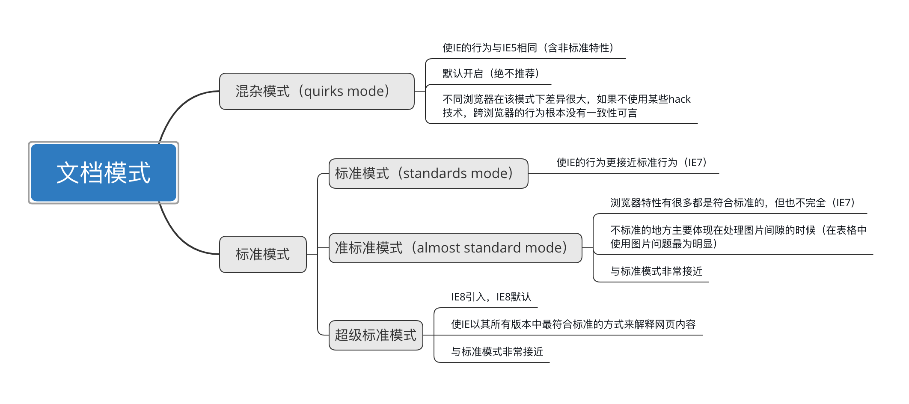

### [JavaScript 原生学习笔记](https://developer.mozilla.org/en-US/docs/Web/JavaScript)
> **介绍**： 学习如何在HTML中使用、引入JavaScript代码。

----

- [1. Javasript 语言t](#1-javasript-语言)
- [2. 在HTML中使用Javasript](#2-在html中使用javasript)
- [3. 文档模式](#3-文档模式)

-----
### [1. Javasript 语言](#)
JavaScript 是一种轻量级的、解释型的编程语言，以其在网页浏览器中的广泛应用而闻名，它支持面向对象、命令式
以及函数式编程风格。JavaScript 具有动态类型系统和松散的变量结构，能够实现事件驱动的异步处理，这使得它非
常适合构建交互式的用户界面和响应式的网络应用。

此外，随着 Node.js 的出现，JavaScript 还成为了服务器端 开发的重要选择之一，拥有庞大的生态系统和丰富的开发工具支持。

理解 JavaScript 在现代 Web 开发中的作用需要区分几个关键概念：
* ECMAScript (ES) 语言核心。
* Document Object Model (DOM) 文档对象模型。 
* Browser Object Model (BOM) 浏览器对象模型。

#### [1.1 ECMAScript (ES)](#)
ECMAScript 是 JavaScript 的核心语言规范，由欧洲计算机制造商协会（ECMA）制定并维护。
这个标准定义了 JavaScript 的语法、基本数据类型、运算符、语句、内置对象等核心功能。
ECMAScript 是一个纯粹的编程语言标准，不涉及任何关于浏览器环境的具体细节。
最新的版本不断引入新特性以增强语言的能力，比如箭头函数、模板字符串、模块化导入导出等。

* 语法、语句
* 类型
* 关键字、保留字、操作符
* 全局对象
* 符号Symbol
* XHR
* 异步
* 代理反射
* API

#### [1.2 文档对象模型 DOM](#)
是一种跨平台的编程接口，允许脚本语言（如JavaScript）动态访问和更新HTML和XML文档的内容、结构和样式。
DOM把文档结构表示为一个树形结构，其中每个节点代表文档的一部分，例如元素、属性、文本等。这种结构使得开发
者可以轻松地动态修改网页。

DOM 的核心概念：
> * 文档：HTML或XML文档被解析成DOM树形结构。
> * 节点：树中的每个点都是一个节点，分为元素节点、文本节点、属性节点等。
> * 树形结构：DOM中的节点以父子关系组织，文档的根是顶级节点。

**DOM Level 1** DOM的第一个版本，定义了基础的文档结构和脚本语言的接口。这个版本的DOM主要分为两个模块：

* DOM Core 核心模块：用于访问和操作文档的基础结构，如创建、删除、修改元素和节点。
* DOM HTML模块：特别为HTML文档定义的接口，允许脚本访问和操作HTML元素。

**DOM Level 2** 在原有基础上进行了扩展，引入了更多模块：
> * DOM视图：描述跟踪一个文档的各种视图（使用CSS样式设计文档前后）的接口；
> * DOM事件：描述事件接口；
> * DOM样式：描述处理基于CSS样式的接口；
> * DOM遍历与范围：描述遍历和操作文档树的接口；

**DOM Level 4** 不再作为独立的规范版本发布，而是逐渐被合并到HTML5和Web API的更现代规范中。随着浏览器的发展，现代DOM接口主要通过WHATWG（Web Hypertext Application Technology Working Group）进行维护和改进。HTML5定义的DOM接口使得现代网页开发更加灵活和高效，包括：
> * 选择器API：例如querySelector和querySelectorAll允许开发者使用CSS选择器查找节点。
> * DOM操作增强：引入了更加丰富的DOM操作方法，如classList、addEventListener等，使得操作文档更为便捷。
> * Shadow DOM：允许创建封闭的DOM子树，通常用于Web组件开发，提供更好的封装性和模块化。

**其他DOM** 除了标准的HTML和XML DOM，还有一些专门为特定类型的文档设计的DOM，比如SVG、MathML 和 SMIL，它们扩展了标准DOM，为特定的图形、数学公式和多媒体操作提供了专用接口。
> SVG DOM (Scalable Vector Graphics DOM) SVG (可缩放矢量图形) 是一种用于在网页中描述二维矢量图形的XML格式。SVG DOM 是专门为操作SVG图形的接口，它允许开发者通过脚本动态地控制和修改SVG图形的内容和样式。
> * SVG DOM 的一些特性包括：
>   * 图形元素的操作：开发者可以通过SVG DOM来动态修改SVG元素，如形状、路径、文字等。例如，<circle> 元素的半径可以通过DOM操作来调整。
>   * 样式和属性控制：SVG DOM 允许修改SVG元素的样式属性，例如颜色、填充、线条宽度等。
>   * 事件处理：和标准DOM一样，SVG元素也可以绑定事件，如点击、悬停等，以响应用户交互。

```javascript
let svgElement = document.getElementById("myCircle");
svgElement.setAttribute("cx", 100); // 修改圆心的位置
svgElement.setAttribute("fill", "blue"); // 修改填充颜色
```
> MathML DOM (Mathematical Markup Language DOM) MathML 是一种用于描述数学公式的标记语言，尤其适用于在网页上表示数学表达式。MathML DOM 提供了对数学表达式节点的操作和修改能力。
> * 操作数学表达式：MathML DOM允许动态修改、添加或删除数学表达式节点，如操作<mrow>、<msup>等标签，改变公式的结构。
> * 支持数学符号和运算：它支持标准的数学符号和操作符，可以对公式进行细粒度的控制。
> * 集成标准DOM：MathML与标准DOM集成良好，可以通过JavaScript访问和操作它的节点。

```xml
<math xmlns="http://www.w3.org/1998/Math/MathML">
  <msup>
    <mi>x</mi>
    <mn>2</mn>
  </msup>
</math>
```
> SMIL DOM (Synchronized Multimedia Integration Language DOM) SMIL (同步多媒体集成语言) 是用于在网页中实现多媒体动画和交互的一种语言，尤其用于同步播放不同的媒体元素，如视频、音频和动画。

#### [1.3 浏览器对象模型 BOM](#)
Browser Object Model 提供了与浏览器窗口交互的对象集合。BOM 并没有正式的标准，它是浏览器厂商共同实现的一套接口。
通过 BOM，JavaScript 可以访问浏览器窗口、弹出新窗口、改变浏览器状态栏文本等。最常用的 BOM 对象包括 
window、location、navigator、history 等。window 对象是所有 BOM 对象的顶级对象，意味着其他 BOM
对象都是 window 对象的属性。

总结来说，ECMAScript 定义了 JavaScript 的语言规则，DOM 和 BOM 则提供了与 Web 页面及其浏览器环境进行交互的方式。在实际开发中，这三个概念共同作用于 Web 应用程序的功能实现。


### [2. 在HTML中使用Javasript](#)
使用 script 元素，分两种情况, 如下所示, script 是一个html标签详情可以查看 [MDN script](https://developer.mozilla.org/zh-CN/docs/Web/HTML/Element/script) 。
* 外部脚本 
* 页面嵌入式脚本

```html
<script src="./index.js" type="text/javascript" ></script> <!-- 外部脚本 -->
<script type="text/javascript" >
    var msg = "i am inner script";
    alert(msg);
</script> <!-- 嵌入式脚本 -->
```

script 元素的基本属性 : 一般将外部脚本引用写在html文档底部
* async [**一般不使用**](#): 值: async 规定异步执行脚本（仅适用于外部脚本）。可选标识立即下载脚本，但是不应该妨碍页面中的其他操作。比如下载其他资源活等待加载其他脚本，只对外部文件有效
    * 如果 async="async"：脚本相对于页面的其余部分异步地执行（当页面继续进行解析时，脚本将被执行）
    * 如果不使用 async 且 defer="defer"：脚本将在页面完成解析时执行
    * 如果既不使用 async 也不使用 defer：在浏览器继续解析页面之前，立即读取并执行脚本
* src：属性规定外部脚本文件的 URL。
    * 绝对 URL - 指向其他站点（比如 `src="www.example.com/example.js"` ）
    * 相对 URL - 指向站点内的文件（比如 src="/scripts/example.js"）
* defer: 值为defer 规定是否对脚本执行进行延迟，直到页面加载为止。 只有 Internet Explorer 支持 defer 属性。
* type:
  * **text/javascript** **默认值** 
  * **module**，则代码会被当成ES6模板，而且只有在这时候代码中才能出现import和export关键字
* crossorigin:可选，配置相关请求的跨院资源共享 `[Cross-Origin Resource Sharing (CORS)]` 设置。默认不使用.两个值 1 anonymous	此元素的 CORS 请求会将凭据标志设置为“同源”。 2.use-credentials	对此元素的 CORS 请求会将凭据标志设置为“包含”。
* integrity:这个 integrity 属性的值来 指定浏览器提取的资源（文件）的base64编码的加密哈希值。如果资源匹配其中一个哈希值，它将被加载。
html5 规定按照他们出现的先后顺序执行脚本代码，在现实中延迟脚本并不一定会按照顺序执行，也不一定会在DOMContendLoaded 事件出发前执行
* nonce 允许脚本的一个一次性加密随机数（nonce）。服务器每次传输策略时都必须生成一个唯一的 nonce 值。提供一个无法猜测的 nonce 是至关重要的，因为绕过一个资源的策略是微不足道的。

#### [2.1 动态加载脚本](#)

1、直接document.write
```html
<script>
    document.write("<script src='a.js'><\/script>");
</script>
```
2、动态改变已有script的src属性

```html
<script src='' id="s1"></script>
<script language="javascript">
    s1.src = "b.js"
</script>
```
3、动态创建script元素

```html
<script>
    var oHead = document.getElementsByTagName('head')[0]; // 在head标签中创建创建script
    var oScript = document.createElement("script");
    oScript.type = "text/javascript";
    oScript.src = "c.js";
    oHead.appendChild(oScript);
</script>
```
这三种方法都是异步执行的，也就是说，在加载这些脚本的同时，主页面的脚本继续运行，如果用以上的方法，那下面的代码将得不到预期的效果。
例如：
```html
<script language="JavaScript">
function LoadJS(id, fileUrl) {
  var scriptTag = document.getElementById(id); 
  var oHead = document.getElementsByTagName('HEAD').item(0);
  var oScript= document.createElement("script");
  if ( scriptTag  ) oHead.removeChild(scriptTag);
  oScript.id = id; 
  oScript.type = "text/javascript"; 
  oScript.src=fileUrl ; 
  oHead.appendChild(oScript); 
}
LoadJS("a.js");
alert("主页面动态加载a.js并取其中的变量：" + str);
</script>
```
上述代码执行后 a.js 的 alert 执行并弹出消息，

但是 主页面产生了错误，没有弹出对话框。原因是 'str' 未定义，为什么呢？因为主页面在取 str 的时候 a.js 并没有
完全加载成功。遇到需要同步执行脚本的时候，可以用下面的第四种方法。

4、 用XMLHTTP取得要脚本的内容，再创建 Script 对象，a.js必须用UTF8编码保存，要不会出错。因为服务器与XML使用UTF8编码传送数据。
主页面代码：

```html
<script language="JavaScript">
function GetHttpRequest() {
  if ( window.XMLHttpRequest ) // Gecko
    return new XMLHttpRequest() ;
  else if (window.ActiveXObject) // IE 
    return new ActiveXObject("MsXml2.XmlHttp") ;
}
 
function AjaxPage(sId, url) {
  var oXmlHttp = GetHttpRequest() ;
  oXmlHttp.OnReadyStateChange = function() { 
    if (oXmlHttp.readyState == 4) {
      if (oXmlHttp.status == 200 || oXmlHttp.status == 304) {
        IncludeJS(sId, url, oXmlHttp.responseText);
      } else { 
        alert('XML request error: ' + oXmlHttp.statusText + ' (' + oXmlHttp.status + ')') ;
      } 
    } 
  } 
  oXmlHttp.open('GET', url, true); 
  oXmlHttp.send(null);
}
 
function IncludeJS(sId, fileUrl, source) { 
  if ((source != null) && (!document.getElementById(sId))) { 
    var oHead = document.getElementsByTagName('HEAD').item(0); 
    var oScript = document.createElement("script"); 
    oScript.language = "javascript"; 
    oScript.type = "text/javascript"; 
    oScript.id = sId; 
    oScript.defer = true; 
    oScript.text = source; 
    oHead.appendChild(oScript); 
  }
}
 
AjaxPage("scrA", "b.js");
alert("主页面动态加载JS脚本。");
alert("主页面动态加载a.js并取其中的变量：" + str );
</script>
```
5、使用 eval 函数加载脚本

一旦有了需要加载的脚本文件的 URL，接下来就可以使用 eval 函数动态加载脚本了。通过将脚本文件的 URL 作为参数传
递给 eval 函数，可以让 JavaScript 引擎在运行时执行并加载该脚本文件的代码。

```javascript
//下面是一个简单的示例，演示了如何使用 eval 函数加载脚本：

function loadScript(scriptURL) {
  const xhr = new XMLHttpRequest(); // 创建 XMLHttpRequest 对象
  xhr.open('GET', scriptURL, true); // 使用 GET 请求获取脚本文件
  xhr.onreadystatechange = function() {
    if (xhr.readyState === 4 && xhr.status === 200) {
      const scriptCode = xhr.responseText; // 获取脚本文件的代码
      eval(scriptCode); // 使用 eval 函数执行脚本代码
    }
  };
  xhr.send(); // 发送请求
}

// 调用 loadScript 函数加载脚本
const scriptURL = constructScriptURL('exampleScript');
loadScript(scriptURL);
```
在这个示例中，loadScript 函数接受一个参数 scriptURL，表示需要加载的脚本文件的 URL。函数
内部使用 XMLHttpRequest 对象发起 GET 请求获取脚本文件的代码，并在请求成功时通过 eval 
函数执行脚本代码。这样就实现了动态加载脚本的功能。

### [3. 文档模式](#)
ES5 引入了文档模式的概念，通过使用DOCTYPE实现模式切换，它的主要作用是告诉浏览器以哪种模式呈现，如何解析文档，也就是说两种模式主要影响CSS内容的呈现，某些情况下也会影响JavaScript的执行。



文档模式的类型
* 混杂模式：向后兼容的解析方式
* 标准模式：要求严格的DTD，根据web标准去解析页面的模式。
* 准标准模式：准标准模式与标准模式非常接近，它们的差异几乎可以忽略不计。

两种模式的区别
* 盒模型的解析
    * 混杂模式盒模型的宽高=内容的宽高；
    * 标准模式盒模型的宽高=内容的宽高+padding的宽高+border的宽高。
* 图片的布局
    * 当一个块元素div中包含的内容只有图片时，在标准模式下，不管IE还是标准，在图片底部都有3像素的空白。但在混杂模式下，标准浏览器（Chrome）中div距图片底部默认没有空白

