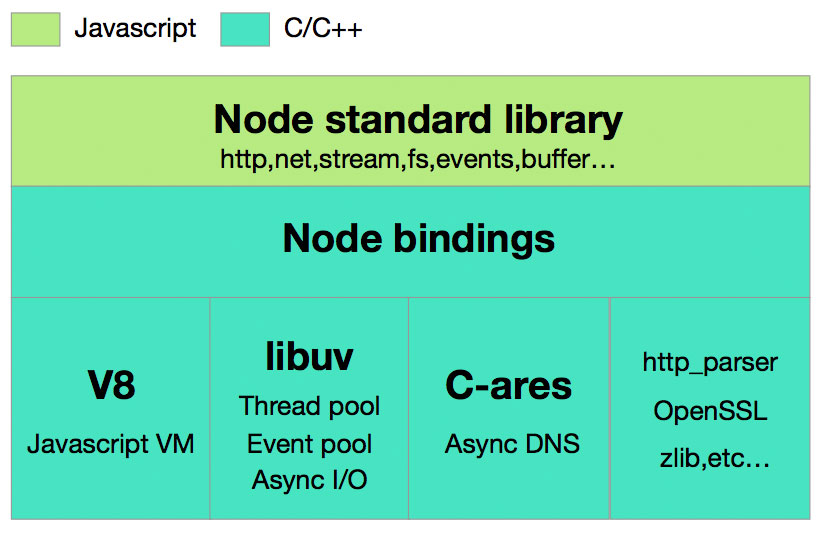
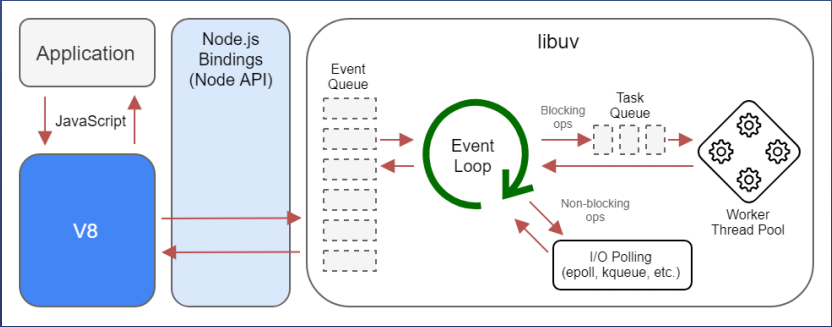

## [Node.JS 架构](#)
Node.js 在浏览器之外运行 V8 JavaScript 引擎，即 Google Chrome 的核心。这使 Node.js 的性能非常出色。

----


- [1. Node.js 简介](#1-nodejs-简介)
- [2. 基本组件](#2-基本组件)
- [3. Node.js工作流程](#3-nodejs工作流程)
- [4. JavaScript 运行机制](#4-javascript-运行机制)
- [5. Node.js 运行](#5-nodejs-运行)
- [6. npm 包管理器简介](#6-npm-包管理器简介)
- [7. package.json](#7-packagejson)

---

### [1. Node.js 简介](#)
Node.js 是一个开源和跨平台的 JavaScript 运行时环境。它是几乎所有类型项目的流行工具！Node.js主要分为四大部分，Node Standard Library，Node Bindings，V8，Libuv，架构图如下:



- `Node Standard Library` 是我们每天都在用的标准库，如Http, Buffer 模块。
- `Node Bindings` 是沟通JS 和 C++的桥梁，封装V8和Libuv的细节，向上层提供基础API服务。
- 这一层是支撑 Node.js 运行的关键，由 C/C++ 实现。
  - V8 是Google开发的JavaScript引擎，提供JavaScript运行环境，可以说它就是 Node.js 的发动机。
  - Libuv 是专门为Node.js开发的一个封装库，提供跨平台的异步I/O能力.
  - C-ares：提供了异步处理 DNS 相关的能力。
  - http_parser、OpenSSL、zlib 等：提供包括 http 解析、SSL、数据压缩等其他的能力。

nodejs v1.0 也就是最早发布的 node 版本下的 deps 文件，也就是 nodejs 所用到的依赖:
- `cares`：用 C-ares 做域名解析
- `gtest`：是 C/C++ 的单元测试框架
- `http-parser`：用来解析 HTTP
- `npm`：包管理工具
- `openssl`：用来解析 HTTPS
- `uv`：一个跨平台的异步 I/O 库
- `v8`：google 开发的js引擎，为 js 提供运行环境
- `zlib`：用来做加密


#### [1.1 Node bindings](#)
C/C++ 实现了一个用来解析 HTTP 的库 http-parser，非常高效，可是对于只会写 js 的程序员非常的不友好，因为没有办法直接去调用这个 C/C++ 的库，这两个语言连最基本的数据类型都不一样。

结论：js 无法直接调用 C++ 的库，需要一个中间的桥梁（调用途径）。

Node.js 的作者 Ryan 做了一个中间层处理
* Node.js 用 C++ 对 http-parse 进行封装，使它符合某些要求（比如统一数据类型），封装好的文件叫做 http_parse_binding.cpp
* 用 Node.js 提供的编译工具将其编译为 .node 文件
* js 代码可以直接通过 require 关键字引入这个 .node 文件

这样 js 就能够调用 C++ 库，这个中间的桥梁就是 bindings，由于 node 提供了很多 binding，所以就叫做 Node bindings


#### [1.2  JS如何与C++通信](#)
Node.js 的底层设计正是基于 JavaScript (JS) 与 C++ 的深度协作，其核心思想是：
用 JavaScript 编写业务逻辑，用 C++ 实现高性能、系统级操作，两者通过 V8 引擎和自定义绑定层无缝通信。

**V8 引擎**：Node.js使用Google的V8 JavaScript 引擎来执行JS代码。V8 是用 C++ 编写的，它不仅执行JS，还允许 C++ 暴露函数给 JS调用。


- `v8::Context`：JS 的执行环境。
- `v8::ObjectTemplate / v8::FunctionTemplate`：用于定义 JS 中的对象和函数。
- `v8::Local<v8::Value>`：JS 和 C++ 数据类型的桥梁。

Node.js 启动时，会加载内置的 C++ 模块（如 fs, net, child_process 等），这些模块的底层实现是 C++，通过 绑定（Bindings） 暴露给 JS。
```cpp
// hello_world.cc
#include <node.h>
#include <v8.h>

void Method(const v8::FunctionCallbackInfo<v8::Value>& args) {
  v8::Isolate* isolate = args.GetIsolate();
  args.GetReturnValue().Set(v8::String::NewFromUtf8(isolate, "Hello from C++!"));
}

void Initialize(v8::Local<v8::Object> exports) {
  NODE_SET_METHOD(exports, "hello", Method);
}

NODE_MODULE(NODE_GYP_MODULE_NAME, Initialize)
```

```javascript
const myaddon = require('./build/Release/hello_world');
console.log(myaddon.hello()); // 输出: Hello from C++!
```

**N-API / Node-API**：稳定的 C++ 接口（推荐方式）早期 Node.js 使用 v8 直接绑定，但 V8 的 API 变化频繁，导致 C++ 插件难以维护。为此，Node.js 引入了 `N-API`（原名 Node-API）：

- 一层 稳定的 C API，屏蔽了 V8 的变化。
- C++ 插件通过 N-API 与 JS 通信，不再直接依赖 V8。
- 支持预编译，跨 Node.js 版本兼容。

```
JS 调用 require('fs').readFile
    → Node.js JS 层转发
    → C++ Binding 层 (N-API)
    → 调用 libuv 异步读取文件
    → 完成后通过回调（Callback）或 Promise 返回 JS
```
异步操作：如何从 C++ 回调 JS，这是 Node.js 非阻塞 I/O 的核心。以 fs.readFile 为例：

**执行流程：**
- JS 调用 fs.readFile('a.txt', callback)
- JS 层调用 C++ 绑定函数。
- C++ 层将任务提交给 libuv 的线程池（非主线程）。
- 主线程（JS）继续执行，不阻塞。
- 文件读取完成后，libuv 通知主线程。
- C++ 层通过 callback 调用 JS 函数（使用 V8/N-API 调用 JS 函数对象）。
- JS 回调被执行。


### [2. 基本组件](#)

#### [2.1 什么是V8](#)
V8引擎是一个 JavaScript 引擎实现，最初由一些语言方面专家设计，后被谷歌收购，随后谷歌对其进行了开源
V8使用 C++ 开发，在运行 JavaScript 之前，相比其它的 JavaScript 的引擎转换成字节码或解释执行，V8 将其编译成原生机器码。
JavaScript 程序在 V8 引擎下的运行速度媲美二进制程序，它是现阶段执行 JavaScript 最快的一个引擎。

- 将 JS 源代码变成本地代码并执行
- 维护调用栈，确保 JS 函数的执行顺序
- 内存管理，为所有对象分配内存
- 垃圾回收，重复利用无用的内存
- 实现 JS 的标准库

js 是单线程的，而 V8 本身是多线程的，开一个线程执行 js，开一个线程清理内存，然后再处理一些其他别的活儿，线程和线程之间毫无瓜葛。

#### [2.2 什么是libuv](#)
因为各个系统的 I/O 库都不一样，windows 系统有 IOCP，Linux 系统有 epoll。Node.js 的作者Ryan 为了将其整合在一起实现一个跨平台的异步 I/O 库，开始写 libuv。

- 从操作系统写文件到硬盘
- 访问网络，从操作系统发出数据到别的服务器
- 打印连接打印机，从操作系统发指令给打印机

以上这些行为都是 I/O，可以理解为系统和外界进行交互的过程都叫 I/O

而 libuv 会根据你是什么系统，自动的选择当前系统已经实现好了的异步操作（I/O）库，用于TCP/UDP/DNS文件等的异步操作

- 比如操作 TCP，我们都知道 HTTP 是基于 TCP/IP 的，如果可以操作 TCP 那么，就可以做 HTTP 的服务
- UDP，用于实时通信，常见的 QQ 聊天解析 DNS

包括读文件、写文件什么的，libuv 都可以帮你管理。这样 I/O 的部分就全部交给 C 语言去做，js 完全不用管，甩手掌柜，负责调用就行了

v8 和 libuv 在整个 Node.js 架构的底层是最为重要的

### [3. Node.js工作流程](#)
所有现代系统都是主程序启动完毕之后，对每个收到的请求开启一个进程，接下来根据不同技术有不同的处理方式，有时差异会大相径庭。典型的实现是：针对一个请求开启一个线程，一步接一步执行任务操作，如果某个操作执行缓慢，这个线程上的后续操作都会随之挂起，直到所有操作完成，返回结果。而在 Node.js 中，所有的操作都注册为一个事件，等待主程序或者外部请求来触发（**事件驱动**）。





**Application** 就是咱们写的代码，把它放在 `V8` 上面去运行。发现需要去读一个文件，这时候 `libuv` 开一个线程去读文件。读完文件，操作系统会返回一个事件给 `event loop`，`event loop` 就把文件传回给 `V8`，再给到代码。

#### [3.1 Node.js中的Event Loop](#)
"Event Loop" 是一个程序结构，用于等待和发送消息和事件。

JavaScript 是单线程的，有了 Event Loop 的加持，Node.js 才可以非阻塞地执行 I/O 操作，把这些操作尽量转移给操作系统来执行

- **Event**: 计时器到期了、文件可以读取了、读取出错了
- **Loop**: Loop 就是循环，由于事件分优先级，所以处理起来也是分先后顺序，所以 Node.js 需要按顺序轮询每种事件，轮询是循环的。

**Event Loop 各阶段详解**

```
   ┌───────────────────────┐
┌─>│        timers         │检查计时器
│  └──────────┬────────────┘
│  ┌──────────┴────────────┐
│  │     I/O callbacks     │
│  └──────────┬────────────┘
│  ┌──────────┴────────────┐
│  │     idle, prepare     │打扫战场，可以忽略
│  └──────────┬────────────┘      ┌─────────┐
│  ┌──────────┴────────────┐      │   incoming:   │
│  │         poll          │检查系统事件  <─────┤  connections, │
│  └──────────┬────────────┘      │   data, etc.  │
│  ┌──────────┴────────────┐      └─────────┘
│  │        check          │检查setImmediate回调
│  └──────────┬────────────┘
│  ┌──────────┴────────────┐
└──┤    close callbacks    │执行关闭事件的回调函数
   └───────────────────────┘
```
上图其中每个方框都是 Event Loop 中的一个阶段，每个阶段都有一个「先入先出队列」，这个队列存有要执行的回调函数


**timer 阶段**

先看看有没有计时器，有了执行回调函数

需要注意的是：当计时器指定的时间达到后，回调函数会尽早被执行。如果操作系统很忙，或者 Node.js 正在执行一个耗时的函数，那么计时器的回调函数就会被推迟执行

举个例子，置了一个计时器在 100 毫秒后执行，然后你的脚本用了 95 毫秒来异步读取了一个文件

**I/O 阶段**

这个阶段会执行一些系统操作的回调函数，还有没有其他没有归类的回调（没有归类的回调：不在 timers 阶段、close callbacks 阶段和 check 阶段这三个阶段执行的回调）

**Idle 阶段**

空闲一会儿，清理战场

**Poll 阶段**

主要用于处理IO回调，处理大部分的事件（文件可读了？读！http请求来了，处理！）

当 event loop 进入 poll 阶段，如果发现没有计时器，就会：
- 如果 poll 队列不是空的，event loop 就会依次执行队列里的回调函数，直到队列被清空或者到达 poll 阶段的时间上限。
- 如果 poll 队列是空的，就会：
    - 如果有 setImmediate() 任务，event loop 就结束 poll 阶段去往 check 阶段。
    - 如果没有 setImmediate() 任务，event loop 就会等待新的回调函数进入 poll 队列，并立即执行它。
- 一旦 poll 队列为空，event loop 就会检查计时器有没有到期，如果有计时器到期了，event loop 就会回到 timers 阶段执行计时器的调

**Check 阶段**

如果 poll 阶段空闲了，同时存在 setImmediate() 任务，event loop 就会进入 check 阶段

setImmediate() 是通过 libuv 里一个能将回调安排在 poll 阶段之后执行的 API 实现的

**Close callback 阶段**

关闭阶段的回调，比如 socket.destroy()，就会有一个 close 事件进入这个阶段，但是 Node.js 不傻，不会一直循环循环，如果发现没什么事儿做，就会停留在 poll（轮询）阶段

轮询的阶段呢，会看看有没有文件可以读，有没有请求可以处理，就等着，时不时的看看有没有新的代码，或者检查一下最近的计时器，看看有没有需要过会儿去执行的 callback

如果计时器事件要处理了，我再从下出发，绕回 timers

Node.js 大部分时间都会停留在 poll 阶段，大部分事件都在 poll 阶段被处理，如文件、网络请求

程序结束时，Node.js 会检查 Event Loop 是否在等待异步 I/O 操作结束，是否在等待计时器触发，如果没有，就会关掉 Event Loop

以上几个阶段的任务被称为“宏任务”，以下任务为微队列任务
* process.nextTick
* promise


#### [3.2 流程总结](#)
Application就是咱们写的代码，把它放在v8上面去运行

- 运行的过程中，发现我们写了个setTimeout，v8就会调用Node.js的bindings，把这个settimeout放进Even loop里面。
- Event loop就会等待适合的时机去发送一个事件去执行这些 js 代码，接着循环等待，一般停留在 poll阶段久一些。
- 发现需要去读一个文件，这时候 Event loop 就会通过 libuv 开一个线程去专门做读文件这事儿。
- 读完文件，操作系统会返回一个事件给 Event loop，Event loop 就把文件传回给v8，最后给到代码。

**js 从头至尾都不参与读文件这个事情，libuv去读**

一句话就是，代码到 V8，通过Node API 使用libuv 和其他一些 C/C++ 提供的功能去完成用户所需要的功能

Node.js 将这些模块进行整合，所以说 Node.js 不是一门语言，就是一个结合技术的平台。

### [4. JavaScript 运行机制](#)
JavaScript 是一种解释型语言，代码执行分为以下几个主要阶段：

读取代码
- 浏览器或 Node.js 会加载并解析你的 JavaScript 文件。

编译（Parsing）
- 将代码转换为抽象语法树（AST）。
- 进行 变量提升（Hoisting） 和 作用域链构建。

执行（Execution）
- 根据编译后的信息逐行执行代码。

**执行上下文（Execution Context）**
执行上下文是 JavaScript 执行代码时的“环境”，它决定了变量、函数和 this 的行为。

1. 类型

- 全局执行上下文：每个脚本只有一个，浏览器中对应 window 对象。
- 函数执行上下文：每次函数被调用都会创建一个新的上下文。
- 块级执行上下文（ES6+）：由 let 和 const 定义的块级作用域生成。

2. 生命周期
- 创建阶段
  - 变量提升（Hoisting）
  - 作用域链初始化
  - this 绑定
- 执行阶段
  - 执行具体代码逻辑
- 销毁阶段
  - 函数执行完毕后，上下文从调用栈中弹出并释放资源

调用栈（Call Stack）：调用栈用于管理函数调用的顺序，遵循 LIFO（后进先出） 原则。

#### [4.1 为什么JavaScript是单线程](#)
JavaScript语言的一大特点就是单线程，这与它的用途有关。作为浏览器脚本语言，JavaScript的主要用途是与用户互动，以及操作DOM。这决定了它只能是单线程，否则会带来很复杂的同步问题。比如，假定JavaScript同时有两个线程，一个线程在某个DOM节点上添加内容，另一个线程删除了这个节点，这时浏览器应该以哪个线程为准？

所以，为了避免复杂性，从一诞生，JavaScript就是单线程，这已经成了这门语言的核心特征，将来也不会改变。

**注意**：为了利用多核CPU的计算能力，HTML5提出Web Worker标准，允许JavaScript脚本创建多个线程，但是子线程完全受主线程控制，且不得操作DOM。所以，这个新标准并没有改变JavaScript单线程的本质。

#### [5.2 任务队列](#)
单线程就意味着，所有任务需要排队，前一个任务结束，才会执行后一个任务。如果前一个任务耗时很长，后一个任务就不得不一直等着。

如果排队是因为计算量大，CPU忙不过来，倒也算了，但是很多时候CPU是闲着的，因为IO设备（输入输出设备）很慢（比如Ajax操作从网络读取数据），不得不等着结果出来，再往下执行。

JavaScript语言的设计者意识到，这时主线程完全可以不管IO设备，挂起处于等待中的任务，先运行排在后面的任务。等到IO设备返回了结果，再回过头，把挂起的任务继续执行下去。

于是，所有任务可以分成两种，一种是同步任务（synchronous），另一种是异步任务（asynchronous）

具体来说，异步执行的运行机制如下。（同步执行也是如此，因为它可以被视为没有异步任务的异步执行。）

1. 所有同步任务都在主线程上执行，形成一个执行栈（execution context stack）。
2. 主线程之外，还存在一个"任务队列"（task queue）。只要异步任务有了运行结果，就在"任务队列"之中放置一个事件。
3. 一旦"执行栈"中的所有同步任务执行完毕，系统就会读取"任务队列"，看看里面有哪些事件。那些对应的异步任务，于是结束等待状态，进入执行栈，开始执行。
4. 主线程不断重复上面的第三步。

只要主线程空了，就会去读取"任务队列"，这就是JavaScript的运行机制。这个过程会不断重复。

#### [5.3 事件和回调函数](#)
**事件循环**（Event Loop）：由于 JavaScript 是单线程语言，事件循环是处理异步任务的核心机制。

**核心概念**
- 宏任务（Macro Task）：如 setTimeout、setInterval、DOM 事件、I/O 操作。
- 微任务（Micro Task）：如 Promise.then、MutationObserver、queueMicrotask。

**执行流程**
- 执行当前宏任务中的同步代码。
- 同步代码执行完后，清空当前所有微任务队列（全部执行完）。
- 取下一个宏任务执行（如 setTimeout 回调），然后再**清空其产生的微任务**。
- 循环往复。

```javascript
console.log("Start"); // 同步代码（宏任务）

setTimeout(() => {
  console.log("Timeout"); // 宏任务
}, 0);

Promise.resolve().then(() => {
  console.log("Promise"); // 微任务
});

console.log("End"); // 同步代码（宏任务）
/*
Start
End
Promise
Timeout
*/
```

JavaScript 提供了多种异步编程方式，包括回调函数、Promise、async/await，但它们的底层都依赖于事件循环。
```javascript
console.log("Start");

setTimeout(() => {
  console.log("Timeout 1");
  Promise.resolve().then(() => {
    console.log("Promise in Timeout 1");
  });
}, 0);
/*
这个 Promise.then 是在 setTimeout 回调中执行的，属于当前宏任务产生的微任务。
所以：执行完这个宏任务后，会清空其微任务队列。
*/

setTimeout(() => {
  console.log("Timeout 2");
}, 0);

Promise.resolve().then(() => {
  console.log("Promise 1");
  setTimeout(() => {
    console.log("Timeout in Promise 1");
  }, 0);
}).then(() => {
  console.log("Promise 2");
});

console.log("End");

/*
Start
End
Promise 1
Promise 2
Timeout in Promise 1
Timeout 1
Promise in Timeout 1
Timeout 2
*/
```

总结执行顺序逻辑:

|阶段	|输出|说明|
|:---|:---|:---|
|1|	Start |	同步代码|
|2|	End |	同步代码|
|3|	Promise 1	|微任务：Promise.then|
|4|	Promise 2	|微任务：链式 then|
|5|	Timeout 1	|宏任务：第一个 setTimeout|
|6|	Promise in Timeout 1	|微任务：在 setTimeout 内部创建的 Promise.then|
|7|	Timeout 2	|宏任务：第二个 setTimeout|
|8|	Timeout in Promise 1	|宏任务：在 Promise.then 中注册的 setTimeout|


### [5. Node.js 运行](#)
Node.js 应用在单个进程中运行，不会为每个请求创建新线程。Node.js 在其标准库中提供了一组异步 I/O 原语，可防止 JavaScript 代码阻塞，并且通常，Node.js 中的库是使用非阻塞范例编写的，这使得阻塞行为成为例外而不是常态。

当 Node.js 执行 I/O 操作（如从网络读取、访问数据库或文件系统）时，Node.js 不会阻塞线程并浪费 CPU 周期等待，而是会在响应返回时恢复操作。

这使 Node.js 能够使用单个服务器处理数千个并发连接，而​​不会带来管理线程并发的负担，这可能是错误的重要来源。

Node.js 具有独特的优势，因为数百万为浏览器编写 JavaScript 的前端开发者现在能够编写服务器端代码以及客户端代码，而无需学习完全不同的语言。

在 Node.js 中，可以毫无问题地使用新的 ECMAScript 标准，因为你不必等待所有用户更新其浏览器 - 你可以通过更改 Node.js 版本来决定使用哪个 ECMAScript 版本，并且还可以通过使用标志运行 Node.js 来启用特定的实验性功能。

Node.js 最常见的示例 Hello World 是一个 Web 服务器：
```javascript
const { createServer } = require('node:http');

const hostname = '127.0.0.1';
const port = 3000;

const server = createServer((req, res) => {
    res.statusCode = 200;
    res.setHeader('Content-Type', 'text/plain');
    res.write(JSON.stringify({"name": "hello world!"}));
    res.end('');
});

server.listen(port, hostname, () => {
    console.log(`Server running at http://${hostname}:${port}/`);
});
```

### [6. npm 包管理器简介](#)
npm 是 Node.js 的标准包管理器,地球上最大的单一语言代码存储库，你可以肯定，几乎所有内容都有一个软件包！

它最初是一种下载和管理 Node.js 包依赖的方法，但后来也成为前端 JavaScript 中使用的工具。Yarn 和 pnpm 是 npm cli 的替代品。你也可以查看它们。

npm 安装、更新和管理项目依赖的下载。依赖是预先构建的代码片段，例如库和包，你的 Node.js 应用需要它们才能运行。


**安装所有依赖** 如果项目有一个 package.json 文件，通过运行如下命令，它将在 node_modules 文件夹中安装项目所需的所有内容，如果尚不存在，则创建它。
```shell
npm install
```
package.json 例子：
```json
{
   // 包名
  "name": "antd",
  // 版本号
  "version": "5.24.8",
  // 项目描述
  "description": "An enterprise-class UI design language and React components implementation",
  // 开源协议
  "license": "MIT",
  // 开源项目的资金支持渠道，帮助用户或企业通过捐赠、赞助等方式支持项目维护者
  "funding": {
    "type": "opencollective",
    "url": "https://opencollective.com/ant-design"
  },
  // 项目主页
  "homepage": "https://ant.design",
  // 仓库地址
  "repository": {
    "type": "git",
    "url": "https://github.com/ant-design/ant-design"
  },
  // bug联系地址
  "bugs": {
    "url": "https://github.com/ant-design/ant-design/issues"
  },
  // 项目关键字，mpm包搜索时匹配
  "keywords": [
    "ant",
    "component",
    "components",
    "design",
    "framework",
    "frontend",
    "react",
    "react-component",
    "ui"
  ],
  // 告知打包工具（如 Webpack、Rollup）模块代码是否包含副作用，从而优化 Tree Shaking 的行为。
  "sideEffects": [
    "*.css"  // 所有 CSS 文件有副作用
  ],
  // commonjs模块导入该包的入口
  "main": "lib/index.js", 
  // esmodule模块导入该包的入口
  "module": "es/index.js",
  // 指定包在浏览器中通过 <script> 标签直接加载的 UMD 格式 文件。
  "unpkg": "dist/antd.min.js",
  // 指定 TypeScript 类型声明文件（`.d.ts`）的入口路径
  "typings": "es/index.d.ts",
  // 指定该包上传的npm的文件
  "files": [
    "BUG_VERSIONS.json",
    "dist",
    "es",
    "lib",
    "locale"
  ],
  // 该包运行的脚本
  "scripts": {
    "api-collection": "antd-tools run api-collection",
    "..."
  },
  // 用于指定支持的浏览器
  "browserslist": [
    "defaults"
  ],
  // 对等依赖，无需安装，只需用户项目安装指定的版本即可
  "peerDependencies": {
    "react": ">=16.9.0",
    "react-dom": ">=16.9.0"
  },
  // 该包的依赖
  "dependencies": {
    "@ant-design/colors": "^7.2.0",
    "..."
  },
  // 发布包到 npm 时的特定行为，它可以覆盖 package.json 中的某些默认设置。
  "publishConfig": {
    "registry": "https://registry.npmjs.org/"
  },
  // 检查 JavaScript 包或文件的体积大小，防止意外增加包体积
  "size-limit": [
    {
      "path": "./dist/antd.min.js",
      "limit": "510 KiB",
      "gzip": true
    },
    {
      "path": "./dist/antd-with-locales.min.js",
      "limit": "600 KiB",
      "gzip": true
    }
  ],
  // 非标准字段，某些框架或工具（如静态站点生成器）可能用它表示项目标题。
  "title": "Ant Design",
  // 配置淘宝的 npm 客户端 tnpm（基于 npm 的镜像加速工具），定义私有仓库或镜像源。
  "tnpm": {
    "mode": "npm"
  },
  // 配置 pnpm 包管理器的特定行为（如依赖解析、存储方式）。
  "pnpm": {
    "overrides": {
      "nwsapi": "2.2.20"
    }
  },
  // 强制指定依赖树中某个包的版本（覆盖嵌套依赖），解决依赖冲突问题。
  "overrides": {
    "nwsapi": "2.2.20"
  },
  // 在 Yarn 中用于强制指定依赖版本。
  "resolutions": {
    "nwsapi": "2.2.20"
  }
}
```

**安装单个包** ,你也可以通过运行如下命令来安装特定的包，此外，从 npm 5 开始，此命令将 `<package-name>` 添加到 `package.json` 文件依赖, 在版本 5 之前，你需要添加标志 `--save`。
```
npm install <package-name>
```
- `--no-save` 安装但不将条目添加到 package.json 文件依赖
- `--save-dev` 安装并将条目添加到 package.json 文件 devDependencies
- `--save-optional` 安装并将条目添加到 package.json 文件 optionalDependencies
- `--no-optional` 将阻止安装可选依赖

也可以使用标志的简写：
- `-S`:`--save`
- `-D`:`--save-dev`
- `-O`:`--save-optional`

devDependencies 和 dependency 之间的区别在于前者包含开发工具，如测试库，而后者在生产中与应用打包在一起。

### [7. package.json](#)
package.json文件对于Node.js应用程序至关重要,它是每个项目的核心，**保存关于应用程序的元数据，管理项目依赖关系，并配置构建工具**。

package.json 里面有许许多多的配置，与项目息息相关，了解它们有助于了解项目，提效开发，规范代码。

```json
{
  "name": "react",
  "version": "18.1.0",
  "description": "",
  "repository": {
    "type":"git",
    "url":"https://github.com/facebook/react.git",
    "directory":"packages/react"
  },
  "homepage": "https://reactjs.org/",
  "main": "index.js",
  "scripts": {
    "start": "node src/index.js",
    "test": "echo \"Error: no test specified\" && exit 1"
  },
  "keywords": [
      "ant",
      "component",
      "components",
      "design",
      "framework",
      "frontend",
      "react",
      "react-component",
      "ui"
  ],
  "files": [
    "filename.js",
    "directory/",
    "glob/*.{js,json}"
  ],
  "bugs": "https://github.com/vuejs/core/issues",
  "author": "",
  "license": "ISC",
  "type": "module"
}
```

#### [7.1 描述配置](#)
主要是项目的基本信息，包括名称，版本，描述，仓库，作者等，部分会展示在 npm 官网上。

- name：项目的名称 ，如果是第三方包的话，其他人可以通过该名称使用 npm install 进行安装。
- version：项目的版本号，开源项目的版本号通常遵循 semver 语义化规范,name + version 能共同构成一个完全唯一的项目标识符，所以它两是最重要的两个字段。
- repository：项目的仓库地址以及版本控制信息。
- description: 描述信息，会展示在 npm 官网，让别人能快速了解该项目。
- keywords：一组项目的技术关键词，比如 Ant Design 组件库的 keywords 如下：
- homepage: 项目主页的链接，通常是项目 github 链接，项目官网或文档首页。
- bugs: 项目 bug 反馈地址，通常是 github issue 页面的链接。
- author: 项目作者.

#### [7.2 文件配置](#)
包括项目所包含的文件，以及入口等信息。

**files**: 项目在进行 npm 发布时，可以通过 files 指定需要跟随一起发布的内容来控制 npm 包的大小，避免安装时间太长。发布时默认会包括 package.json，license，README 和main 字段里指定的文件。忽略 node_modules，lockfile 等文件。

默认情况下会发布所有位于项目根目录下的文件和文件夹，我们也可以通过.npmignore来配置那些文件被忽略。但是更多的做法是通过配置files属性，这里设置的文件或者文件夹都会被发布，该字段包含的文件不能通过 .npmignore 或 .gitignore 排除。 一般我们只需要发布打包后的文件即可。

```
{
  "files": [
      "dist",
      "es",
      "lib",
      "locale"
  ]
}
```
但是下方列出的文件始终被发布:
- package.json
- README
- LICENSE / LICENCE
- main字段指定的文件
- bin 字段对应的文件 （实际测试发现这个也会被默认提交，例如vue-cli中的配置）

下方列出的文件总是被忽略
- .git
- CVS
- .svn
- .hg
- `.lock-wscript`
- `.wafpickle-N`
- `.*.swp`
- `.DS_Store`
- `._*`
- npm-debug.log
- `.npmrc`
- node_modules
- config.gypi
- `*.orig`
- package-lock.json (如果您希望发布，请使用 npm-shrinkwrap.json)


> 在此基础上，我们可以指定更多需要一起发布的内容。可以是单独的文件，整个文件夹，或者使用通配符匹配到的文件。
一般情况下，files 里会指定构建出来的产物以及类型文件，而 src，test 等目录下的文件不需要跟随发布。

**type**: 在node支持 ES 模块后，要求ES模块采用`.mjs`后缀文件名。只要遇到`.mjs` 文件，就认为它是`ES`模块。如果不想修改文件后缀，就可以在package.json文件中，指定 type 字段为`module`,这样所有 .js 后缀的文件，node 都会用 ES 模块解释。

> 如果还要使用 CommonJS 模块规范，那么需要将 CommonJS 脚本的后缀名都改成.cjs，不过两种模块规范最好不要混用，会产生异常报错。

**main**：项目发布时，默认会包括 `package.json`，license，README 和main 字段里指定的文件，因为 main 字段里指定的是项目的入口文件，在 browser 和 Node 环境中都可以使用。

如果不设置 main 字段，那么入口文件就是根目录下的`index.js`。

> 这是早期只有 CommonJS 模块规范时，指定项目入口的唯一属性。

**browser**： main 字段里指定的入口文件在 browser 和 Node 环境中都可以使用。如果只想在`web`端使用，不允许在`server`端使用，可以通过 browser 字段指定入口。
```
"browser": "./browser/index.js"
```
**module**: 项目也可以指定 ES 模块的入口文件，这就是 module 字段的作用。
```
"module": "./index.mjs"
```
当一个项目同时定义了 main，browser 和 module，像 webpack，rollup 等构建工具会感知这些字段，并会根据环境以及不同的模块规范来进行不同的入口文件查找。
```
"main": "./index.js", 
"browser": "./browser/index.js",
"module": "./index.mjs"
```
比如 webpack 构建项目时默认的 target 为 'web'，也就是 Web 构建。它的 resolve.mainFeilds 字段默认为 ['browser', 'module', 'main']。

```javascript
module.exports = {
  //...
  resolve: {
    mainFields: ['browser', 'module', 'main'],
  },
};
```
此时会按照 `browser -> module -> main` 的顺序来查找入口文件。

**workspaces**: 项目的工作区配置，用于在本地的根目录下管理多个子项目。可以自动地在 npm install 时将 workspaces 下面的包，软链到根目录的 node_modules 中，不用手动执行 npm link 操作。

workspaces 字段接收一个数组，数组里可以是文件夹名称或者通配符。比如：
```
"workspaces": [
  "workspace-a"
]
```
表示在 workspace-a 目录下还有一个项目，它也有自己的 package.json。

通常子项目都会平铺管理在 packages 目录下，所以根目录下 workspaces 通常配置为：
```
"workspaces": [
  "packages/*"
]
```


#### [7.2.续 条件导出](#)
在 npm 包的 package.json 文件中，exports 和 main 都可以用来定义包的入口点，但是 exports 字段是 main 字段的现代的替代方案。
如果是开发新的 npm 包，建议使用 package.json 的 exports 字段定义主入口点导出：

```
{
  "exports": "./index.js"
}
```
当定义了 exports 字段时，包的所有子路径都会被封闭起来，导入者无法再访问未被 exports 导出的模块。例如，require('pkg/subpath.js') 会抛出 ERR_PACKAGE_PATH_NOT_EXPORTED 错误。

这种导出的封装为工具以及在处理包的 semver（语义化版本）升级时提供了更可靠的包接口保证。然而，这并不是一种强封装，因为直接 require 包的任何绝对子路径（例如 require('/path/to/node_modules/pkg/subpath.js')）仍然会加载 subpath.js。

著作权归作者所有。商业转载请联系作者获得授权，非商业转载请注明出处。
- **更可靠的包接口保证**：**通过明确指定哪些模块可以被外部访问，开发者可以更好地控制包的公共 API，从而减少意外暴露内部实现细节的风险**。
- **不是强封装**：尽管有这些控制，但如果用户知道确切的文件路径，他们仍然可以直接通过绝对路径来加载包内的任意文件，这绕过了 exports 字段的限制。

**子路径导出**: 在 package.json 的 exports 字段中，你可以指定包的主要入口点和其他自定义子路径。主要入口点用 . 表示，表示当用户直接引用包时应加载的文件。其他自定义子路径则可以指向包内的特定模块或文件，允许更精细地控制哪些部分可以被外部访问。

```json
{
  "exports": {
    ".": "./index.js",
    "./submodule.js": "./src/submodule.js"
  }
}
```
只有 exports 中定义的子路径才能被使用者导入：
```javascript
import submodule from 'es-module-package/submodule.js';
// Loads ./node_modules/es-module-package/src/submodule.js
```
其他子路径则会报错：
```javascript
import submodule from 'es-module-package/private-module.js';
// Throws ERR_PACKAGE_PATH_NOT_EXPORTED
```
exports 字段可以配置不同环境对应的模块入口文件，并且当它存在时，它的优先级最高,使用 require 和 import 字段根据模块规范分别定义入口：
```
{
  "exports": {
    "require": "./index.js",
    "import": "./index.mjs"
   }
}
```
这样的配置在使用 `import 'xxx'` 和 `require('xxx')` 时会从不同的入口引入文件，exports 也支持使用 browser 和 node 字段定义 browser 和 Node 环境中的入口。

**导出语法糖**: 如果 `.` 导出是唯一的导出，那么 exports 字段为这种情况提供了简化的语法糖，即 exports 字段的值直接指定默认导出的内容。
上方的写法其实等同于：
```
{
  "exports": {
  ".": {
    "require": "./index.js",
    "import": "./index.mjs"
  }
 }
}
```


```json
{
   "exports": {
    ".": {
      "types": "./dist/index.d.ts",
      "import": "./dist/index.mjs",
      "require": "./dist/index.js"
    },
    "./unstyled": {
      "types": "./dist/unstyled.d.ts",
      "import": "./dist/unstyled.mjs",
      "require": "./dist/unstyled.js"
    }
  },
}
```
不过要注意，node_modules 中的路径禁止在 exports 中使用，确保导出的文件只限于当前包内部。
#### [7.2 续 imports 路径映射](#)
在复杂的项目中，为了引用位于不同目录层级的模块，开发者通常需要使用多个 `../` 来回溯目录层级，这不仅书写繁琐而且容易出错。
通过在 package.json 文件中配置 imports 字段，开发者可以定义一组路径别名（即路径映射），使得整个应用程序可以通过这些预定义的路径来简化模块的导入，而不需要每次都写出冗长的相对路径。

例如这个例子，此例子在 package.json 中使用 imports 字段定义了一组路径别名：
```json
{
  "imports": {
    "#utils/calc": "./src/utils/calc.js"
  }
}
```
imports 字段中的条目必须总是以 `#` 开头，以确保它们与外部包的模块标识符区分开来。imports 字段中定义的路径别名（即路径映射）是**私有的**，仅在包内部使用。
```javascript
const calc = require("#utils/calc");

const total = calc.add(1, 2);

console.log("res  ", {
  total,
});
```
与 exports 字段不同的是，imports 字段支持将外部包直接作为导入路径，而不仅仅局限于本地模块。
```json
{
  "imports": {
    "#lodash": {
      "require": "lodash",
      "import": "lodash-es"
    }
  },
  "dependencies": {
    "lodash-es": "^4.17.21",
    "lodash": "^4.17.21"
  }
}
```
通过这个的配置，我们可以在代码中这样引入 lodash。
```javascript
// index.cjs
const { omit } = require("#lodash");
```

**子路径模式**： 如果一个 npm 包只有少量的导出或导入项，则建议直接在 package.json 文件中详细列出每一个具体的子路径，以确保清晰性和可读性。 

然后，如果一个 npm 包拥有大量导出或导入项，如果逐一列出这些路径，会导致 package.json 文件臃肿并引发维护问题。

对于这种情况，可以改用子路径模式：
```json
// ./node_modules/es-module-package/package.json
{
  "exports": {
    "./features/*.js": "./src/features/*.js"
  },
  "imports": {
    "#internal/*.js": "./src/internal/*.js"
  }
}
```
在上面的路径映射中，`*` 表示一个通配符，用于匹配任意有效的路径片段。

而且，在实际解析路径映射时，只是简单地将匹配到的部分替换成指定的目标路径。即使替换的值中包含路径分隔符 /，这些分隔符也会被正确处理并保留：
```javascript
import featureX from 'es-module-package/features/x.js';
// Loads ./node_modules/es-module-package/src/features/x.js

import featureY from 'es-module-package/features/y/y.js';
// Loads ./node_modules/es-module-package/src/features/y/y.js

import internalZ from '#internal/z.js';
// Loads ./node_modules/es-module-package/src/internal/z.js
```


#### [7.3 脚本配置](#)
**scripts**: 指定项目的一些内置脚本命令，这些命令可以通过 npm run 来执行。通常包含项目开发，构建 等 CI 命令，比如：
```
"scripts": {
  "build": "webpack"
}
```
我们可以使用命令 npm run build / yarn build 来执行项目构建。

**config**: config 用于设置 scripts 里的脚本在运行时的参数。比如设置 port 为 3001：
```
"config": {
  "port": "3001"
}
```
在执行脚本时，我们可以通过 npm_package_config_port 这个变量访问到 3001。
```
console.log(process.env.npm_package_config_port); // 3001
```

#### [7.4 依赖配置](#)
项目可能会依赖其他包，需要在 package.json 里配置这些依赖的信息。

**dependencies**: 运行依赖，也就是项目生产环境下需要用到的依赖。比如 react，vue，状态管理库以及组件库等。

使用 `npm install xxx` 或则 `npm install xxx --save` 时，会被自动插入到该字段中。
```
"dependencies": {
  "react": "^18.2.0",
  "react-dom": "^18.2.0"
}
```
**devDependencies**: 开发依赖，项目开发环境需要用到而运行时不需要的依赖，用于辅助开发，通常包括项目工程化工具比如 webpack，vite，eslint 等。

使用 `npm install xxx -D` 或者 `npm install xxx --save-dev` 时，会被自动插入到该字段中。
```
"devDependencies": {
  "webpack": "^5.69.0"
}
```
**peerDependencies**： 同伴依赖，一种特殊的依赖，不会被自动安装，通常用于表示与另一个包的依赖与兼容性关系来警示使用者。

比如我们安装 A，A 的正常使用依赖 B@2.x 版本，那么 B@2.x 就应该被列在 A 的 peerDependencies 下，表示“如果你使用我，那么你也需要安装 B，并且至少是 2.x 版本”。比如 React 组件库 Ant Design，它的 package.json 里 peerDependencies 为
```json
{
   "peerDependencies":{
      "react":">=16.9.0",
      "react-dom":">=16.9.0"
  }
}
```
表示如果你使用 Ant Design，那么你的项目也应该安装 react 和 react-dom，并且版本需要大于等于 16.9.0。

**optionalDependencies**: 可选依赖，顾名思义，表示依赖是可选的，它不会阻塞主功能的使用，安装或者引入失败也无妨。这类依赖如果安装失败，那么 npm 的整个安装过程也是成功的。

比如我们使用 colors 这个包来对 console.log 打印的信息进行着色来增强和区分提示，但它并不是必需的，所以可以将其加入到 optionalDependencies，并且在运行时处理引入失败的逻辑。

使用 `npm install xxx -O` 或者 `npm install xxx --save-optional` 时，依赖会被自动插入到该字段中。
```
"optionalDependencies": {
  "colors": "^1.4.0"
}
```
peerDependenciesMeta: 同伴依赖也可以使用 peerDependenciesMeta 将其指定为可选的。
```
{
  "peerDependencies": {
    "colors": "^1.4.0"
  },
  "peerDependenciesMeta": {
    "colors": {
      "optional": true
     }
   }
}
```

**overrides** overrides 可以重写项目依赖的依赖，及其依赖树下某个依赖的版本号，进行包的替换。
> npm命令中强制指定依赖树中某个包的版本（覆盖嵌套依赖），解决依赖冲突问题。它的核心目的是解决依赖冲突、修复安全漏洞或确保依赖版本的一致性。

```
{
  "overrides": {
    // 全局覆盖 lodash 的版本
    "lodash": "4.17.21",
    
    // 当 react@17.0.0 被安装时，覆盖其依赖的 prop-types 版本
    "react@17.0.0": {
      "prop-types": "15.8.1"
    },
    
    // 覆盖所有父包中依赖的 typescript 版本
    "typescript": "5.0.0"
  }
}
```

#### [7.5 发布配置](#)
主要是和项目发布相关的配置。

**private** : 如果是私有项目，不希望发布到公共 npm 仓库上，可以将 private 设为 true。
```json
{
  "private":true
}
```
**publishConfig**: 比如在安装依赖时指定了 registry 为 taobao 镜像源，但发布时希望在公网发布，就可以指定 publishConfig.registry。
```json
{
  "publishConfig":{
    "registry":"https://registry.npmjs.org/"
  }
}
```

#### [7.6 系统配置](#)
和项目关联的系统配置，比如 node 版本或操作系统兼容性之类。这些要求只会起到提示警告的作用，即使用户的环境不符合要求，也不影响安装依赖包。

**engines**: 一些项目由于兼容性问题会对 node 或者包管理器有特定的版本号要求，比如：
```
{
  "engines": {
    "node": ">=14 <16",
    "pnpm": ">7"
  }
}
```
要求 node 版本大于等于 14 且小于 16，同时 pnpm 版本号需要大于 7。

**os**: 在 linux 上能正常运行的项目可能在 windows 上会出现异常，使用 os 字段可以指定项目对操作系统的兼容性要求。
```
{
  "os": ["darwin", "linux"]
}
```
**cpu**: 指定项目只能在特定的 CPU 体系上运行。
```
{
  "cpu": ["x64", "ia32"]
}
```


### [参考文章](#)
- [https://nodejs.cn/en/learn](https://nodejs.cn/en/learn)
- [https://juejin.cn/post/7470488087656366091](https://juejin.cn/post/7470488087656366091)