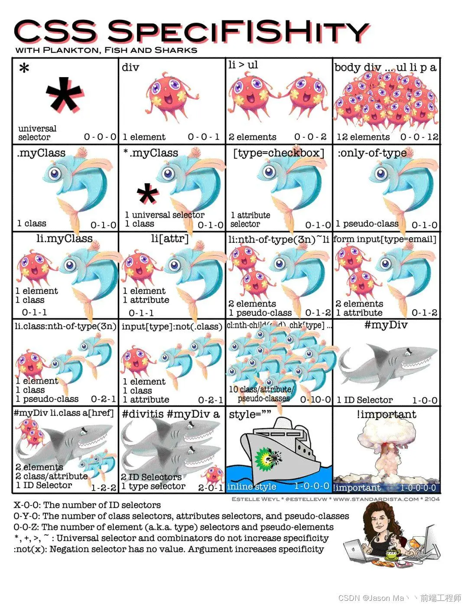

## [CSS：层叠样式表](#)
层叠样式表（Cascading Style Sheets，缩写为 CSS）是一种样式表语言，用来描述 HTML 或 XML（包括如 SVG、MathML 或 XHTML 之类的 XML 分支语言）文档的呈现方式。

---

### [1. 概述](#)

#### 1.1 CSS的主要功能
1. **控制页面布局**:设置元素的位置、大小、边距、边框等。
2. **定义字体和颜色**:设置文本的字体、大小、颜色、背景色等。
3. **实现响应式设计**:通过媒体查询适配不同设备(如手机、平板、桌面)。
4. **动画与过渡效果**:实现元素的动画、渐变、变换等交互效果。
5. **样式继承和层叠**:多个样式规则可以叠加应用，优先级由层叠规则决定。

### 2. CSS引入方式
CSS样式有三种引入方式：行内样式、内部样式\外部样式.

**行内样式**：也可以称为**内联样式** `(Inline Style)`，利用style全局属性，例如：为p标签添加一个CSS样式，让其中的字体改变颜色，标签上添加style属性，所有的CSS属性都要编写到style中。

语法：在元素标签内添加 style 属性，属性值为 CSS 声明（多个声明用分号分隔）。

```html
<p style="color: green">
  我是一段文本，我想请问你要干嘛，为什么要黑我们家鸽鸽
</p>
<p style="background-color: #f0f0f0; padding: 10px;">这是一个段落</p>
```

**注意**：优先级最高（覆盖其他样式）,但是不易维护（样式与内容混杂），不适用于多元素复用。

**内部样式** ：通过**style标签引入** 直接在HTML的head标签内部插入应该style标签。

```html
<html>
<head>
    <title>内部样式示例</title>
    <style>
        body {
            background-color: linen; /* 背景颜色 */
        }
        h1 {
            color: maroon; /* 标题颜色 */
            margin-left: 40px; /* 左边距 */
        }
        p {
            font-family: Arial, sans-serif; /* 字体 */
        }
    </style>
</head>
<body>
    <h1>欢迎使用内部样式</h1>
    <p>这是一个使用内部样式的段落。</p>
</body>
</html>
```

注意：不能跨页面复用，优先级低于行内样式。

**外部样式**：通过**link标签引入**，link标签一般放在head标签内部。

```html
<!DOCTYPE html>
<html>
<head>
    <title>外部样式示例</title>
    <link rel="stylesheet" type="text/css" href="styles.css"> 
    <!-- 链接外部CSS文件 -->
</head>
<body>
    <h1>外部样式标题</h1>
    <p>这是一个使用外部样式的段落。</p>
</body>
</html>
```

CSS 文件（如styles.css）：

```css
body {
    background-color: #ffffff;
}
h1 {
    color: green;
    text-align: center;
}
p {
    padding: 15px;
    border: 1px solid #ccc;
}
```

最佳可维护性（样式与内容完全分离），支持多页面复用，优先级最低（便于全局覆盖）,需要额外文件，加载速度略慢（需 HTTP 请求）。

### 3. CSS选择器的优先级
优先级概念 CSS选择器优先级是决定样式应用顺序的权重系统，当多个规则作用于同一元素时，浏览器根据选择器权重决定应用哪个规则。

```html
<style>
    #content {
        color: #f00;
    }
    .content {
        color: #0f0;
    }
</style>

<div id="content" class="content">
我是什么颜色
</div>
```

那最后文字是什么颜色呢？答案很简单：红色。这就涉及到了优先级问题，同一块内容，我们同时用了 ID选择器 和 类选择器,因为 ID选择器 优先级大于 类选择器 , 所以最终显示为红色。

#### 浏览器具体的优先级算法
优先级是由 （A 、B、C、D）四个值来决定的，其中它们的值计算规则如下：

1. 如果存在内联样式，那么 A = 1, 否则 A = 0;
2. B 的值等于 ID选择器 出现的次数;
3. C 的值等于 类选择器 和 属性选择器 和 伪类 出现的总次数;
4. D 的值等于 标签选择器 和 伪元素 出现的总次数 。

```css
#nav-global > ul > li > a.nav-link{

}
```

套用上面的算法，依次求出 A B C D 的值：

1. 因为没有内联样式 ，所以 A = 0;
2. ID选择器总共出现了1次， B = 1;
3. 类选择器出现了1次， 属性选择器出现了0次，伪类选择器出现0次，所以 C = (1 + 0 + 0) = 1；
4. 标签选择器出现了3次， 伪元素出现了0次，所以 D = (3 + 0) = 3;

上面算出的A 、 B、C、D 可以简记作：(0, 1, 1, 3)。

```
li                                  /* (0, 0, 0, 1) */
ul li                               /* (0, 0, 0, 2) */
ul ol+li                            /* (0, 0, 0, 3) */
ul ol+li                            /* (0, 0, 0, 3) */
h1 + *[REL=up]                      /* (0, 0, 1, 1) */
ul ol li.red                        /* (0, 0, 1, 3) */
li.red.level                        /* (0, 0, 2, 1) */
a1.a2.a3.a4.a5.a6.a7.a8.a9.a10.a11  /* (0, 0, 11,0) */
#x34y                               /* (0, 1, 0, 0) */
li:first-child h2 .title            /* (0, 0, 2, 2) */
#nav .selected > a:hover            /* (0, 1, 2, 1) */
html body #nav .selected > a:hover  /* (0, 1, 2, 3) */
```

**比较规则**: 从左往右依次进行比较 ，较大者胜出，如果相等，则继续往右移动一位进行比较 。如果4位全部相等，则后面的会覆盖前面的。

#### 优先级的特殊情况
我们可以知道内联样式的优先级是最高的，但是外部样式有没有什么办法覆盖内联样式呢？有的，那就要 !important 出马了。因为一般情况下，很少会使用内联样式 ，所以 !important 也很少会用到！如果不是为了要覆盖内联样式，建议尽量不要使用 !important 。

```css
.app {
    color: 0f0!important;
}
```

记住，千万不要在内联样式中使用 !important

#### 简单记忆优先级

1. important 标识符
2. 内联样式
3. id选择器
4. 类名选择器(标签选择器)
5. 伪类选择器 = 属性选择器 
6. 元素选择器 = 伪元素选择器
7. 通配符选择器。



### 4. CSS样式继承
在 css 中，每个 CSS 属性定义的概述都指出了这个属性是默认继承的 ("Inherited: Yes") 还是默认不继承的 ("Inherited: no")。这决定了当你没有为元素的属性指定值时该如何计算值。

CSS属性继承是CSS中一个重要的概念，它决定了哪些样式会从父元素传递给子元素。

承属性的一个典型例子就是 color 属性。给出以下样式规则：

```css
p {
  color: green;
}
```

```html
<p>This paragraph has <em>emphasized text</em> in it.</p>
```

"emphasized text" 就会呈现为绿色，因为 em 元素继承了 p 元素 color 属性的值，而没有获取color 属性的初始值

#### 可继承属性
以下是一些常见的可继承属性，子元素自动继承父元素的值。

- 文本相关属性：color, font-family, font-size, font-weight, line-height, text-align, text-indent
- 列表相关属性：list-style, list-style-type, list-style-position
- 表格相关属性：border-collapse, border-spacing
- 其他属性：visibility, cursor, letter-spacing, word-spacing

#### 不可继承属性

以下是一些常见的不可继承属性：

- 盒模型属性：width, height, margin, padding, border
- 定位属性：position, top, right, bottom, left, z-index
- 背景属性：background, background-color, background-image
- 显示属性：display, float, clear
- 其他属性：overflow, vertical-align, opacity

### 4. 特殊CSS值

- 属性继承：CSS中只有部分属性会自然继承，了解哪些属性可继承是有效使用CSS的基础。
- inherit：强制继承父元素的计算值，即使该属性通常不可继承。
- initial：将属性重置为其初始值（浏览器默认值）。
- unset：根据属性是否可继承表现不同行为，可继承属性表现为inherit，不可继承属性表现为initial。
- revert：将属性重置为浏览器默认值或用户代理样式。

inherit关键字强制元素继承父元素的属性值，即使该属性通常不可继承。

```css
.parent {
  border: 1px solid #333;
  padding: 20px;
}

.child {
  /* 正常情况下border不可继承，但使用inherit可以强制继承 */
  border: inherit;
  /* padding通常也不可继承 */
  padding: inherit;
}
```

initial关键字将属性重置为其初始值（浏览器默认值）。

```css
.element {
  color: initial; /* 重置为默认文本颜色（通常是黑色） */
  display: initial; /* 重置为默认display值（通常是inline） */
  font-size: initial; /* 重置为默认字体大小（通常是16px） */
}
```

unset关键字根据属性是否可继承来表现不同行为：
- 如果属性可继承，则表现为inherit
- 如果属性不可继承，则表现为initial

```css
.element {
  color: unset; /* 由于color可继承，等同于inherit */
  border: unset; /* 由于border不可继承，等同于initial */
}
```

revert 关键字将属性值重置为：
- 如果存在用户代理样式表（浏览器默认样式），则重置为该值
- 否则，行为类似于unset

```css
.element {
  display: revert; /* 重置为浏览器默认的display值 */
  font-weight: revert; /* 重置为浏览器默认的字体粗细 */
}
```

### [5. 用户代理样式](#)
还记得我们在一开始的时候介绍到，引入CSS的方式主要有三种，分别是：

- 内联样式/行内样式 （Inline CSS）直接在HTML元素的style属性中编写CSS代码。
- 内部样式 （Internal CSS）在HTML文档的 `<head>` 标签内使用 `<style>` 标签定义CSS规则。
- 外部样式 （External CSS）将CSS代码写在独立的.css文件中，然后通过 `<link>` 标签引入到HTML页面中。

此外，在计算机发展的早期，浏览器本身为了能让一些缺少自定义CSS样式的网站有一个大致的排版，通常会有一些自己默认的样式设置。

body标签在Chrome下同样具有默认外边距设置，body的默认样式实际上是来源于用户代理样式表的。

虽然用户代理样式表很多情况下能够帮助一些没有CSS样式的网站更好看地显示内容，但是在有些时候，不同浏览器的用户代理样式不一样，可能会导致网页的某些元素以不一样的尺寸或边距进行展示，从而出现不同用户看到的页面样式不同的情况。因此，为了避免这个问题，我们可以引入一些用于消除不同浏览器用户代理样式差异的CSS文件，从而实现统一。

这里我们使用前面提到的link标签进行引入：

```html
<link rel="stylesheet" href="css/normalize.css">
```

可以看到normalize.css将一些常见的元素样式进行了统一，从而消除不同浏览器之间的差别：

```css
html {
  line-height: 1.15; /* 统一行高设置 */
  -webkit-text-size-adjust: 100%;
}

body {
  margin: 0;  /* 统一消除了body的外边距 */
}
```