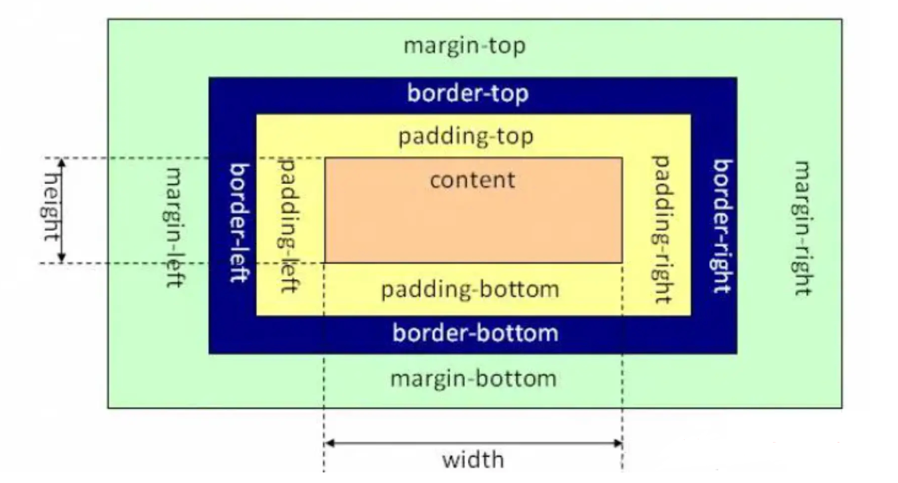
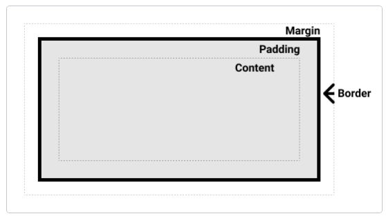
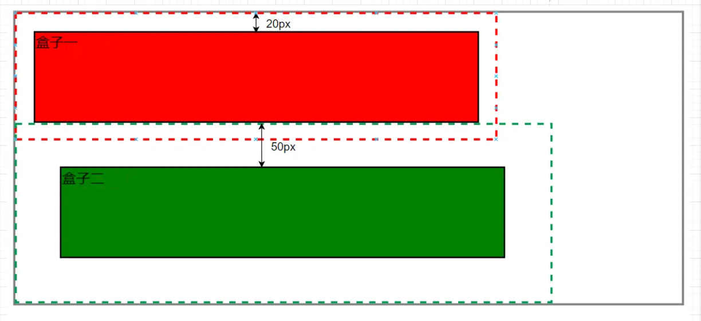

## [CSS 盒模型](#)
> **盒模型（Box Model）** 是理解布局和元素尺寸计算的基础。它定义了每个HTML元素如何根据其内容、内边距（padding）、边框（border）和外边距（margin）来确定其最终的显示尺寸。

----

- [1. 盒模型](#1-盒模型)
- [2. display属性](#2-display属性)
- [3. 内容宽高](#3-内容宽高)
- [4. box-sizing](#4-box-sizing)

----

### [1. 盒模型](#)
在HTML中，我们可以将任意一个元素视为一个矩形盒子，无论这个元素是行内元素还是块级元素：

**只要是一个元素，浏览器在渲染时都会将其当做一个矩形盒子渲染**，而这样的一个盒子，一共包含4个部分，它由内容区域（Content）、内边距（Padding）、边框（Border）和外边距（Margin）组成，这种模型能够有助于我们理解和控制元素的布局和空间占用。

CSS 中组成一个区块盒子需要：
- 内容盒子：显示内容的区域；使用 inline-size 和 block-size 或 width 和 height 等属性确定其大小。
- 内边距盒子：填充位于内容周围的空白处；使用 padding 和相关属性确定其大小。
- 边框盒子：边框盒子包住内容和任何填充；使用 border 和相关属性确定其大小。
- 外边距盒子：外边距是最外层，其包裹内容、内边距和边框，作为该盒子与其他元素之间的空白；使用 margin 和相关属性确定其大小。



```js
box = content + padding + border + margin
```

也可以更加粗糙的表示：



#### 1.1 块级元素、行内元素、行内块元素
在HTML中，元素主要分为三大类：行内元素（Inline elements）、行内块元素（Inline-block elements）和块元素（Block elements）。

常见的行内元素：
1. `<span>`：用于对文档中的一小块内容进行分组或应用样式，但它本身不会在页面上产生任何可见的效果，主要用于样式和脚本的挂钩。
2. `<a>`：定义超链接，允许用户从一个页面链接到另一个页面或页面内的某个部分。
3. `<strong>`：表示文本的重要性，通常显示为加粗文本。
4. `<em>`：表示文本的强调，通常显示为斜体文本。
5. `<br>`：换行符，用于在文本中插入一个简单的换行，但它不是一个块级元素，因为它不会在其前后产生额外的空间。
6. `<label>`：用于定义`<input>`元素的标签，它关联于一个表单控件，改善用户体验。

常见的行内块元素：
1. ``：虽然``标签是行内元素，但它具有特殊的性质，因为它会生成一个“替换元素”，即它的内容不是由文档直接给出的，而是由外部资源（如图片）替换的。
2. 通过CSS的 `display: inline-block;` 属性将任何元素设置为行内块元素。

常见的块元素
1. `<div>、<main>、<header> <section> <aside> <footer>....`：用于文档分区或布局的容器。
2. `<p>`：定义段落，自动添加段落间的垂直间距。
3. `<h1>` 到 `<h6>`：六级标题，用于结构化文本内容并区分标题级别。
4. `<ul>`、`<ol>` 和 `<li>`：分别用于创建无序列表、有序列表和列表项。
5. `<table>、<tr>、<td>` 和 `<th>`：用于创建表格，分别表示表格、行、单元格和表头单元格。

- **单独成行**：块级元素会排斥其他元素，导致其他元素另起一行展示，这是块级元素的一大特性。
- **行内块元素**，所谓行内块，就是既具有行内元素的特性（比如不会占据一行宽度，而是穿插在文本中），也具有块级元素的特性（允许设置宽高）。img标签，它是一个行内块元素，所谓行内块，就是既具有行内元素的特性（比如不会占据一行宽度，而是穿插在文本中），也具有块级元素的特性（允许设置宽高）。因此，实际上对于图片这种行内块元素，width和height也是可以生效的：
- **行内元素**盒子的宽度由内部文本或其他行内元素的总宽度决定，盒子的高度由内部文本的字体大小和行高决定。
- **块级元素**盒子的宽度默认直接占满整行，盒子的高度由内部其他元素高度总和而决定。

**三者区别**

|` `|是否在同一行|能否设置宽高尺寸|能否设置水平方向padding、margin|能否设置垂直方向padding、margin|
|:---|:---|:---|:---|:---|
|行内元素|是|不能(其尺寸主要由内容决定)|能|否|
|行内块元素|是|能|能|能|
|块元素|否，独占一行|能|能|能|

#### 1.2 标准盒模型（W3C Box Model）
在标准盒模型中，width 和 height 属性仅指定了内容区域（content box）的宽度和高度。

- 总宽度 = `width` + `padding-left` + `padding-right` + `border-left-width` + `border-right-width` + `margin-left` + `margin-right`
- 总高度 = `height` + `padding-top` + `padding-bottom` + `border-top-width` + `border-bottom-width` + `margin-top` + `margin-bottom`

#### 1.3 掌握外边距折叠
区块的上下外边距有时会合并（折叠）为单个边距，其大小为两个边距中的最大值（或如果它们相等，则仅为其中一个），这种行为称为外边距折叠。注意：有设定浮动和绝对定位的元素不会发生外边距折叠。

```css
<!DOCTYPE html>
<html lang="en">
<head>
    <meta charset="UTF-8">
    <title>Title</title>
    <style>
        .container {
            border: 3px solid grey;
        }
        .top {
            background: red;
            width: 500px;
            height: 100px;
            margin: 20px;  /* 较小外边距 */
            border: 2px solid black;
        }
        .bottom {
            background: green;
            margin: 50px; /* 较大外边距 */
            width: 500px;
            height: 100px;
            border: 2px solid black;
        }
    </style>
</head>
<body>
<div class='container'>
    <div class='top'>盒子一</div>
    <div class='bottom'>盒子二</div>
</div>
</body>
</html>
```




### [2. display属性](#)
[display](https://developer.mozilla.org/zh-CN/docs/Web/CSS/Reference/Properties/display) 属性定义了元素在文档流中显示的性质，默认情况下，div 元素：display:block，span元素：display:inline。

> display 属性设置元素是否被视为块级或行级盒子以及用于子元素的布局，例如流式布局、网格布局或弹性布局。

| 属性值 | 说明 |
| :--- | :--- |
| `none` | 隐藏元素 |
| `inline` | （默认值）指定对象为内联元素，元素前后没有换行符 |
| `block` | 指定对象为块元素，元素前后会带有换行符 |
| `inline-block` | 指定对象为内联块元素 |
| `list-item` | 指定对象为列表项目 |
| `table` | 指定对象作为块元素级的表格，表格前后带有换行符 |
| `flex` | 弹性布局 |
| `grid` | 网格布局 |

### [3. 内容宽高](#)
元素内容的宽度和高度通常使用 width 和 height 属性来设置，也可以通过 `inline-size` 和 `block-size` 属性来设置。

> 在CSS中，默认情况下行内元素（如 `<span>`、`<a>`、`` 等）无法直接通过 width 和 height 属性来设置宽高，其宽高由内容决定。

| 属性类别 | 属性名称 | 功能描述 | 常用取值/备注 |
| :--- | :--- | :--- | :--- |
| 基础宽高 | `width` | 设置盒子的宽度 | `px`, `%`, `vw`, `auto` (默认) 等 |
| 基础宽高 | `height` | 设置盒子的高度 | `px`, `%`, `vh`, `auto` (默认) 等 |
| 限制范围 | `min-width` | 设置盒子的最小宽度 | 防止盒子过窄 |
| 限制范围 | `max-width` | 设置盒子的最大宽度 | 防止盒子过宽，常用于响应式布局 |
| 限制范围 | `min-height` | 设置盒子的最小高度 | 防止盒子过矮 |
| 限制范围 | `max-height` | 设置盒子的最大高度 | 防止盒子过高，常配合 overflow 使用 |
| 盒模型计算 | `box-sizing` | 控制盒子尺寸的计算规则 | `content-box` (默认，宽高仅含内容)`border-box` (宽高含内容+padding+border) |
|逻辑属性|`inline-size`|根据书写模式定义了元素区块横向或纵向尺寸|`px`, `%`, `vw`, `auto` (默认) 等|
|逻辑属性|`block-size`|根据书写模式定义了元素区块横向或纵向尺寸|`px`, `%`, `vw`, `auto` (默认) 等|

**常用取值**：可以使用绝对单位（如 px）、相对单位（如百分比 %、视口单位 vw/vh）或 auto（默认值，根据内容自动调整）。

```css
.outer-box {
  width: 400px;
  height: 100px;
  background-color: green;
}
```

- width 属性用于设置元素的宽度。width 默认设置内容区域的宽度，但如果 box-sizing 属性被设置为 border-box，就转而设置边框区域的宽度。
- height 属性用于设置元素的高度。height 默认设置内容区域的高度，但如果 box-sizing 属性被设置为 border-box，就转而设置边框区域的高度。


```css
/* <length> values */
width: 300px;
width: 25em;

/* <percentage> value */
width: 75%;

/* Keyword values */
width: max-content;
width: min-content;
width: fit-content(20em);
width: auto;

/* Global values */
width: inherit;
width: initial;
width: unset;
```

#### [3.1 inline-size](#)
CSS 属性 inline-size 根据行内元素的书写模式定义了元素区块的横向或纵向尺寸。根据 **writing-mode** 的值，此属性对应于 width 或 height 属性。

若为**纵向书写模式**，则 `inline-size` 的值对应于元素的**高度**；**否则**对应于元素的**宽度**。与此相关的属性为 block-size，此属性定义了元素另一方向的尺度。

> 在现代网页开发中，使用逻辑属性的最大优势是适配国际化与多语言布局。

```css
inline-size: 150px; // 设置元素宽度为 150px
writing-mode: horizontal-tb;
```

```css
inline-size: 150px; //设置元素高度为 150px
writing-mode: vertical-rl;
```

```css
inline-size: auto; // 宽度由内容决定
writing-mode: horizontal-tb;
```

#### [3.2 block-size](#)
CSS 属性 block-size 根据元素的书写模式定义了元素块的横向或纵向尺寸。根据 writing-mode 的值，此属性对应于 width 或 height 属性。

若为**纵向书写模式**，则 block-size 的值对应于元素的**宽度**；**否则**对应于元素的**高度**。与此相关的属性为 inline-size，此属性定义了元素另一方向的尺度。

> 在现代网页开发中，使用逻辑属性的最大优势是适配国际化与多语言布局。

```css
block-size: 150px; // 设置元素高度为 150px
writing-mode: horizontal-tb;


block-size: 150px; //设置元素宽度为 150px
writing-mode: vertical-rl;
```

### [4. box-sizing](#)
CSS 中的 box-sizing 属性定义了 user agent 应该如何计算一个元素的总宽度和总高度。

box-sizing 属性可以被用来调整这些表现：
- `content-box` **默认值**。如果你设置一个元素的宽为 100px，那么这个元素的内容区会有 100px 宽，并且任何边框和内边距的宽度都会被增加到最后绘制出来的元素宽度中。
- `border-box` 告诉浏览器：你想要设置的边框和内边距的值是包含在 width 内的。

> 也就是说，如果你将一个元素的 width 设为 100px，那么这 100px 会包含它的 border 和 padding，内容区的实际宽度是 width 减去 (border + padding) 的值。大多数情况下，这使得我们更容易地设定一个元素的宽高。

在解释一下就是：`box-sizing：控制盒子尺寸的计算规则`。
- `content-box`（默认值）：标准的 W3C 盒模型。设置的宽高仅包含内容区，实际占位大小 = 宽高 + padding + border。
- `border-box`：IE 怪异盒模型。设置的宽高包含了内容区 + padding + border，这会让布局计算更加直观。

本例显示了不同的 box-sizing 值如何改变两个原本相同的元素的渲染尺寸。

```css
div {
  width: 160px;
  height: 80px;
  padding: 20px;
  border: 8px solid red;
  background: yellow;
}

.content-box {
  box-sizing: content-box;
  /* Total width: 160px + (2 * 20px) + (2 * 8px) = 216px
     Total height: 80px + (2 * 20px) + (2 * 8px) = 136px
     Content box width: 160px
     Content box height: 80px */
}

.border-box {
  box-sizing: border-box;
  /* Total width: 160px
     Total height: 80px
     Content box width: 160px - (2 * 20px) - (2 * 8px) = 104px
     Content box height: 80px - (2 * 20px) - (2 * 8px) = 24px */
}
```
